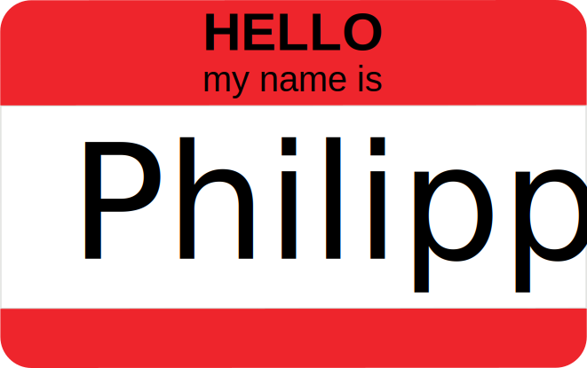

**Mail:** **[pm@bios.au.dk](pm@bios.au.dk)**

**Github page:** **[https://github.com/PMassicotte](https://github.com/PMassicotte)**

**R blog:** **[http://pmassicotte.github.io/](http://pmassicotte.github.io/)**

## Data science

> Data Science is an interdisciplinary field about processes and systems to **extract knowledge or insights from large volumes of data** in various forms, either structured or unstructured (Wikipedia).

----

<figure>
  

<figcaption>Source: http://berkeleysciencereview.com/article/first-rule-data-science</figcaption>
</figure>

----

<figure>

<figcaption>Source: http://berkeleysciencereview.com/article/first-rule-data-science</figcaption>
</figure>

## Data science in ecology

- Data relevant to environmental issues is produced very rapidly at high spacial and temporal scales
      - Remote sensing
      - Automated *in-situ* sensors (salinity, Chl*a*, ...)
      - *No, we are not doing big data science*

- As scientists, **you need** to learn and practice essential tools for capturing, manipulating and sharing data.

- I wish I knew more about code workflow and data organization when I started my PhD!

## What is this class about

- Provide tools (R) and knowledge (basic statistics) for ecologists.

- Focus on **understanding what you are doing** not necessary on the core. $x(n)y(n) \Leftrightarrow \frac{1}{{2\pi }}\int\limits_{ - \pi }^\pi  {X(e^{j\theta } )Y(e^{j(\omega  - \theta )} )d\theta }$

- Best practices to data manipulation and data analysis.

## Why programing?

You might wonder why it is important to learn how to program in environemental sciences. There are *at least* two good reasons:

1. Reproducibility (ability to recreate what you did).

2. Automation (run existing analysis on new data).

## Why is it important?

> It is often said that 80% of data analysis is spent on the cleaning and preparing data. And it’s not just a first step, but it must be repeated many over the course of analysis as new problems come to light or new data is collected (Hadley Whickham).

## Why using R

During this course we will focus on R.

- It is a free software!

- It is cross-platforms (Windows, Mac and Linux).

- Has exceptional graphics capabilities (ideal for preparing scientific manuscripts).

- Easy to develop your own functions (**automation**).

- Allows to keep a trace on how analyzes have been done (**reproducible**).

- Packages and active development (7342 packages available on CRAN).

## Outline

This course will be divided into two main parts:

1. An introduction to R (data manipulation, graphics, etc.)

2. Statistical analysis using R

## Class schedule

Have a look to the printed schedule.

## What I am expecting

**Your participation.**

The best way to learn programming and statistics is by practicing. After each concept, we will do exercises together.

## Project description

- The purpose of this project is to use the R programming and the statistical skills acquired during the class to produce a report formatted as a scientific paper.
- Prepare two or three questions to which you will answer using appropriate statistics and R tools.
- Related to your own data.
- Have concrete questions or hypothesis.
- Objective: **produce publication ready material (tables, figures)**
- Deadline: **no later than January 29th**.

## Installing R and RStudio

*Download R* https://cran.r-project.org/

**I strongly recommend to install RStudio as your integrated developing environment (IDE).**

*Download RStudio* http://bit.ly/1HlIr0q

