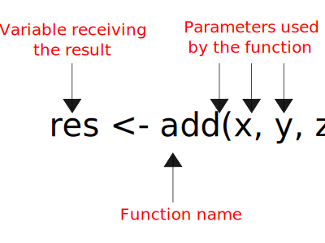

```{r setup, include=FALSE}
knitr::opts_chunk$set(echo = TRUE)
library(ggplot2)
```

```{r cache=F,echo=F}
s0 <- knitr::knit_hooks$get('source')
o0 <- knitr::knit_hooks$get('output')

knitr::knit_hooks$set(
  list(
    source=function(x,options){
      if (is.null(options$class)) s0(x, options)
      else
        paste0(
          paste0("<div class='", options$class, "'><pre><code>")
          ,x
          ,'</code></pre>\n'
        )
    }
    ,output = function(x,options){
      if (is.null(options$class)) o0(x, options)
      else 
        paste0(
          "<pre><code>"
          ,x
          ,'</code></pre></div>\n'
        )
    }
  )
)
```

## Basics

In its simplest form, R can be used as a calculator.

```{r}
1 + 1
2 + log(2)
sin(pi / 2) # pi is a predefined constant in R (3.141593)
```

## Variables

Printed results are interesting, but not very useful if we can not reuse them.

> In R, two operators (**=** , **<-** ) can be
used to assign a value to a variable. However, by convention **<-** is preferred. Use keys **alt + -** to automatically insert the **<-** symbol. 

```{r}
x = 120 # Works, but not recommended by convention
x <- pi
x <- "hi"
```

## Variable names

> You have to be careful when choosing a variable name. There are few rules to respect.

1. Can contain both letters and numbers, but must start with a letter (good: x123, bad: 1x23)

2. Should not contain special characters (à, è, æ, ø, å, ?, %, ', $, etc.)

3. Should not be the same as a R function or predefined variable name (`cos`, `sin`, `pi`, `min`, etc.)

## Basic data types

> - numeric: `12.3`, `pi`, `1`, etc.
> - character: `"a"`, `"text"`, `"long text with space"`
> - boolean/logical: `TRUE/1`, `FALSE/0`
> - date: `2016-01-31` (use ISO format, large -> small)

We can use the `class()` function to get the type of a variable.

```{r}
x <- -32.234 # Create variable x and assign the value -32.234
class(x) # What is the class of x?

```

## Basic data types {.exercises}

#### Exercise #1

What is the class of `x`?

```{r}
x <- "2015-05-24"
```

## Vectors

## Vectors

> - Vectors are arrays of successive elements. Elements of a vector can be, for example: **numeric**, **character**, **logical**, **date**.
> - Vectors are created using the `c()` function with `,` used to separate elements.

```{r}
x <- c(1, 4, -1, 10, 5.4) # Vector of numeric values
y <- c("This", "is", "a", "vector") # Vector of character values
z <- c(FALSE, TRUE, FALSE, FALSE, TRUE) # Vector of logical values

class(z)
```

## Exercise {.exercises}

#### Question #1

What is the class of this vector?

```{r}
x <- c(1, "2", -3, "pi")
```

## Elements of vector 

> - Particular elements of a vector can be accessed using the **[]** operator.
> - The first element of a vector is located at position 1.

```{r}
x <- c(1, 4, -1, 10, 5.4) # Vector of numeric values
x[1] # Value at the first position
x[1] + x[4] # 1 + 10
```

## Exercise {.exercises}

Given the vector `x`:

```{r}
x <- c(1, 4, -1, 10, 5.4)
```

#### Question #1

What is the value of:

```{r, eval = FALSE}
x[6]
```

## Exercise {.exercises}

Given the vector `x`:

```{r}
x <- c(1, 4, -1, 10, 5.4)
```

#### Question #2

What is the value of:

```{r, eval = FALSE}
x[-1]
```

## Elements of vector 

We can also apply a function to all elements of a vector.

```{r}
x <- c(1, 4, -1, 10, 5.4)

x / 2   # Divide all elements of x by 2
sin(x)  # sin value of all elements of x
```

## Elements of vector 

Vectors and matrices of the same size can be operated on arithmetically, with the operations acting element-wise.

```{r}
x <- c(1, 3, 5, 1)  # vector 1
y <- c(3, 1, 4, 1)  # vector 2

x + y
```

## Exercise {.exercises}

#### Question #1

What will happen when executing the following code:

```{r, eval = FALSE}
x <- c(1, 3, 5, 1)  # vector 1
y <- c(3, 1)        # vector 2

x + y
```

## Exercise {.exercises}

#### Question #2

What will happen when executing the following code:

```{r, eval = FALSE}
x <- c(1, 3, 5, 1)  # vector 1
y <- c(3, 1, 4)     # vector 2

x + y
```

## Matrix

## Matrix

> - A matrix is a 2-dimensional entity containing a number of rows and columns. 
> - The upper left element is located at line 1 and column 1.

$$
A_{m,n} =
 \begin{bmatrix}
  a_{1,1} & a_{1,2} & \cdots & a_{1,n} \\
  a_{2,1} & a_{2,2} & \cdots & a_{2,n} \\
  \vdots  & \vdots  & \ddots & \vdots  \\
  a_{m,1} & a_{m,2} & \cdots & a_{m,n}
 \end{bmatrix}
$$

## Matrix

To understand how matrix work in R, lets create the following matrix `A`.

```{r}
set.seed(1234)

# Create a 5 by 5 matrix
A <- matrix(data = sample(25), nrow = 5, ncol = 5)

A
```

## Matrix indexes

Elements of a matrix can be accessed using the following scheme:

```{r, eval = FALSE}
A[m, n] # Element located a line m and column n
```

For example, the value at position $A_{3,1}$ is:

```{r}
A[3, 1] # Return the value at line 3 and column 1
```


## Matrix indexes

If the line or row number is omitted, the corresponding vector at line or row will be returned.

```{r}
A[1, ] # Returns all elements from the first line

A[, 4] # Returns all elements from the 4th column
```

## Exercise {.exercises}

#### Question #1

What is the value of:
```{r, eval = FALSE}
A[10]
```

#### Question #2

What is the value of:

```{r, eval = FALSE}
A[, -1]
```

## Missing values

## Missing values

Missing values in R are represented by `NA` (not available). All operations performed on NA values will return the value `NA`.

```{r}
# Create a vector with one NA at the 4th position
x <- c(1, 2, 3, NA, 5)

x + 1
```

NA can be easily identified with the `is.na()` function.

```{r}
is.na(x)
```

## Operations on NA

Most R functions will return `NA` if such values are present in the data.

```{r}
x <- c(1, 2, 3, NA, 5)
mean(x) # Will returns NA
```

You have to **explicitly** tell R what to do with `NA`. This is often done using the `na.rm` argument.

```{r}
mean(x, na.rm = TRUE) # Remove NA values before calculating the mean
```

## Logical operators

## Logical operators

Logical operators are another important concept. When using these operators in R, `TRUE` or `FALSE` will be **always** returned.

| **Operator**    | **Description**              |
| :---------:     |:--------------               |
| <               | less than                    |
| >               | greater than                 |
| <=              | lesser than or equal to      |
| >=              | greater than or equal to     |
| ==              | **equal to**                 |
| !=              | not equal to                 |
| $|$             | entry wise or                |
| &               | entry wise and               |
| !               | not                          |

## Some examples

```{r}
1 < 0
x <- c(1, 2, 3, 4, 5, 6)
x < 4
x != 4
```

## Boolean

It is important to know that: `0 == FALSE` and `1 == TRUE`.

```{r}
0 == FALSE # 0 equal to FALSE
1 == TRUE  # 1 equal to TRUE
```

----

Logical operators can also be used on characters or strings.

```{r}
"Hi" == "hi" # R is case sensitive
"A" > "B" # R uses alphabet position (index) to compare letters
"AB" < "AC"
```

## Logical table

Logical operators can also be combined.

| **A** | **B** | **AND (A & B)** | **OR (A &#124; B)** | **NOT (!A)** |
|-------|-------|-----------------|---------------------|--------------|
| FALSE | FALSE | FALSE           | FALSE               | TRUE         |
| FALSE | TRUE  | FALSE           | TRUE                | TRUE         |
| TRUE  | FALSE | FALSE           | TRUE                | FALSE        |
| TRUE  | TRUE  | TRUE            | TRUE                | FALSE        |


## Examples

Logical operators can also be combined.

```{r}
(1 < 2) & (2 < 1) # If 1 < 2 AND 2 < 1.  TRUE and FALSE = FALSE

(1 < 2) | (2 < 1) # If 1 < 2 OR 2 < 1.  TRUE or FALSE = TRUE 

```

## Exercise {.exercises}

#### Question #1

What will be the result of the following code?

```{r, eval = FALSE}
!(10 < 2) | (2 > 1) & ("B" > "A") 
```

## Functions

## Functions

A function is a procedure that performs different commands and returns only the computed result.

The user does not see the source code of the function since he/she is (usually) only interested by the result.

## Schema of a function

<figure>
  
</figure>

## Schema of a function

For example, whitin the following code, the `mean()` and `rnorm()` functions are used to calculate the average of 10 numbers generated randomly.

```{r}
mean(rnorm(10))
```

We know what it does, but we do not know how it has been programmed internally.

## Definition of a function

<figure>
  
</figure>

## Parameters order

The order of the parameters passed to a function is **important**. There are two ways for passing parameters to a function.

### Unnamed approach

```{r, eval = FALSE}
add(1, 2, 3) # R will automatically sets x = 1, y = 2, z = 3
```

### Named approach

```{r, eval = FALSE}
add(x = 1, y = 2, z = 3) # The named approach is usually a better way
```

## Structure of a function

```{r, eval = FALSE}
my_function <- function(param1, param2, ...) {
  
  # Do something super cool with param1 and param2
  
  # Return the result(s) of what you did in the function
  return(...)
}
```

The function `return()` is used to return the final result(s) of a function.

## Your first R function

Lets create a function that will sum 3 values.

```{r}
my_first_r_function <- function(x, y, z) 
{
  # Do something here with arguments x, y, z
  result <- x + y + z
  
  # Return the value of result
  return(result)
}
```

```{r}
# x = 1, y = 2, z = 3
my_first_r_function(1, 2, 3)
```

## Your first R function

```{r}
my_first_r_function <- function(x, y, z) 
{
  # Do something here with arguments x, y, z
  result <- x + y + z
  
  # Return the value of result
  return(result)
}
```

```{r}
# x = -3.141593, y = 0.9092974, z = 32
my_first_r_function(-pi, sin(2), 32)
```

## Quick-RStudio tip

> To rapidly create a new function, start typing "fun" and press tab and select snippet. 

## Required vs optional parameters

- Sometimes, a function needs a minimum number of parameters to be invoked. These are called **required parameters**.

- On other hand, **optional parameters** have default values and can be omitted.

## Required parameters

In some cases, parameters of a function must be **obligatory** provided by the user.

```{r, error = TRUE}

# x = 1, y = 2, z = 3
my_first_r_function(1, 2, 3) # Call the function with 3 parameters.

# x = 1, y = 2, z = ???
my_first_r_function(1, 2) # Call the function with only 2 parameters.
```

## Optional parameters

Optional parameters mean that the function has been written with default values for some of its parameters. If the user do not specify them, the default value will be used.

```{r}
my_first_r_function <- function(x, y , z = 2) 
{
  result <- x + y + z
  return(result)
}
```

```{r}
my_first_r_function(1, 2) # Same as x = 1, y = 2, z = 2
```

----

```{r}
my_first_r_function <- function(x, y , z = 2) 
{
  result <- x + y + z
  return(result)
}
```

```{r}
my_first_r_function(1, 2, 1) # Same as x = 1, y = 2, z = 1
```


## Control flow

## Control flow

Control flow describes how functions should be evaluated according to condition(s) when your code is being executed.

For example, you could tell R to execute one particular task if the value of a variable is greater than a specific threshold.

## if-then-else

An **if condition** offers the possibility to execute a code section if a certain condition is `TRUE`.

```{r, eval = FALSE}
if (TRUE) {
  "This will be executed."
}
```

It is also possible to add an `else` clause to specify what to do if the condition is not met.

```{r, eval = FALSE}
if (TRUE) {
  "This will be executed."
} else {
  "Otherwise, this will be executed."
}
```

## Examples

```{r}
if (1 < 3) {
  print("A")
} else {
  print("B")
}
```

```{r}
if ("abc" == "ABC") {
  print("abc is equal to ABC")
}
```

## ifelse

For simple conditions, it can be convenient to use the `ifelse()` function.

```{r}
# Test if pi is < than 3. If yes, return "A", if no return "B"
ifelse(test = pi < 3, yes = "A", no = "B")
```

## Quick-RStudio tip

> To rapidly create an **if condition**, start typing "if" and press tab and select snippet. 

## More complex control {.exercises}

#### Question #1:

What will be the value of `b` after this code is executed?
 
```{r, eval = FALSE}
a <- TRUE
b <- 10

if (a == TRUE & b != 9) {
  b <- b + 1
} else {
  b <- b - 1
}
```

## Loops

## Loops

Loops allow repeating operation(s) a number of time. There is two main types of loop in R: (**1**) *for loop* and (**2**) *while loop*. In both cases, everything inside the curly brackets **{}** will be repeated a certain number of time.

## For loops

For loops are usually used when **we know in advance** how many loops we need to do. This type of loop depends on a counter that determines when the looping should stop. For loops are defined as follows:

```{r, eval = FALSE}
for (counter in vector) {
  # Stuff to do here
}
```

At each iteration, the variable counter will take a new value based on all elements contained in vector.

## Example

For example, the following **for loop** will be executed five times.

```{r}
# Loop through all elements of a numeric vector
for(i in 1:5) {
  print(i)
}
```

## Example

```{r}
# Loop through all elements of a character vector
for(i in c("a", "c", "b")) {
  print(i)
}
```

## Quick-RStudio tip

> To rapidly create a **for loop**, start typing "for" and press tab and select snippet. 

## Exercise {.exercises}

#### Exercise #1

First, use the following code to create a numeric vector with 100 random numbers.

```{r}
set.seed(1234)
vec <- rnorm(100)
```

Create a loop that will calculate the average of all elements in the vector `vec`. The answer should be: `r mean(vec)`.

## while loop

While loops are usually used when **we do not know in advance** how many loops we need to do. A while loop will execute a block of commands until the condition is no longer satisfied.

## Example

In this example, the loop is executed as long as $x \geq 2$.

```{r}
x <- 10

while (x >= 2) {
  
  print(x)    # Print the value of x
  
  x <- x - 2  # Decrease the value of x by 2
}
```

## Quick-RStudio tip

> To rapidly create a **while loop**, start typing "while" and press tab and select snippet. 

## Exercise {.exercises}

#### Exercise #1

Create a **while loop** that will divide a given number (ex: $x = 12344$) by 3 until the result is not smaller than 0.001.

```{r, eval = FALSE}
x <- 12334

while(...){
  # Your code here
}
```

#### Exercise #2

How many loop were done?

## Packages

## Packages

There are already many functions defined in R.

R has a rapid growing community -> users developing external functions which are regrouped into **packages** or **libraries**.

## Packages in R

The number of downloaded packages everyday is impressive.

<figure>
  
</figure>

## Most downloaded packages

<figure>
  
</figure>

## R packages

We first need to **install** and **load** libraries before we can use them.

#### Installation

```{r, eval = FALSE}
# Install the package names "vegan". Only need to do it once.
install.packages("vegan")
```

#### Loading
```{r, eval = FALSE}
# Load the library into memory. Has to be done every time you open R.
library("vegan")
```

## R packages

#### Updating
```{r, eval = FALSE}
# Update all installed packages. Should do it on a regular basis.
update.packages(ask = FALSE)
```

## Packages

There are a ton of packages on CRAN (10 000+) and not all of them are good. 

The frequency at which a package is updated is a good first sign of quality. The date at which a package has been updated can be found in the **DESCRIPTION** file.

**vegan package**

<small>
https://cran.r-project.org/web/packages/available_packages_by_name.html
</small>

<small>
https://cran.r-project.org/web/packages/vegan/index.html
</small>

## Using R help

> Documentation is one of the most important aspects of a good package.

```{r, eval = FALSE}
browseVignettes() # List available vignettes in an HTML browser
```

```{r, eval = FALSE}
help(sum) # Open the help file for the sum() function
```

## Style guide

## Style guide

http://r-pkgs.had.co.nz/style.html

> Good coding style is like using correct punctuation. You can manage without it, but it sure makes things easier to read. 

You do not have to follow every rules, but be consistent.

## Naming convention

#### Object names

```{r, eval = FALSE}
# Good
day_one
day_1

# Bad
first_day_of_the_month
DayOne
dayone
djm1
```

----

#### Spacing

```{r, eval = FALSE}
# Good
average <- mean(feet / 12 + inches, na.rm = TRUE)

# Bad
average<-mean(feet/12+inches,na.rm=TRUE)
```


```{r, eval = FALSE}
# Good
if (debug) do(x)
diamonds[5, ]

# Bad
if ( debug ) do(x)  # No spaces around debug
x[1,]   # Needs a space after the comma
x[1 ,]  # Space goes after comma not before
```

----

#### Line wrapping

```{r, eval = FALSE}
# Bad
list(total = a + b + c, mean = (a + b + c) / n, min = min(c(1, 2, 3)))

# Good
list(
  total = a + b + c,
  mean = (a + b + c) / n,
  min = min(c(1, 2, 3))
)
```

----

#### File names

```text
# Good
fit_models.R
utility_functions.R

# Bad
foo.r
stuff.r
```

## Exercises

## {.exercises}

#### Exercise #1

Create the following vector and find a way to extract odd numbers. Hint: use the `seq()` function.

```{r}
v <- c(1:15)
v
```

## {.exercises}

#### Exercise #2

Create a matrix A using the following command. Then, write a command to find how many values are smaller than 0. Hints: use the `sum()` and `which()` functions.

```{r}
set.seed(1234)
A <- matrix(data = rnorm(25), ncol = 5, nrow = 5)
A
```

## {.exercises}

#### Exercise #3

Create the `subtraction()` function using the following code:

```{r}
subtraction <- function(x, y = 3) {
  return(x - y)
}
```

What will be the outputs of these commands?

```{r, eval = FALSE}
subtraction(-1, 10)
subtraction(10)
subtraction(y = -1, x = 10)
```

## {.exercises}

#### Exercise #4

Create a vector of integers using the following code:

```{r}
set.seed(1234)
x <- sample(1000, replace = TRUE)
```

How many even numbers (0, 2, 4, ...) are there in the vector?

Hint: Type `?Arithmetic` and read about **mod**.

```{r, echo=FALSE, eval=FALSE}
sum(x %% 2 == 0)
```


You can also find hints here: https://en.wikipedia.org/wiki/Modulo_operation

## Recommended resources

> - http://www.cookbook-r.com/
> - http://www.statmethods.net/
> - http://tryr.codeschool.com/

