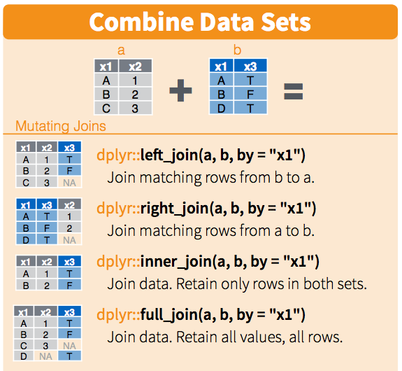

## Importing your data

Until now we have been working with simple data generated within R. 

However, most of the time we want to work with external data.

- Various sources and types of data: text file, images (geotif/raster).
- Most of the time either **.csv** or **.xls** formats.

## Data frames

Data frames are important objects in R which are created when reading a file.

Can be seen as an Excel tabular sheet:

> - **Lines are observations**
> - **Columns are variables**

A data frame can be seen as a matrix with the difference that **columns (variables) can be of different types** (numerics, dates, characters, etc.).

## Examples


```r
# See the first 6 rows of the mpg data frame (included in R)
head(mtcars) 
```

```
##                    mpg cyl disp  hp drat    wt  qsec vs am gear carb
## Mazda RX4         21.0   6  160 110 3.90 2.620 16.46  0  1    4    4
## Mazda RX4 Wag     21.0   6  160 110 3.90 2.875 17.02  0  1    4    4
## Datsun 710        22.8   4  108  93 3.85 2.320 18.61  1  1    4    1
## Hornet 4 Drive    21.4   6  258 110 3.08 3.215 19.44  1  0    3    1
## Hornet Sportabout 18.7   8  360 175 3.15 3.440 17.02  0  0    3    2
## Valiant           18.1   6  225 105 2.76 3.460 20.22  1  0    3    1
```

## Structure of a df

After you opened a data file, it is always a good idea to look the structure of the returned data frame. This ensure that all variables have the right types.


```r
str(mtcars) # str stands for structure
```

```
## 'data.frame':	32 obs. of  11 variables:
##  $ mpg : num  21 21 22.8 21.4 18.7 18.1 14.3 24.4 22.8 19.2 ...
##  $ cyl : num  6 6 4 6 8 6 8 4 4 6 ...
##  $ disp: num  160 160 108 258 360 ...
##  $ hp  : num  110 110 93 110 175 105 245 62 95 123 ...
##  $ drat: num  3.9 3.9 3.85 3.08 3.15 2.76 3.21 3.69 3.92 3.92 ...
##  $ wt  : num  2.62 2.88 2.32 3.21 3.44 ...
##  $ qsec: num  16.5 17 18.6 19.4 17 ...
##  $ vs  : num  0 0 1 1 0 1 0 1 1 1 ...
##  $ am  : num  1 1 1 0 0 0 0 0 0 0 ...
##  $ gear: num  4 4 4 3 3 3 3 4 4 4 ...
##  $ carb: num  4 4 1 1 2 1 4 2 2 4 ...
```

## CSV and Excel files

I recommend to use `readr` and `readxl` libraries for reading CSV and Excel files. These two libraries are not installed by default.

<center>
  
</center>


```r
install.packages("readr") # Package to read csv files
install.packages("readxl") # Package to read Excel files
```

----

### Reading Excel files


```r
library(readxl) # Load the readxl package
mydata <- read_excel("/path/to/myfile.xls")
mydata <- read_excel("/path/to/myfile.xlsx", sheet = 3)
```

### Reading csv files


```r
library(readr) # Load the readr package
mydata <- read_csv("/path/to/myfile.csv") # Read some data
```

Use `read_csv2()` if you are using CSV files produced with EU settings (`;` instead of `,` separator).

## Useful functions


```r
names(mtcars) # List column names
```

```
##  [1] "mpg"  "cyl"  "disp" "hp"   "drat" "wt"   "qsec" "vs"   "am"   "gear" "carb"
```

```r
nrow(mtcars) # Return the number of row (observations)
```

```
## [1] 32
```

```r
ncol(mtcars) # Return the number of column (variables)
```

```
## [1] 11
```

## Accessing elements of data frame

There are two main ways to access data of a data frame.

#### First method

The first way to access elements of a data frame consists in using **indexes** as we did for accessing matrix. 

For example, 


```r
mtcars[1, 3]
```

```
## [1] 160
```

----

Accessing columns of a data frame.


```r
mtcars[, 4] # Column 4 (i.e "hp")
```

```
##  [1] 110 110  93 110 175 105 245  62  95 123 123 180 180 180 205 215 230  66  52  65  97 150 150 245 175  66  91 113 264 175 335 109
```

----

Accessing rows of a data frame.


```r
mtcars[1, ] # First row 
```

```
##           mpg cyl disp  hp drat   wt  qsec vs am gear carb
## Mazda RX4  21   6  160 110  3.9 2.62 16.46  0  1    4    4
```

----

#### Second method

The second method to access elements of a data frame consists in using the `$` operator using the `df$variable` scheme.


```r
mtcars$cyl # Return the values of the vector named "cyl"
```

```
##  [1] 6 6 4 6 8 6 8 4 4 6 6 8 8 8 8 8 8 4 4 4 4 8 8 8 8 4 4 4 8 6 8 4
```

----

Using the second method makes things more obvious and easy to read since you don't have to wonder the position (indexes) of the variables in the data frame.


```r
mtcars$cyl[1:10] # first 10 values of the vector names "cyl"
```

```
##  [1] 6 6 4 6 8 6 8 4 4 6
```

## Quick-RStudio tip

> After typing the name of a data frame, the list of all variables within this data frame will appears. Use the keyboard to select the variable of interest. 

## Other file formats

There are many file format supported by R. This is a list of functions to use to open most used file format.

| **Data format**                    | **Function** | **Package** |
|------------------------------------|--------------|-------------|
| Comma separated values (.csv)      | read_csv()   | readr       |
| Excel (.xls, .xlsx)                | read_excel() | readxl      |
| Other text files (.txt, .dat, ...) | read_delim() | readr       |
| Stata                              | read_stata() | haven       |
| SPSS                               | read_spss()  | haven       |
| SAS                                | read_sas()   | haven       |
| Matlab file (.mat)                 | readMat()    | R.matlab    |


## Exercise {.exercises}

#### Exercise #1

Open and explore your data in R and start exploring them. 

If you already have you data for the class report it might be a good idea to see if you can import them into R.

> - Data types as expected?
> - How missing values (`NA`) have been handled by R?
> - Any problems?

## Data manipulation 

> It is often said that 80% of data analysis is spent on the cleaning and preparing data. And it's not just a first step, but it must be repeated many over the course of analysis as new problems come to light or new data is collected.

- Two main characteristics of good data manipulation:
    + **speed** (results are returned in reasonable time)
    + **elegance** (easy to use and understand what is going on)

## The tidyverse

> The tidyverse is an opinionated collection of R packages designed for data science. All packages share an underlying design philosophy, grammar, and data structures.

## The tidyverse

The tidyverse provides a set of packages which provides flexible tools for data manipulation.

<center>

</center>

<center>
    
</center>

## The tidyverse

The package is not included in the base installation of R.


```r
install.packages("tidyverse") # Install the tidyverse packages
```


```r
# Load all the packages inncluded in tidyverse
library(tidyverse)
```


You can refer to the printed **cheat sheet** for an overview of the package's functions.

## dplyr

All dplyr functions use the same scheme: the first argument to provide is a data frame.

| **Function**           | **Definition**                                                                                                           |
|--------------------|----------------------------------------------------------------------------------------------------------------------|
| filter(df, ...)    | Select a subset of the rows of a data frame.                                                                         |
| arrange(df, ...)   | Reorder rows of a data frame.                                                                                        |
| select(df, ...)    | Select columns of a data frame.                                                                                      |
| mutate(df, ...)    | Add new columns to a data frame.                                                                                     |
| summarise(df, ...) | Summarize a data frame into a single row. This function is very helpful in combination with the group_by() function. |
| group_by(df, ...)  | Group a data frame based on the specified columns.                                                                   |

## Lets practice!

To learn how to use these functions, we will use datasets from package `nycflights13` which we first need to install.


```r
install.packages("nycflights13") # Install a dataset package
```

## nycflights13

This package contains information about all flights that departed from New York (i.e., EWR, JFK and LGA) in 2013. 

For the following examples we are going to use **fights**, **planes**, **airports**, **airlines** tables.


```r
library(dplyr)
library(nycflights13) # Load the data, look at your workspace

data(flights)
data(planes)
data(airports)
data(airlines)
```

## Exploring the data

## flights


```r
str(flights)
```

```
## Classes 'tbl_df', 'tbl' and 'data.frame':	336776 obs. of  19 variables:
##  $ year          : int  2013 2013 2013 2013 2013 2013 2013 2013 2013 2013 ...
##  $ month         : int  1 1 1 1 1 1 1 1 1 1 ...
##  $ day           : int  1 1 1 1 1 1 1 1 1 1 ...
##  $ dep_time      : int  517 533 542 544 554 554 555 557 557 558 ...
##  $ sched_dep_time: int  515 529 540 545 600 558 600 600 600 600 ...
##  $ dep_delay     : num  2 4 2 -1 -6 -4 -5 -3 -3 -2 ...
##  $ arr_time      : int  830 850 923 1004 812 740 913 709 838 753 ...
##  $ sched_arr_time: int  819 830 850 1022 837 728 854 723 846 745 ...
##  $ arr_delay     : num  11 20 33 -18 -25 12 19 -14 -8 8 ...
##  $ carrier       : chr  "UA" "UA" "AA" "B6" ...
##  $ flight        : int  1545 1714 1141 725 461 1696 507 5708 79 301 ...
##  $ tailnum       : chr  "N14228" "N24211" "N619AA" "N804JB" ...
##  $ origin        : chr  "EWR" "LGA" "JFK" "JFK" ...
##  $ dest          : chr  "IAH" "IAH" "MIA" "BQN" ...
##  $ air_time      : num  227 227 160 183 116 150 158 53 140 138 ...
##  $ distance      : num  1400 1416 1089 1576 762 ...
##  $ hour          : num  5 5 5 5 6 5 6 6 6 6 ...
##  $ minute        : num  15 29 40 45 0 58 0 0 0 0 ...
##  $ time_hour     : POSIXct, format: "2013-01-01 05:00:00" "2013-01-01 05:00:00" "2013-01-01 05:00:00" "2013-01-01 05:00:00" ...
```


```r
?flights # Description of all variables included in the data frame
```

## planes


```r
str(planes)
```

```
## Classes 'tbl_df', 'tbl' and 'data.frame':	3322 obs. of  9 variables:
##  $ tailnum     : chr  "N10156" "N102UW" "N103US" "N104UW" ...
##  $ year        : int  2004 1998 1999 1999 2002 1999 1999 1999 1999 1999 ...
##  $ type        : chr  "Fixed wing multi engine" "Fixed wing multi engine" "Fixed wing multi engine" "Fixed wing multi engine" ...
##  $ manufacturer: chr  "EMBRAER" "AIRBUS INDUSTRIE" "AIRBUS INDUSTRIE" "AIRBUS INDUSTRIE" ...
##  $ model       : chr  "EMB-145XR" "A320-214" "A320-214" "A320-214" ...
##  $ engines     : int  2 2 2 2 2 2 2 2 2 2 ...
##  $ seats       : int  55 182 182 182 55 182 182 182 182 182 ...
##  $ speed       : int  NA NA NA NA NA NA NA NA NA NA ...
##  $ engine      : chr  "Turbo-fan" "Turbo-fan" "Turbo-fan" "Turbo-fan" ...
```


```r
?planes # Description of all variables included in the data frame
```

## airports


```r
str(airports)
```

```
## Classes 'tbl_df', 'tbl' and 'data.frame':	1458 obs. of  8 variables:
##  $ faa  : chr  "04G" "06A" "06C" "06N" ...
##  $ name : chr  "Lansdowne Airport" "Moton Field Municipal Airport" "Schaumburg Regional" "Randall Airport" ...
##  $ lat  : num  41.1 32.5 42 41.4 31.1 ...
##  $ lon  : num  -80.6 -85.7 -88.1 -74.4 -81.4 ...
##  $ alt  : int  1044 264 801 523 11 1593 730 492 1000 108 ...
##  $ tz   : num  -5 -6 -6 -5 -5 -5 -5 -5 -5 -8 ...
##  $ dst  : chr  "A" "A" "A" "A" ...
##  $ tzone: chr  "America/New_York" "America/Chicago" "America/Chicago" "America/New_York" ...
##  - attr(*, "spec")=
##   .. cols(
##   ..   id = col_integer(),
##   ..   name = col_character(),
##   ..   city = col_character(),
##   ..   country = col_character(),
##   ..   faa = col_character(),
##   ..   icao = col_character(),
##   ..   lat = col_double(),
##   ..   lon = col_double(),
##   ..   alt = col_integer(),
##   ..   tz = col_double(),
##   ..   dst = col_character(),
##   ..   tzone = col_character()
##   .. )
```


```r
?airports # Description of all variables included in the data frame
```

## airlines


```r
str(airlines)
```

```
## Classes 'tbl_df', 'tbl' and 'data.frame':	16 obs. of  2 variables:
##  $ carrier: chr  "9E" "AA" "AS" "B6" ...
##  $ name   : chr  "Endeavor Air Inc." "American Airlines Inc." "Alaska Airlines Inc." "JetBlue Airways" ...
```


```r
?airlines # Description of all variables included in the data frame
```

## Relationships between tables


## Filtering data

## filter

Most of the time you will want to work on subset observations of your data. 

- `filter()` allows you to select a subset of the rows of a data frame. 

- The first argument is the name of the data frame, and the second and subsequent are filtering expressions evaluated in the context of that data frame.

## Example

#### Select all flights with tail number equal to "N14228".


```r
filter(flights, tailnum == "N14228")
```

```
## # A tibble: 111 x 19
##     year month   day dep_time sched_dep_time dep_delay arr_time sched_arr_time arr_delay carrier flight tailnum origin dest  air_time distance  hour
##    <int> <int> <int>    <int>          <int>     <dbl>    <int>          <int>     <dbl> <chr>    <int> <chr>   <chr>  <chr>    <dbl>    <dbl> <dbl>
##  1  2013     1     1      517            515         2      830            819        11 UA        1545 N14228  EWR    IAH        227     1400     5
##  2  2013     1     8     1435           1440        -5     1717           1746       -29 UA        1579 N14228  EWR    MIA        150     1085    14
##  3  2013     1     9      717            700        17      812            815        -3 UA        1142 N14228  EWR    BOS         39      200     7
##  4  2013     1     9     1143           1144        -1     1425           1445       -20 UA        1707 N14228  EWR    TPA        149      997    11
##  5  2013     1    13      835            824        11     1030            951        39 UA        1572 N14228  EWR    BOS         43      200     8
##  6  2013     1    16     1829           1730        59     2117           2023        54 UA        1637 N14228  EWR    TPA        144      997    17
##  7  2013     1    22     1902           1808        54     2214           2106        68 UA        1269 N14228  EWR    PBI        163     1023    18
##  8  2013     1    23     1050           1056        -6     1143           1208       -25 UA        1047 N14228  EWR    BOS         39      200    10
##  9  2013     1    23     1533           1529         4     1641           1645        -4 UA        1116 N14228  EWR    BOS         47      200    15
## 10  2013     1    25      724            720         4     1000           1023       -23 UA        1724 N14228  EWR    PBI        137     1023     7
## # … with 101 more rows, and 2 more variables: minute <dbl>, time_hour <dttm>
```

## Example

#### Select all flights with a departure delay >= 180 minutes.


```r
filter(flights, dep_delay >= 180)
```

```
## # A tibble: 3,945 x 19
##     year month   day dep_time sched_dep_time dep_delay arr_time sched_arr_time arr_delay carrier flight tailnum origin dest  air_time distance  hour
##    <int> <int> <int>    <int>          <int>     <dbl>    <int>          <int>     <dbl> <chr>    <int> <chr>   <chr>  <chr>    <dbl>    <dbl> <dbl>
##  1  2013     1     1      848           1835       853     1001           1950       851 MQ        3944 N942MQ  JFK    BWI         41      184    18
##  2  2013     1     1     1815           1325       290     2120           1542       338 EV        4417 N17185  EWR    OMA        213     1134    13
##  3  2013     1     1     1842           1422       260     1958           1535       263 EV        4633 N18120  EWR    BTV         46      266    14
##  4  2013     1     1     2006           1630       216     2230           1848       222 EV        4644 N14972  EWR    SAV        121      708    16
##  5  2013     1     1     2115           1700       255     2330           1920       250 9E        3347 N924XJ  JFK    CVG        115      589    17
##  6  2013     1     1     2205           1720       285       46           2040       246 AA        1999 N5DNAA  EWR    MIA        146     1085    17
##  7  2013     1     1     2312           2000       192       21           2110       191 EV        4312 N13958  EWR    DCA         44      199    20
##  8  2013     1     1     2343           1724       379      314           1938       456 EV        4321 N21197  EWR    MCI        222     1092    17
##  9  2013     1     2     1244            900       224     1431           1104       207 EV        4412 N13958  EWR    MYR         94      550     9
## 10  2013     1     2     1332            904       268     1616           1128       288 EV        4364 N41104  EWR    MCI        203     1092     9
## # … with 3,935 more rows, and 2 more variables: minute <dbl>, time_hour <dttm>
```

## Example

#### Select all flights from carriers "MQ" or "EV".


```r
filter(flights, carrier ==  "MQ" | carrier == "EV")
```

```
## # A tibble: 80,570 x 19
##     year month   day dep_time sched_dep_time dep_delay arr_time sched_arr_time arr_delay carrier flight tailnum origin dest  air_time distance  hour
##    <int> <int> <int>    <int>          <int>     <dbl>    <int>          <int>     <dbl> <chr>    <int> <chr>   <chr>  <chr>    <dbl>    <dbl> <dbl>
##  1  2013     1     1      557            600        -3      709            723       -14 EV        5708 N829AS  LGA    IAD         53      229     6
##  2  2013     1     1      600            600         0      837            825        12 MQ        4650 N542MQ  LGA    ATL        134      762     6
##  3  2013     1     1      602            605        -3      821            805        16 MQ        4401 N730MQ  LGA    DTW        105      502     6
##  4  2013     1     1      608            600         8      807            735        32 MQ        3768 N9EAMQ  EWR    ORD        139      719     6
##  5  2013     1     1      624            630        -6      909            840        29 EV        4626 N11107  EWR    MSP        190     1008     6
##  6  2013     1     1      624            630        -6      840            830        10 MQ        4599 N518MQ  LGA    MSP        166     1020     6
##  7  2013     1     1      632            608        24      740            728        12 EV        4144 N13553  EWR    IAD         52      212     6
##  8  2013     1     1      656            705        -9     1007            940        27 MQ        4534 N722MQ  LGA    XNA        233     1147     7
##  9  2013     1     1      749            710        39      939            850        49 MQ        3737 N508MQ  EWR    ORD        148      719     7
## 10  2013     1     1      800            810       -10      949            955        -6 MQ        4406 N828MQ  JFK    RDU         80      427     8
## # … with 80,560 more rows, and 2 more variables: minute <dbl>, time_hour <dttm>
```

## Example

#### Select all flights from carriers MQ OR EV.


```r
filter(flights, carrier %in% c("MQ", "EV"))
```

```
## # A tibble: 80,570 x 19
##     year month   day dep_time sched_dep_time dep_delay arr_time sched_arr_time arr_delay carrier flight tailnum origin dest  air_time distance  hour
##    <int> <int> <int>    <int>          <int>     <dbl>    <int>          <int>     <dbl> <chr>    <int> <chr>   <chr>  <chr>    <dbl>    <dbl> <dbl>
##  1  2013     1     1      557            600        -3      709            723       -14 EV        5708 N829AS  LGA    IAD         53      229     6
##  2  2013     1     1      600            600         0      837            825        12 MQ        4650 N542MQ  LGA    ATL        134      762     6
##  3  2013     1     1      602            605        -3      821            805        16 MQ        4401 N730MQ  LGA    DTW        105      502     6
##  4  2013     1     1      608            600         8      807            735        32 MQ        3768 N9EAMQ  EWR    ORD        139      719     6
##  5  2013     1     1      624            630        -6      909            840        29 EV        4626 N11107  EWR    MSP        190     1008     6
##  6  2013     1     1      624            630        -6      840            830        10 MQ        4599 N518MQ  LGA    MSP        166     1020     6
##  7  2013     1     1      632            608        24      740            728        12 EV        4144 N13553  EWR    IAD         52      212     6
##  8  2013     1     1      656            705        -9     1007            940        27 MQ        4534 N722MQ  LGA    XNA        233     1147     7
##  9  2013     1     1      749            710        39      939            850        49 MQ        3737 N508MQ  EWR    ORD        148      719     7
## 10  2013     1     1      800            810       -10      949            955        -6 MQ        4406 N828MQ  JFK    RDU         80      427     8
## # … with 80,560 more rows, and 2 more variables: minute <dbl>, time_hour <dttm>
```

## arrange

> - `arrange()` works similarly to `filter()` except that instead of filtering or selecting rows, it reorders them. 

> - The function takes a data frame, and a set of column names (or more complicated expressions) to order by.

## Example

#### Order flights on the departure delay.


```r
arrange(flights, dep_delay)
```

```
## # A tibble: 336,776 x 19
##     year month   day dep_time sched_dep_time dep_delay arr_time sched_arr_time arr_delay carrier flight tailnum origin dest  air_time distance  hour
##    <int> <int> <int>    <int>          <int>     <dbl>    <int>          <int>     <dbl> <chr>    <int> <chr>   <chr>  <chr>    <dbl>    <dbl> <dbl>
##  1  2013    12     7     2040           2123       -43       40           2352        48 B6          97 N592JB  JFK    DEN        265     1626    21
##  2  2013     2     3     2022           2055       -33     2240           2338       -58 DL        1715 N612DL  LGA    MSY        162     1183    20
##  3  2013    11    10     1408           1440       -32     1549           1559       -10 EV        5713 N825AS  LGA    IAD         52      229    14
##  4  2013     1    11     1900           1930       -30     2233           2243       -10 DL        1435 N934DL  LGA    TPA        139     1010    19
##  5  2013     1    29     1703           1730       -27     1947           1957       -10 F9         837 N208FR  LGA    DEN        250     1620    17
##  6  2013     8     9      729            755       -26     1002            955         7 MQ        3478 N711MQ  LGA    DTW         88      502     7
##  7  2013    10    23     1907           1932       -25     2143           2143         0 EV        4361 N13994  EWR    TYS        111      631    19
##  8  2013     3    30     2030           2055       -25     2213           2250       -37 MQ        4573 N725MQ  LGA    DTW         87      502    20
##  9  2013     3     2     1431           1455       -24     1601           1631       -30 9E        3318 N929XJ  JFK    BUF         55      301    14
## 10  2013     5     5      934            958       -24     1225           1309       -44 B6         375 N531JB  LGA    FLL        150     1076     9
## # … with 336,766 more rows, and 2 more variables: minute <dbl>, time_hour <dttm>
```

## Example

#### Order flights on the departure delay and by arrival delay


```r
arrange(flights, dep_delay, arr_delay)
```

```
## # A tibble: 336,776 x 19
##     year month   day dep_time sched_dep_time dep_delay arr_time sched_arr_time arr_delay carrier flight tailnum origin dest  air_time distance  hour
##    <int> <int> <int>    <int>          <int>     <dbl>    <int>          <int>     <dbl> <chr>    <int> <chr>   <chr>  <chr>    <dbl>    <dbl> <dbl>
##  1  2013    12     7     2040           2123       -43       40           2352        48 B6          97 N592JB  JFK    DEN        265     1626    21
##  2  2013     2     3     2022           2055       -33     2240           2338       -58 DL        1715 N612DL  LGA    MSY        162     1183    20
##  3  2013    11    10     1408           1440       -32     1549           1559       -10 EV        5713 N825AS  LGA    IAD         52      229    14
##  4  2013     1    11     1900           1930       -30     2233           2243       -10 DL        1435 N934DL  LGA    TPA        139     1010    19
##  5  2013     1    29     1703           1730       -27     1947           1957       -10 F9         837 N208FR  LGA    DEN        250     1620    17
##  6  2013     8     9      729            755       -26     1002            955         7 MQ        3478 N711MQ  LGA    DTW         88      502     7
##  7  2013     3    30     2030           2055       -25     2213           2250       -37 MQ        4573 N725MQ  LGA    DTW         87      502    20
##  8  2013    10    23     1907           1932       -25     2143           2143         0 EV        4361 N13994  EWR    TYS        111      631    19
##  9  2013     5     5      934            958       -24     1225           1309       -44 B6         375 N531JB  LGA    FLL        150     1076     9
## 10  2013     9    18     1631           1655       -24     1812           1845       -33 AA        2223 N4XXAA  LGA    STL        125      888    16
## # … with 336,766 more rows, and 2 more variables: minute <dbl>, time_hour <dttm>
```

## Example

#### Order flights on the departure delay and by *decreasing* arrival delay


```r
arrange(flights, dep_delay, desc(arr_delay)) # Using desc()
```

```
## # A tibble: 336,776 x 19
##     year month   day dep_time sched_dep_time dep_delay arr_time sched_arr_time arr_delay carrier flight tailnum origin dest  air_time distance  hour
##    <int> <int> <int>    <int>          <int>     <dbl>    <int>          <int>     <dbl> <chr>    <int> <chr>   <chr>  <chr>    <dbl>    <dbl> <dbl>
##  1  2013    12     7     2040           2123       -43       40           2352        48 B6          97 N592JB  JFK    DEN        265     1626    21
##  2  2013     2     3     2022           2055       -33     2240           2338       -58 DL        1715 N612DL  LGA    MSY        162     1183    20
##  3  2013    11    10     1408           1440       -32     1549           1559       -10 EV        5713 N825AS  LGA    IAD         52      229    14
##  4  2013     1    11     1900           1930       -30     2233           2243       -10 DL        1435 N934DL  LGA    TPA        139     1010    19
##  5  2013     1    29     1703           1730       -27     1947           1957       -10 F9         837 N208FR  LGA    DEN        250     1620    17
##  6  2013     8     9      729            755       -26     1002            955         7 MQ        3478 N711MQ  LGA    DTW         88      502     7
##  7  2013    10    23     1907           1932       -25     2143           2143         0 EV        4361 N13994  EWR    TYS        111      631    19
##  8  2013     3    30     2030           2055       -25     2213           2250       -37 MQ        4573 N725MQ  LGA    DTW         87      502    20
##  9  2013     5    14      914            938       -24     1143           1204       -21 9E        4065 N8747B  LGA    SDF        107      659     9
## 10  2013     3     2     1431           1455       -24     1601           1631       -30 9E        3318 N929XJ  JFK    BUF         55      301    14
## # … with 336,766 more rows, and 2 more variables: minute <dbl>, time_hour <dttm>
```

## select

> - `select()` is used to extract columns from a data frame.
> - Useful when you want to perform data analysis on specific columns and not the complete dataset.

## Example

#### Select "faa" and "name" columns from the airports data frame.


```r
select(airports, faa, name)
```

```
## # A tibble: 1,458 x 2
##    faa   name                          
##    <chr> <chr>                         
##  1 04G   Lansdowne Airport             
##  2 06A   Moton Field Municipal Airport 
##  3 06C   Schaumburg Regional           
##  4 06N   Randall Airport               
##  5 09J   Jekyll Island Airport         
##  6 0A9   Elizabethton Municipal Airport
##  7 0G6   Williams County Airport       
##  8 0G7   Finger Lakes Regional Airport 
##  9 0P2   Shoestring Aviation Airfield  
## 10 0S9   Jefferson County Intl         
## # … with 1,448 more rows
```

## Example

You can also use `select()` to remove columns by using `-` in front of the columns you want to remove.


```r
select(airports, -faa, -name)
```

```
## # A tibble: 1,458 x 6
##      lat    lon   alt    tz dst   tzone              
##    <dbl>  <dbl> <int> <dbl> <chr> <chr>              
##  1  41.1  -80.6  1044    -5 A     America/New_York   
##  2  32.5  -85.7   264    -6 A     America/Chicago    
##  3  42.0  -88.1   801    -6 A     America/Chicago    
##  4  41.4  -74.4   523    -5 A     America/New_York   
##  5  31.1  -81.4    11    -5 A     America/New_York   
##  6  36.4  -82.2  1593    -5 A     America/New_York   
##  7  41.5  -84.5   730    -5 A     America/New_York   
##  8  42.9  -76.8   492    -5 A     America/New_York   
##  9  39.8  -76.6  1000    -5 U     America/New_York   
## 10  48.1 -123.    108    -8 A     America/Los_Angeles
## # … with 1,448 more rows
```

## mutate and transmute

> - The `mutate()` and `transmute()` functions are used to add columns to a data frame.
> - The difference between both functions is that mutate adds new variables and preserves existing while transmute drops existing variables.

## Example

#### Add a new column named "distance_km" which converts mile distances into km distances.


```r
mutate(flights, distance_km = distance / 0.62137)
```

```
## # A tibble: 336,776 x 20
##     year month   day dep_time sched_dep_time dep_delay arr_time sched_arr_time arr_delay carrier flight tailnum origin dest  air_time distance  hour
##    <int> <int> <int>    <int>          <int>     <dbl>    <int>          <int>     <dbl> <chr>    <int> <chr>   <chr>  <chr>    <dbl>    <dbl> <dbl>
##  1  2013     1     1      517            515         2      830            819        11 UA        1545 N14228  EWR    IAH        227     1400     5
##  2  2013     1     1      533            529         4      850            830        20 UA        1714 N24211  LGA    IAH        227     1416     5
##  3  2013     1     1      542            540         2      923            850        33 AA        1141 N619AA  JFK    MIA        160     1089     5
##  4  2013     1     1      544            545        -1     1004           1022       -18 B6         725 N804JB  JFK    BQN        183     1576     5
##  5  2013     1     1      554            600        -6      812            837       -25 DL         461 N668DN  LGA    ATL        116      762     6
##  6  2013     1     1      554            558        -4      740            728        12 UA        1696 N39463  EWR    ORD        150      719     5
##  7  2013     1     1      555            600        -5      913            854        19 B6         507 N516JB  EWR    FLL        158     1065     6
##  8  2013     1     1      557            600        -3      709            723       -14 EV        5708 N829AS  LGA    IAD         53      229     6
##  9  2013     1     1      557            600        -3      838            846        -8 B6          79 N593JB  JFK    MCO        140      944     6
## 10  2013     1     1      558            600        -2      753            745         8 AA         301 N3ALAA  LGA    ORD        138      733     6
## # … with 336,766 more rows, and 3 more variables: minute <dbl>, time_hour <dttm>, distance_km <dbl>
```

## Example

`transmute()` drops all other columns.


```r
transmute(flights, distance_km = distance / 0.62137)
```

```
## # A tibble: 336,776 x 1
##    distance_km
##          <dbl>
##  1       2253.
##  2       2279.
##  3       1753.
##  4       2536.
##  5       1226.
##  6       1157.
##  7       1714.
##  8        369.
##  9       1519.
## 10       1180.
## # … with 336,766 more rows
```

## Example

It is also possible to add many new variable in a single operation.


```r
transmute(flights, distance_km = distance / 0.62137,
          distance_knot = distance / 1.15078)
```

```
## # A tibble: 336,776 x 2
##    distance_km distance_knot
##          <dbl>         <dbl>
##  1       2253.         1217.
##  2       2279.         1230.
##  3       1753.          946.
##  4       2536.         1370.
##  5       1226.          662.
##  6       1157.          625.
##  7       1714.          925.
##  8        369.          199.
##  9       1519.          820.
## 10       1180.          637.
## # … with 336,766 more rows
```

## summarise

> - The `summarise()` function allows to summarise columns from a dataframe.
> - **Compress** a data frame into single values (i.e. one row).

Hence, you have to provide a function that will be used to calculate a certain value.

## Example

#### Calculate the average departure and arrival delays in the flights table.


```r
summarise(flights,
          average_departure_delay = mean(dep_delay),
          average_arrival_delay = mean(arr_delay))
```

```
## # A tibble: 1 x 2
##   average_departure_delay average_arrival_delay
##                     <dbl>                 <dbl>
## 1                      NA                    NA
```

What is going on?

## Example

#### Calculate the average departure and arrival delays in the flights table.


```r
summarise(flights,
          average_departure_delay = mean(dep_delay, na.rm = TRUE),
          average_arrival_delay = mean(arr_delay, na.rm = TRUE))
```

```
## # A tibble: 1 x 2
##   average_departure_delay average_arrival_delay
##                     <dbl>                 <dbl>
## 1                    12.6                  6.90
```

## Working with grouped data

> - Alone, the `summarise()` function is not really helpful because it collapses a data frame to a single row.
> - Usually we want to work on grouped data.
> - `group_by()` "prepares" a data frame to send it to the `summarise()` function.

## Example

#### Calculate the average departure delay for each carrier.


```r
grouped <- group_by(flights, carrier) # Group flights by carrier

summarise(grouped, 
          average_departure_delay = mean(dep_delay, na.rm = TRUE))
```

----


```
## # A tibble: 16 x 2
##    carrier average_departure_delay
##    <chr>                     <dbl>
##  1 9E                        16.7 
##  2 AA                         8.59
##  3 AS                         5.80
##  4 B6                        13.0 
##  5 DL                         9.26
##  6 EV                        20.0 
##  7 F9                        20.2 
##  8 FL                        18.7 
##  9 HA                         4.90
## 10 MQ                        10.6 
## 11 OO                        12.6 
## 12 UA                        12.1 
## 13 US                         3.78
## 14 VX                        12.9 
## 15 WN                        17.7 
## 16 YV                        19.0
```

## Example

It might be interested to know how many observations were used in each group to compute the average. To do so, we can use the `n()` function.


```r
grouped <- group_by(flights, carrier) # Group flights by carrier

summarise(grouped, 
          average_departure_delay = mean(dep_delay, na.rm = TRUE),
          number_of_observation = n())
```

----


```
## # A tibble: 16 x 3
##    carrier average_departure_delay number_of_observation
##    <chr>                     <dbl>                 <int>
##  1 9E                        16.7                  18460
##  2 AA                         8.59                 32729
##  3 AS                         5.80                   714
##  4 B6                        13.0                  54635
##  5 DL                         9.26                 48110
##  6 EV                        20.0                  54173
##  7 F9                        20.2                    685
##  8 FL                        18.7                   3260
##  9 HA                         4.90                   342
## 10 MQ                        10.6                  26397
## 11 OO                        12.6                     32
## 12 UA                        12.1                  58665
## 13 US                         3.78                 20536
## 14 VX                        12.9                   5162
## 15 WN                        17.7                  12275
## 16 YV                        19.0                    601
```

## Example

It is possible to summarise more than one column at once.


```r
grouped <- group_by(flights, carrier) # Group flights by carrier

summarise(grouped,
          number_of_flight = n(),
          average_departure_delay = mean(dep_delay, na.rm = TRUE),
          min_delay = min(dep_delay, na.rm = TRUE),
          max_delay = max(dep_delay, na.rm = TRUE))
```

----


```
## # A tibble: 16 x 5
##    carrier number_of_flight average_departure_delay min_delay max_delay
##    <chr>              <int>                   <dbl>     <dbl>     <dbl>
##  1 9E                 18460                   16.7        -24       747
##  2 AA                 32729                    8.59       -24      1014
##  3 AS                   714                    5.80       -21       225
##  4 B6                 54635                   13.0        -43       502
##  5 DL                 48110                    9.26       -33       960
##  6 EV                 54173                   20.0        -32       548
##  7 F9                   685                   20.2        -27       853
##  8 FL                  3260                   18.7        -22       602
##  9 HA                   342                    4.90       -16      1301
## 10 MQ                 26397                   10.6        -26      1137
## 11 OO                    32                   12.6        -14       154
## 12 UA                 58665                   12.1        -20       483
## 13 US                 20536                    3.78       -19       500
## 14 VX                  5162                   12.9        -20       653
## 15 WN                 12275                   17.7        -13       471
## 16 YV                   601                   19.0        -16       387
```

## Exercise {.exercises}

For this exercise, we will look at statistics of R packages downloaded on 2015-11-21. You can load the data as follow:


```r
downloads <- read_csv("data/2018-07-15.csv.gz") 
```

#### Question #1

Which package has been downloaded the most that day?

## Exercise {.exercises}

#### Question #2

From which countries people downloaded the most packages?

## Exercise {.exercises}

#### Question #3

How many packages have been downloaded that day from people in Denmark?

## Joining tables

## Joining tables

- Data are rarely stored in a single data frame.

- Good database practices recommend to have similar data in separate tables.

- Joins are used to "merge" data frame together.

## Graphical view

<center>

<figure>



<figcaption>Source: http://blog.rstudio.org/2015/01/09/dplyr-0-4-0/</figcaption>
</figure>

</center>


## Types of join

<center>

<figure>


<figcaption>Source: http://bit.ly/1QZ8Oil</figcaption>
</figure>

</center>

## Joins in R

There are many ways of joining tables (data frames) in R. We will however focus on the merging tools offered by the package `dplyr`.

## Examples

To understand how joins work we will create two small data frames from data in `nycflights13`.


```r
flights2 <- select(flights, year, month, day, hour, origin)
flights2
```

```
## # A tibble: 336,776 x 5
##     year month   day  hour origin
##    <int> <int> <int> <dbl> <chr> 
##  1  2013     1     1     5 EWR   
##  2  2013     1     1     5 LGA   
##  3  2013     1     1     5 JFK   
##  4  2013     1     1     5 JFK   
##  5  2013     1     1     6 LGA   
##  6  2013     1     1     5 EWR   
##  7  2013     1     1     6 EWR   
##  8  2013     1     1     6 LGA   
##  9  2013     1     1     6 JFK   
## 10  2013     1     1     6 LGA   
## # … with 336,766 more rows
```

## Examples


```r
airports2 <- select(airports, faa, name)
airports2
```

```
## # A tibble: 1,458 x 2
##    faa   name                          
##    <chr> <chr>                         
##  1 04G   Lansdowne Airport             
##  2 06A   Moton Field Municipal Airport 
##  3 06C   Schaumburg Regional           
##  4 06N   Randall Airport               
##  5 09J   Jekyll Island Airport         
##  6 0A9   Elizabethton Municipal Airport
##  7 0G6   Williams County Airport       
##  8 0G7   Finger Lakes Regional Airport 
##  9 0P2   Shoestring Aviation Airfield  
## 10 0S9   Jefferson County Intl         
## # … with 1,448 more rows
```

## left join

With a left join, all observations from table A are keep and only observations from table B that match will be merged.


```r
# By default, dplyr will merge using all common columns.
left_join(flights2, airports2)
```

```
## Error: `by` required, because the data sources have no common variables
```

## left join

With a left join, all observations from table A are keep and only observations from table B that match will be merged.


```r
# By default, dplyr will merge using all commun columns.
left_join(flights2, airports2, by = c("origin" = "faa"))
```

```
## # A tibble: 336,776 x 6
##     year month   day  hour origin name               
##    <int> <int> <int> <dbl> <chr>  <chr>              
##  1  2013     1     1     5 EWR    Newark Liberty Intl
##  2  2013     1     1     5 LGA    La Guardia         
##  3  2013     1     1     5 JFK    John F Kennedy Intl
##  4  2013     1     1     5 JFK    John F Kennedy Intl
##  5  2013     1     1     6 LGA    La Guardia         
##  6  2013     1     1     5 EWR    Newark Liberty Intl
##  7  2013     1     1     6 EWR    Newark Liberty Intl
##  8  2013     1     1     6 LGA    La Guardia         
##  9  2013     1     1     6 JFK    John F Kennedy Intl
## 10  2013     1     1     6 LGA    La Guardia         
## # … with 336,766 more rows
```

## left join

**Attention, the order is important!**


```r
left_join(airports2, flights2, by = c("faa" = "origin"))
```

```
## # A tibble: 338,231 x 6
##    faa   name                            year month   day  hour
##    <chr> <chr>                          <int> <int> <int> <dbl>
##  1 04G   Lansdowne Airport                 NA    NA    NA    NA
##  2 06A   Moton Field Municipal Airport     NA    NA    NA    NA
##  3 06C   Schaumburg Regional               NA    NA    NA    NA
##  4 06N   Randall Airport                   NA    NA    NA    NA
##  5 09J   Jekyll Island Airport             NA    NA    NA    NA
##  6 0A9   Elizabethton Municipal Airport    NA    NA    NA    NA
##  7 0G6   Williams County Airport           NA    NA    NA    NA
##  8 0G7   Finger Lakes Regional Airport     NA    NA    NA    NA
##  9 0P2   Shoestring Aviation Airfield      NA    NA    NA    NA
## 10 0S9   Jefferson County Intl             NA    NA    NA    NA
## # … with 338,221 more rows
```

## right join

With a right join, all observations from table B are keep and only observations from table A that match will be merged.


```r
# This is the same as the previous "inverted" left join
right_join(flights2, airports2, by = c("origin" = "faa"))
```

```
## # A tibble: 338,231 x 6
##     year month   day  hour origin name                          
##    <int> <int> <int> <dbl> <chr>  <chr>                         
##  1    NA    NA    NA    NA 04G    Lansdowne Airport             
##  2    NA    NA    NA    NA 06A    Moton Field Municipal Airport 
##  3    NA    NA    NA    NA 06C    Schaumburg Regional           
##  4    NA    NA    NA    NA 06N    Randall Airport               
##  5    NA    NA    NA    NA 09J    Jekyll Island Airport         
##  6    NA    NA    NA    NA 0A9    Elizabethton Municipal Airport
##  7    NA    NA    NA    NA 0G6    Williams County Airport       
##  8    NA    NA    NA    NA 0G7    Finger Lakes Regional Airport 
##  9    NA    NA    NA    NA 0P2    Shoestring Aviation Airfield  
## 10    NA    NA    NA    NA 0S9    Jefferson County Intl         
## # … with 338,221 more rows
```

## inner join

With a inner join, only observations that match both tables are kept.


```r
# Here the order is not important.
inner_join(flights2, airports2, by = c("origin" = "faa"))
```

```
## # A tibble: 336,776 x 6
##     year month   day  hour origin name               
##    <int> <int> <int> <dbl> <chr>  <chr>              
##  1  2013     1     1     5 EWR    Newark Liberty Intl
##  2  2013     1     1     5 LGA    La Guardia         
##  3  2013     1     1     5 JFK    John F Kennedy Intl
##  4  2013     1     1     5 JFK    John F Kennedy Intl
##  5  2013     1     1     6 LGA    La Guardia         
##  6  2013     1     1     5 EWR    Newark Liberty Intl
##  7  2013     1     1     6 EWR    Newark Liberty Intl
##  8  2013     1     1     6 LGA    La Guardia         
##  9  2013     1     1     6 JFK    John F Kennedy Intl
## 10  2013     1     1     6 LGA    La Guardia         
## # … with 336,766 more rows
```

## full join

With a full join, **all observations** from both tables are kept.


```r
full_join(flights2, airports2, by = c("origin" = "faa"))
```

```
## # A tibble: 338,231 x 6
##     year month   day  hour origin name               
##    <int> <int> <int> <dbl> <chr>  <chr>              
##  1  2013     1     1     5 EWR    Newark Liberty Intl
##  2  2013     1     1     5 LGA    La Guardia         
##  3  2013     1     1     5 JFK    John F Kennedy Intl
##  4  2013     1     1     5 JFK    John F Kennedy Intl
##  5  2013     1     1     6 LGA    La Guardia         
##  6  2013     1     1     5 EWR    Newark Liberty Intl
##  7  2013     1     1     6 EWR    Newark Liberty Intl
##  8  2013     1     1     6 LGA    La Guardia         
##  9  2013     1     1     6 JFK    John F Kennedy Intl
## 10  2013     1     1     6 LGA    La Guardia         
## # … with 338,221 more rows
```

## anti join

With an anti join, only observations from table A that do not match table B are kept. 


```r
# Which airports do not match flights.
anti_join(airports2, flights2, by = c("faa" = "origin"))
```

```
## # A tibble: 1,455 x 2
##    faa   name                          
##    <chr> <chr>                         
##  1 04G   Lansdowne Airport             
##  2 06A   Moton Field Municipal Airport 
##  3 06C   Schaumburg Regional           
##  4 06N   Randall Airport               
##  5 09J   Jekyll Island Airport         
##  6 0A9   Elizabethton Municipal Airport
##  7 0G6   Williams County Airport       
##  8 0G7   Finger Lakes Regional Airport 
##  9 0P2   Shoestring Aviation Airfield  
## 10 0S9   Jefferson County Intl         
## # … with 1,445 more rows
```

## Exercise {.exercises}

#### Exercise #1

First, load the statistics of R packages downloaded on 2015-11-21 and countries ISO codes as follow:


```r
# http://cran-logs.rstudio.com/2018/2018-07-15.csv.gz
downloads <- read_csv("data/2018-07-15.csv.gz")

countries <- read_csv("data/countries_ISO.csv")
```

From which countries **there were no** packages downloaded this particular date?

## Tidy data

## Tidy data 

In a tidy data set, each row correspond to an **observation** whereas each column is a **variable**.

Tidying a dataset consists in cleaning and structuring datasets to facilitate analysis.

## What is a messy dataset?

<small>
https://cran.r-project.org/web/packages/tidyr/vignettes/tidy-data.html
</small>

There are five main common problems that define a messy dataset:

1. Column headers are values, not variable names.
2. Multiple variables are stored in one column.
3. Variables are stored in both rows and columns.
4. Multiple types of observational units are stored in the same table.
5. A single observational unit is stored in multiple tables.

## Is there a solution?

Of course! Most of these problems can be easily addressed with little effort using the `tidyr` package (included in tidyverse). 


```r
 # To install it alone if you have not installed tidyverse
install.packages("tidyr")
library(tidyr)
```

You can refer to the printed **cheat sheet** for an overview of the package's functions.

## Column headers are values, not variable name

## The messy data

The following dataset explores the relationship between income and religion in the US. 


```r
messy <- read_csv("https://goo.gl/4rjDWu")
```

## The messy data

Take a minute to look at the following table to find what is the main problems.

<small>
<!-- html table generated in R 3.5.2 by xtable 1.8-2 package -->
<!-- Fri Feb 15 11:00:18 2019 -->
<table border=1>
<tr> <th>  </th> <th> religion </th> <th> &lt;$10k </th> <th> $10-20k </th> <th> $20-30k </th> <th> $30-40k </th> <th> $40-50k </th> <th> $50-75k </th> <th> $75-100k </th> <th> $100-150k </th> <th> &gt;150k </th> <th> Don't know/refused </th>  </tr>
  <tr> <td align="right"> 1 </td> <td> Agnostic </td> <td align="right"> 27.00 </td> <td align="right"> 34.00 </td> <td align="right"> 60.00 </td> <td align="right"> 81.00 </td> <td align="right"> 76.00 </td> <td align="right"> 137.00 </td> <td align="right"> 122.00 </td> <td align="right"> 109.00 </td> <td align="right"> 84.00 </td> <td align="right"> 96.00 </td> </tr>
  <tr> <td align="right"> 2 </td> <td> Atheist </td> <td align="right"> 12.00 </td> <td align="right"> 27.00 </td> <td align="right"> 37.00 </td> <td align="right"> 52.00 </td> <td align="right"> 35.00 </td> <td align="right"> 70.00 </td> <td align="right"> 73.00 </td> <td align="right"> 59.00 </td> <td align="right"> 74.00 </td> <td align="right"> 76.00 </td> </tr>
  <tr> <td align="right"> 3 </td> <td> Buddhist </td> <td align="right"> 27.00 </td> <td align="right"> 21.00 </td> <td align="right"> 30.00 </td> <td align="right"> 34.00 </td> <td align="right"> 33.00 </td> <td align="right"> 58.00 </td> <td align="right"> 62.00 </td> <td align="right"> 39.00 </td> <td align="right"> 53.00 </td> <td align="right"> 54.00 </td> </tr>
  <tr> <td align="right"> 4 </td> <td> Catholic </td> <td align="right"> 418.00 </td> <td align="right"> 617.00 </td> <td align="right"> 732.00 </td> <td align="right"> 670.00 </td> <td align="right"> 638.00 </td> <td align="right"> 1116.00 </td> <td align="right"> 949.00 </td> <td align="right"> 792.00 </td> <td align="right"> 633.00 </td> <td align="right"> 1489.00 </td> </tr>
  <tr> <td align="right"> 5 </td> <td> Don’t know/refused </td> <td align="right"> 15.00 </td> <td align="right"> 14.00 </td> <td align="right"> 15.00 </td> <td align="right"> 11.00 </td> <td align="right"> 10.00 </td> <td align="right"> 35.00 </td> <td align="right"> 21.00 </td> <td align="right"> 17.00 </td> <td align="right"> 18.00 </td> <td align="right"> 116.00 </td> </tr>
  <tr> <td align="right"> 6 </td> <td> Evangelical Prot </td> <td align="right"> 575.00 </td> <td align="right"> 869.00 </td> <td align="right"> 1064.00 </td> <td align="right"> 982.00 </td> <td align="right"> 881.00 </td> <td align="right"> 1486.00 </td> <td align="right"> 949.00 </td> <td align="right"> 723.00 </td> <td align="right"> 414.00 </td> <td align="right"> 1529.00 </td> </tr>
   </table>
</small>

## The problem

#### Column headers are values, not variable names

What we need to do here is to **gather** information that is spread in the column names.

This is done using the `gather(df, key, value)` function where `df` is a data frame, `key` is the new column name that will contain the values of the data spread in the old dataframe and `value` is the name of the new column that will contain the actual values.

We can also specify variables that we do not need to tidy using the `-var` operator. In this case, `-religion`.

## gather


```r
# Tidy the data frame (2 new columns and keep "religion" as is).
fixed <- gather(messy, income, frequency, -religion)
```

<small>
<!-- html table generated in R 3.5.2 by xtable 1.8-2 package -->
<!-- Fri Feb 15 11:00:18 2019 -->
<table border=1>
<tr> <th>  </th> <th> religion </th> <th> income </th> <th> frequency </th>  </tr>
  <tr> <td align="right"> 1 </td> <td> Agnostic </td> <td> &lt;$10k </td> <td align="right"> 27.00 </td> </tr>
  <tr> <td align="right"> 2 </td> <td> Atheist </td> <td> &lt;$10k </td> <td align="right"> 12.00 </td> </tr>
  <tr> <td align="right"> 3 </td> <td> Buddhist </td> <td> &lt;$10k </td> <td align="right"> 27.00 </td> </tr>
  <tr> <td align="right"> 4 </td> <td> Catholic </td> <td> &lt;$10k </td> <td align="right"> 418.00 </td> </tr>
  <tr> <td align="right"> 5 </td> <td> Don’t know/refused </td> <td> &lt;$10k </td> <td align="right"> 15.00 </td> </tr>
  <tr> <td align="right"> 6 </td> <td> Evangelical Prot </td> <td> &lt;$10k </td> <td align="right"> 575.00 </td> </tr>
  <tr> <td align="right"> 7 </td> <td> Hindu </td> <td> &lt;$10k </td> <td align="right"> 1.00 </td> </tr>
  <tr> <td align="right"> 8 </td> <td> Historically Black Prot </td> <td> &lt;$10k </td> <td align="right"> 228.00 </td> </tr>
  <tr> <td align="right"> 9 </td> <td> Jehovah's Witness </td> <td> &lt;$10k </td> <td align="right"> 20.00 </td> </tr>
  <tr> <td align="right"> 10 </td> <td> Jewish </td> <td> &lt;$10k </td> <td align="right"> 19.00 </td> </tr>
   </table>
</small>

<small>
This new dataset is tidy each column represents a variable and each row represents an observation. We will later see how tidy data can be very useful for analysis and plotting (especially with ggplot2).
</small>

## Multiple variables stored in one column

## The messy data

The following messy dataset comes from the World Health Organisation, and records the counts of confirmed tuberculosis cases between 1980 and 2008. 

The demographic groups are broken down by sex (m, f) and age (0-14, 15-25, 25-34, 35-44, 45-54, 55-64, unknown).


```r
messy <- read_csv("https://goo.gl/xyxnJU")
messy <- select(messy, -new_sp) # Remove unneeded column
```

<small>
http://www.who.int/tb/country/data/download/en/
</small>

## The messy data

Take a minute to look at the following table to find what is the main problems.

<small>
<!-- html table generated in R 3.5.2 by xtable 1.8-2 package -->
<!-- Fri Feb 15 11:00:19 2019 -->
<table border=1>
<tr> <th>  </th> <th> iso2 </th> <th> year </th> <th> new_sp_m04 </th> <th> new_sp_m514 </th> <th> new_sp_m014 </th> <th> new_sp_m1524 </th> <th> new_sp_m2534 </th> <th> new_sp_m3544 </th>  </tr>
  <tr> <td align="right"> 1 </td> <td> AD </td> <td align="right"> 1989.00 </td> <td align="right"> NA </td> <td align="right"> NA </td> <td align="right"> NA </td> <td align="right"> NA </td> <td align="right"> NA </td> <td align="right"> NA </td> </tr>
  <tr> <td align="right"> 2 </td> <td> AD </td> <td align="right"> 1990.00 </td> <td align="right"> NA </td> <td align="right"> NA </td> <td align="right"> NA </td> <td align="right"> NA </td> <td align="right"> NA </td> <td align="right"> NA </td> </tr>
  <tr> <td align="right"> 3 </td> <td> AD </td> <td align="right"> 1991.00 </td> <td align="right"> NA </td> <td align="right"> NA </td> <td align="right"> NA </td> <td align="right"> NA </td> <td align="right"> NA </td> <td align="right"> NA </td> </tr>
  <tr> <td align="right"> 4 </td> <td> AD </td> <td align="right"> 1992.00 </td> <td align="right"> NA </td> <td align="right"> NA </td> <td align="right"> NA </td> <td align="right"> NA </td> <td align="right"> NA </td> <td align="right"> NA </td> </tr>
  <tr> <td align="right"> 5 </td> <td> AD </td> <td align="right"> 1993.00 </td> <td align="right"> NA </td> <td align="right"> NA </td> <td align="right"> NA </td> <td align="right"> NA </td> <td align="right"> NA </td> <td align="right"> NA </td> </tr>
  <tr> <td align="right"> 6 </td> <td> AD </td> <td align="right"> 1994.00 </td> <td align="right"> NA </td> <td align="right"> NA </td> <td align="right"> NA </td> <td align="right"> NA </td> <td align="right"> NA </td> <td align="right"> NA </td> </tr>
  <tr> <td align="right"> 7 </td> <td> AD </td> <td align="right"> 1996.00 </td> <td align="right"> NA </td> <td align="right"> NA </td> <td align="right"> 0.00 </td> <td align="right"> 0.00 </td> <td align="right"> 0.00 </td> <td align="right"> 4.00 </td> </tr>
  <tr> <td align="right"> 8 </td> <td> AD </td> <td align="right"> 1997.00 </td> <td align="right"> NA </td> <td align="right"> NA </td> <td align="right"> 0.00 </td> <td align="right"> 0.00 </td> <td align="right"> 1.00 </td> <td align="right"> 2.00 </td> </tr>
  <tr> <td align="right"> 9 </td> <td> AD </td> <td align="right"> 1998.00 </td> <td align="right"> NA </td> <td align="right"> NA </td> <td align="right"> 0.00 </td> <td align="right"> 0.00 </td> <td align="right"> 0.00 </td> <td align="right"> 1.00 </td> </tr>
  <tr> <td align="right"> 10 </td> <td> AD </td> <td align="right"> 1999.00 </td> <td align="right"> NA </td> <td align="right"> NA </td> <td align="right"> 0.00 </td> <td align="right"> 0.00 </td> <td align="right"> 0.00 </td> <td align="right"> 1.00 </td> </tr>
  <tr> <td align="right"> 11 </td> <td> AD </td> <td align="right"> 2000.00 </td> <td align="right"> NA </td> <td align="right"> NA </td> <td align="right"> 0.00 </td> <td align="right"> 0.00 </td> <td align="right"> 1.00 </td> <td align="right"> 0.00 </td> </tr>
  <tr> <td align="right"> 12 </td> <td> AD </td> <td align="right"> 2001.00 </td> <td align="right"> NA </td> <td align="right"> NA </td> <td align="right"> 0.00 </td> <td align="right"> NA </td> <td align="right"> NA </td> <td align="right"> 2.00 </td> </tr>
   </table>
</small>

## The problems

There are two main problems with this dataset:

1. We have column names representing observations.
2. There are two type of information in column names (sex and age).

## Problem #1

#### Column headers are values, not variable names

As for the previous dataset, we use the `gather()` function.


```r
fixed <- gather(messy, demographic, frequency, -iso2, -year)
```

<small>
<!-- html table generated in R 3.5.2 by xtable 1.8-2 package -->
<!-- Fri Feb 15 11:00:19 2019 -->
<table border=1>
<tr> <th>  </th> <th> iso2 </th> <th> year </th> <th> demographic </th> <th> frequency </th>  </tr>
  <tr> <td align="right"> 1 </td> <td> AD </td> <td align="right"> 1989.00 </td> <td> new_sp_m04 </td> <td align="right"> NA </td> </tr>
  <tr> <td align="right"> 2 </td> <td> AD </td> <td align="right"> 1990.00 </td> <td> new_sp_m04 </td> <td align="right"> NA </td> </tr>
  <tr> <td align="right"> 3 </td> <td> AD </td> <td align="right"> 1991.00 </td> <td> new_sp_m04 </td> <td align="right"> NA </td> </tr>
  <tr> <td align="right"> 4 </td> <td> AD </td> <td align="right"> 1992.00 </td> <td> new_sp_m04 </td> <td align="right"> NA </td> </tr>
  <tr> <td align="right"> 5 </td> <td> AD </td> <td align="right"> 1993.00 </td> <td> new_sp_m04 </td> <td align="right"> NA </td> </tr>
  <tr> <td align="right"> 6 </td> <td> AD </td> <td align="right"> 1994.00 </td> <td> new_sp_m04 </td> <td align="right"> NA </td> </tr>
   </table>
</small>

<small>
At this point, the dataset looks already better.
</small>

## Problem #2

#### Multiple variables stored in one column

The column demographic contains two types of information (sex and age). 

<center>
<figure>

</figure>
</center>

It seems ti be always the same pattern: sex start at the **7th position** and the age at the **8th position**.

## Problem #2

To "split" this column into three different columns, we will use the `separate()` function.


```r
fixed <- separate(data = fixed, # Which data frame we separate
         col = demographic, # Which column we want to separate
         into = c("junk", "sex", "age_group"), # The new col. names
         sep = c(7, 8)) # How do we split the demographic col?
```

## The result

<small>
<!-- html table generated in R 3.5.2 by xtable 1.8-2 package -->
<!-- Fri Feb 15 11:00:19 2019 -->
<table border=1>
<tr> <th>  </th> <th> iso2 </th> <th> year </th> <th> junk </th> <th> sex </th> <th> age_group </th> <th> frequency </th>  </tr>
  <tr> <td align="right"> 1 </td> <td> AD </td> <td align="right"> 1989.00 </td> <td> new_sp_ </td> <td> m </td> <td> 04 </td> <td align="right"> NA </td> </tr>
  <tr> <td align="right"> 2 </td> <td> AD </td> <td align="right"> 1990.00 </td> <td> new_sp_ </td> <td> m </td> <td> 04 </td> <td align="right"> NA </td> </tr>
  <tr> <td align="right"> 3 </td> <td> AD </td> <td align="right"> 1991.00 </td> <td> new_sp_ </td> <td> m </td> <td> 04 </td> <td align="right"> NA </td> </tr>
  <tr> <td align="right"> 4 </td> <td> AD </td> <td align="right"> 1992.00 </td> <td> new_sp_ </td> <td> m </td> <td> 04 </td> <td align="right"> NA </td> </tr>
  <tr> <td align="right"> 5 </td> <td> AD </td> <td align="right"> 1993.00 </td> <td> new_sp_ </td> <td> m </td> <td> 04 </td> <td align="right"> NA </td> </tr>
  <tr> <td align="right"> 6 </td> <td> AD </td> <td align="right"> 1994.00 </td> <td> new_sp_ </td> <td> m </td> <td> 04 </td> <td align="right"> NA </td> </tr>
  <tr> <td align="right"> 7 </td> <td> AD </td> <td align="right"> 1996.00 </td> <td> new_sp_ </td> <td> m </td> <td> 04 </td> <td align="right"> NA </td> </tr>
  <tr> <td align="right"> 8 </td> <td> AD </td> <td align="right"> 1997.00 </td> <td> new_sp_ </td> <td> m </td> <td> 04 </td> <td align="right"> NA </td> </tr>
  <tr> <td align="right"> 9 </td> <td> AD </td> <td align="right"> 1998.00 </td> <td> new_sp_ </td> <td> m </td> <td> 04 </td> <td align="right"> NA </td> </tr>
  <tr> <td align="right"> 10 </td> <td> AD </td> <td align="right"> 1999.00 </td> <td> new_sp_ </td> <td> m </td> <td> 04 </td> <td align="right"> NA </td> </tr>
  <tr> <td align="right"> 11 </td> <td> AD </td> <td align="right"> 2000.00 </td> <td> new_sp_ </td> <td> m </td> <td> 04 </td> <td align="right"> NA </td> </tr>
  <tr> <td align="right"> 12 </td> <td> AD </td> <td align="right"> 2001.00 </td> <td> new_sp_ </td> <td> m </td> <td> 04 </td> <td align="right"> NA </td> </tr>
  <tr> <td align="right"> 13 </td> <td> AD </td> <td align="right"> 2002.00 </td> <td> new_sp_ </td> <td> m </td> <td> 04 </td> <td align="right"> NA </td> </tr>
  <tr> <td align="right"> 14 </td> <td> AD </td> <td align="right"> 2003.00 </td> <td> new_sp_ </td> <td> m </td> <td> 04 </td> <td align="right"> NA </td> </tr>
  <tr> <td align="right"> 15 </td> <td> AD </td> <td align="right"> 2004.00 </td> <td> new_sp_ </td> <td> m </td> <td> 04 </td> <td align="right"> NA </td> </tr>
   </table>
</small>


## Variables are stored in both rows and columns

## The messy data

The following messy dataset is the daily weather data from the Global Historical Climatology Network for one weather station (MX17004) in Mexico for five months in 2010.

Take a minute to look at the following table to find what are the main problems.


```r
messy <- read_csv("https://goo.gl/eUUJ6n")
```

<small>
<!-- html table generated in R 3.5.2 by xtable 1.8-2 package -->
<!-- Fri Feb 15 11:00:20 2019 -->
<table border=1>
<tr> <th>  </th> <th> id </th> <th> year </th> <th> month </th> <th> element </th> <th> d1 </th> <th> d2 </th> <th> d3 </th> <th> d4 </th> <th> d5 </th> <th> d6 </th> <th> d7 </th> <th> d8 </th> <th> d9 </th> <th> d10 </th>  </tr>
  <tr> <td align="right"> 1 </td> <td> MX17004 </td> <td align="right"> 2010.00 </td> <td align="right"> 1.00 </td> <td> tmax </td> <td align="right"> NA </td> <td align="right"> NA </td> <td align="right"> NA </td> <td align="right"> NA </td> <td align="right"> NA </td> <td align="right"> NA </td> <td align="right"> NA </td> <td align="right"> NA </td> <td> NA </td> <td align="right"> NA </td> </tr>
  <tr> <td align="right"> 2 </td> <td> MX17004 </td> <td align="right"> 2010.00 </td> <td align="right"> 1.00 </td> <td> tmin </td> <td align="right"> NA </td> <td align="right"> NA </td> <td align="right"> NA </td> <td align="right"> NA </td> <td align="right"> NA </td> <td align="right"> NA </td> <td align="right"> NA </td> <td align="right"> NA </td> <td> NA </td> <td align="right"> NA </td> </tr>
  <tr> <td align="right"> 3 </td> <td> MX17004 </td> <td align="right"> 2010.00 </td> <td align="right"> 2.00 </td> <td> tmax </td> <td align="right"> NA </td> <td align="right"> 27.30 </td> <td align="right"> 24.10 </td> <td align="right"> NA </td> <td align="right"> NA </td> <td align="right"> NA </td> <td align="right"> NA </td> <td align="right"> NA </td> <td> NA </td> <td align="right"> NA </td> </tr>
  <tr> <td align="right"> 4 </td> <td> MX17004 </td> <td align="right"> 2010.00 </td> <td align="right"> 2.00 </td> <td> tmin </td> <td align="right"> NA </td> <td align="right"> 14.40 </td> <td align="right"> 14.40 </td> <td align="right"> NA </td> <td align="right"> NA </td> <td align="right"> NA </td> <td align="right"> NA </td> <td align="right"> NA </td> <td> NA </td> <td align="right"> NA </td> </tr>
  <tr> <td align="right"> 5 </td> <td> MX17004 </td> <td align="right"> 2010.00 </td> <td align="right"> 3.00 </td> <td> tmax </td> <td align="right"> NA </td> <td align="right"> NA </td> <td align="right"> NA </td> <td align="right"> NA </td> <td align="right"> 32.10 </td> <td align="right"> NA </td> <td align="right"> NA </td> <td align="right"> NA </td> <td> NA </td> <td align="right"> 34.50 </td> </tr>
  <tr> <td align="right"> 6 </td> <td> MX17004 </td> <td align="right"> 2010.00 </td> <td align="right"> 3.00 </td> <td> tmin </td> <td align="right"> NA </td> <td align="right"> NA </td> <td align="right"> NA </td> <td align="right"> NA </td> <td align="right"> 14.20 </td> <td align="right"> NA </td> <td align="right"> NA </td> <td align="right"> NA </td> <td> NA </td> <td align="right"> 16.80 </td> </tr>
   </table>
</small>

## Problem #1

#### Column headers are values, not variable names

It is easy to understand that we have values spread in the columns. For instance, `d1` means **day 1**. We should instead have a column named `day` with values from 1 to 31.


```r
fixed <- gather(messy, day, temperature, -id, -year, -month, -element)

fixed <- na.omit(fixed) # Remove NA while we there
```

## First problem resolved

It feels better already.

<small>
<!-- html table generated in R 3.5.2 by xtable 1.8-2 package -->
<!-- Fri Feb 15 11:00:20 2019 -->
<table border=1>
<tr> <th>  </th> <th> id </th> <th> year </th> <th> month </th> <th> element </th> <th> day </th> <th> temperature </th>  </tr>
  <tr> <td align="right"> 1 </td> <td> MX17004 </td> <td align="right"> 2010.00 </td> <td align="right"> 12.00 </td> <td> tmax </td> <td> d1 </td> <td align="right"> 29.90 </td> </tr>
  <tr> <td align="right"> 2 </td> <td> MX17004 </td> <td align="right"> 2010.00 </td> <td align="right"> 12.00 </td> <td> tmin </td> <td> d1 </td> <td align="right"> 13.80 </td> </tr>
  <tr> <td align="right"> 3 </td> <td> MX17004 </td> <td align="right"> 2010.00 </td> <td align="right"> 2.00 </td> <td> tmax </td> <td> d2 </td> <td align="right"> 27.30 </td> </tr>
  <tr> <td align="right"> 4 </td> <td> MX17004 </td> <td align="right"> 2010.00 </td> <td align="right"> 2.00 </td> <td> tmin </td> <td> d2 </td> <td align="right"> 14.40 </td> </tr>
  <tr> <td align="right"> 5 </td> <td> MX17004 </td> <td align="right"> 2010.00 </td> <td align="right"> 11.00 </td> <td> tmax </td> <td> d2 </td> <td align="right"> 31.30 </td> </tr>
  <tr> <td align="right"> 6 </td> <td> MX17004 </td> <td align="right"> 2010.00 </td> <td align="right"> 11.00 </td> <td> tmin </td> <td> d2 </td> <td align="right"> 16.30 </td> </tr>
  <tr> <td align="right"> 7 </td> <td> MX17004 </td> <td align="right"> 2010.00 </td> <td align="right"> 2.00 </td> <td> tmax </td> <td> d3 </td> <td align="right"> 24.10 </td> </tr>
  <tr> <td align="right"> 8 </td> <td> MX17004 </td> <td align="right"> 2010.00 </td> <td align="right"> 2.00 </td> <td> tmin </td> <td> d3 </td> <td align="right"> 14.40 </td> </tr>
  <tr> <td align="right"> 9 </td> <td> MX17004 </td> <td align="right"> 2010.00 </td> <td align="right"> 7.00 </td> <td> tmax </td> <td> d3 </td> <td align="right"> 28.60 </td> </tr>
  <tr> <td align="right"> 10 </td> <td> MX17004 </td> <td align="right"> 2010.00 </td> <td align="right"> 7.00 </td> <td> tmin </td> <td> d3 </td> <td align="right"> 17.50 </td> </tr>
  <tr> <td align="right"> 11 </td> <td> MX17004 </td> <td align="right"> 2010.00 </td> <td align="right"> 11.00 </td> <td> tmax </td> <td> d4 </td> <td align="right"> 27.20 </td> </tr>
  <tr> <td align="right"> 12 </td> <td> MX17004 </td> <td align="right"> 2010.00 </td> <td align="right"> 11.00 </td> <td> tmin </td> <td> d4 </td> <td align="right"> 12.00 </td> </tr>
   </table>
</small>

## Problem #2

#### The variable `day` is not numeric.


```r
str(fixed)
```

```
## Classes 'tbl_df', 'tbl' and 'data.frame':	66 obs. of  6 variables:
##  $ id         : chr  "MX17004" "MX17004" "MX17004" "MX17004" ...
##  $ year       : num  2010 2010 2010 2010 2010 2010 2010 2010 2010 2010 ...
##  $ month      : num  12 12 2 2 11 11 2 2 7 7 ...
##  $ element    : chr  "tmax" "tmin" "tmax" "tmin" ...
##  $ day        : chr  "d1" "d1" "d2" "d2" ...
##  $ temperature: num  29.9 13.8 27.3 14.4 31.3 16.3 24.1 14.4 28.6 17.5 ...
##  - attr(*, "na.action")= 'omit' Named int  1 2 3 4 5 6 7 8 9 10 ...
##   ..- attr(*, "names")= chr  "1" "2" "3" "4" ...
```

## Problem #2

We can easily extract numerical values from character using the `parse_number()` function.


```r
fixed <- mutate(fixed, day = parse_number(day))
```

<small>
<!-- html table generated in R 3.5.2 by xtable 1.8-2 package -->
<!-- Fri Feb 15 11:00:20 2019 -->
<table border=1>
<tr> <th>  </th> <th> id </th> <th> year </th> <th> month </th> <th> element </th> <th> day </th> <th> temperature </th>  </tr>
  <tr> <td align="right"> 1 </td> <td> MX17004 </td> <td align="right"> 2010.00 </td> <td align="right"> 12.00 </td> <td> tmax </td> <td align="right"> 1.00 </td> <td align="right"> 29.90 </td> </tr>
  <tr> <td align="right"> 2 </td> <td> MX17004 </td> <td align="right"> 2010.00 </td> <td align="right"> 12.00 </td> <td> tmin </td> <td align="right"> 1.00 </td> <td align="right"> 13.80 </td> </tr>
  <tr> <td align="right"> 3 </td> <td> MX17004 </td> <td align="right"> 2010.00 </td> <td align="right"> 2.00 </td> <td> tmax </td> <td align="right"> 2.00 </td> <td align="right"> 27.30 </td> </tr>
  <tr> <td align="right"> 4 </td> <td> MX17004 </td> <td align="right"> 2010.00 </td> <td align="right"> 2.00 </td> <td> tmin </td> <td align="right"> 2.00 </td> <td align="right"> 14.40 </td> </tr>
  <tr> <td align="right"> 5 </td> <td> MX17004 </td> <td align="right"> 2010.00 </td> <td align="right"> 11.00 </td> <td> tmax </td> <td align="right"> 2.00 </td> <td align="right"> 31.30 </td> </tr>
  <tr> <td align="right"> 6 </td> <td> MX17004 </td> <td align="right"> 2010.00 </td> <td align="right"> 11.00 </td> <td> tmin </td> <td align="right"> 2.00 </td> <td align="right"> 16.30 </td> </tr>
  <tr> <td align="right"> 7 </td> <td> MX17004 </td> <td align="right"> 2010.00 </td> <td align="right"> 2.00 </td> <td> tmax </td> <td align="right"> 3.00 </td> <td align="right"> 24.10 </td> </tr>
  <tr> <td align="right"> 8 </td> <td> MX17004 </td> <td align="right"> 2010.00 </td> <td align="right"> 2.00 </td> <td> tmin </td> <td align="right"> 3.00 </td> <td align="right"> 14.40 </td> </tr>
  <tr> <td align="right"> 9 </td> <td> MX17004 </td> <td align="right"> 2010.00 </td> <td align="right"> 7.00 </td> <td> tmax </td> <td align="right"> 3.00 </td> <td align="right"> 28.60 </td> </tr>
  <tr> <td align="right"> 10 </td> <td> MX17004 </td> <td align="right"> 2010.00 </td> <td align="right"> 7.00 </td> <td> tmin </td> <td align="right"> 3.00 </td> <td align="right"> 17.50 </td> </tr>
  <tr> <td align="right"> 11 </td> <td> MX17004 </td> <td align="right"> 2010.00 </td> <td align="right"> 11.00 </td> <td> tmax </td> <td align="right"> 4.00 </td> <td align="right"> 27.20 </td> </tr>
  <tr> <td align="right"> 12 </td> <td> MX17004 </td> <td align="right"> 2010.00 </td> <td align="right"> 11.00 </td> <td> tmin </td> <td align="right"> 4.00 </td> <td align="right"> 12.00 </td> </tr>
   </table>
</small>

## Problem #3

#### Variables are stored in column

Looking at the table we see that there is something strange with `element`. Can you guess it?

<small>
<!-- html table generated in R 3.5.2 by xtable 1.8-2 package -->
<!-- Fri Feb 15 11:00:20 2019 -->
<table border=1>
<tr> <th>  </th> <th> id </th> <th> year </th> <th> month </th> <th> element </th> <th> day </th> <th> temperature </th>  </tr>
  <tr> <td align="right"> 1 </td> <td> MX17004 </td> <td align="right"> 2010.00 </td> <td align="right"> 12.00 </td> <td> tmax </td> <td align="right"> 1.00 </td> <td align="right"> 29.90 </td> </tr>
  <tr> <td align="right"> 2 </td> <td> MX17004 </td> <td align="right"> 2010.00 </td> <td align="right"> 12.00 </td> <td> tmin </td> <td align="right"> 1.00 </td> <td align="right"> 13.80 </td> </tr>
  <tr> <td align="right"> 3 </td> <td> MX17004 </td> <td align="right"> 2010.00 </td> <td align="right"> 2.00 </td> <td> tmax </td> <td align="right"> 2.00 </td> <td align="right"> 27.30 </td> </tr>
  <tr> <td align="right"> 4 </td> <td> MX17004 </td> <td align="right"> 2010.00 </td> <td align="right"> 2.00 </td> <td> tmin </td> <td align="right"> 2.00 </td> <td align="right"> 14.40 </td> </tr>
  <tr> <td align="right"> 5 </td> <td> MX17004 </td> <td align="right"> 2010.00 </td> <td align="right"> 11.00 </td> <td> tmax </td> <td align="right"> 2.00 </td> <td align="right"> 31.30 </td> </tr>
  <tr> <td align="right"> 6 </td> <td> MX17004 </td> <td align="right"> 2010.00 </td> <td align="right"> 11.00 </td> <td> tmin </td> <td align="right"> 2.00 </td> <td align="right"> 16.30 </td> </tr>
  <tr> <td align="right"> 7 </td> <td> MX17004 </td> <td align="right"> 2010.00 </td> <td align="right"> 2.00 </td> <td> tmax </td> <td align="right"> 3.00 </td> <td align="right"> 24.10 </td> </tr>
  <tr> <td align="right"> 8 </td> <td> MX17004 </td> <td align="right"> 2010.00 </td> <td align="right"> 2.00 </td> <td> tmin </td> <td align="right"> 3.00 </td> <td align="right"> 14.40 </td> </tr>
  <tr> <td align="right"> 9 </td> <td> MX17004 </td> <td align="right"> 2010.00 </td> <td align="right"> 7.00 </td> <td> tmax </td> <td align="right"> 3.00 </td> <td align="right"> 28.60 </td> </tr>
  <tr> <td align="right"> 10 </td> <td> MX17004 </td> <td align="right"> 2010.00 </td> <td align="right"> 7.00 </td> <td> tmin </td> <td align="right"> 3.00 </td> <td align="right"> 17.50 </td> </tr>
  <tr> <td align="right"> 11 </td> <td> MX17004 </td> <td align="right"> 2010.00 </td> <td align="right"> 11.00 </td> <td> tmax </td> <td align="right"> 4.00 </td> <td align="right"> 27.20 </td> </tr>
  <tr> <td align="right"> 12 </td> <td> MX17004 </td> <td align="right"> 2010.00 </td> <td align="right"> 11.00 </td> <td> tmin </td> <td align="right"> 4.00 </td> <td align="right"> 12.00 </td> </tr>
   </table>
</small>

## Problem #3

`tmin` and `tmax` are variables, not values and we should make them columns instead.

This is easily done using the `spread()` function.


```r
fixed <- spread(fixed, element, temperature)
```

<small>
<!-- html table generated in R 3.5.2 by xtable 1.8-2 package -->
<!-- Fri Feb 15 11:00:20 2019 -->
<table border=1>
<tr> <th>  </th> <th> id </th> <th> year </th> <th> month </th> <th> day </th> <th> tmax </th> <th> tmin </th>  </tr>
  <tr> <td align="right"> 1 </td> <td> MX17004 </td> <td align="right"> 2010.00 </td> <td align="right"> 1.00 </td> <td align="right"> 30.00 </td> <td align="right"> 27.80 </td> <td align="right"> 14.50 </td> </tr>
  <tr> <td align="right"> 2 </td> <td> MX17004 </td> <td align="right"> 2010.00 </td> <td align="right"> 2.00 </td> <td align="right"> 2.00 </td> <td align="right"> 27.30 </td> <td align="right"> 14.40 </td> </tr>
  <tr> <td align="right"> 3 </td> <td> MX17004 </td> <td align="right"> 2010.00 </td> <td align="right"> 2.00 </td> <td align="right"> 3.00 </td> <td align="right"> 24.10 </td> <td align="right"> 14.40 </td> </tr>
  <tr> <td align="right"> 4 </td> <td> MX17004 </td> <td align="right"> 2010.00 </td> <td align="right"> 2.00 </td> <td align="right"> 11.00 </td> <td align="right"> 29.70 </td> <td align="right"> 13.40 </td> </tr>
  <tr> <td align="right"> 5 </td> <td> MX17004 </td> <td align="right"> 2010.00 </td> <td align="right"> 2.00 </td> <td align="right"> 23.00 </td> <td align="right"> 29.90 </td> <td align="right"> 10.70 </td> </tr>
  <tr> <td align="right"> 6 </td> <td> MX17004 </td> <td align="right"> 2010.00 </td> <td align="right"> 3.00 </td> <td align="right"> 5.00 </td> <td align="right"> 32.10 </td> <td align="right"> 14.20 </td> </tr>
  <tr> <td align="right"> 7 </td> <td> MX17004 </td> <td align="right"> 2010.00 </td> <td align="right"> 3.00 </td> <td align="right"> 10.00 </td> <td align="right"> 34.50 </td> <td align="right"> 16.80 </td> </tr>
  <tr> <td align="right"> 8 </td> <td> MX17004 </td> <td align="right"> 2010.00 </td> <td align="right"> 3.00 </td> <td align="right"> 16.00 </td> <td align="right"> 31.10 </td> <td align="right"> 17.60 </td> </tr>
  <tr> <td align="right"> 9 </td> <td> MX17004 </td> <td align="right"> 2010.00 </td> <td align="right"> 4.00 </td> <td align="right"> 27.00 </td> <td align="right"> 36.30 </td> <td align="right"> 16.70 </td> </tr>
  <tr> <td align="right"> 10 </td> <td> MX17004 </td> <td align="right"> 2010.00 </td> <td align="right"> 5.00 </td> <td align="right"> 27.00 </td> <td align="right"> 33.20 </td> <td align="right"> 18.20 </td> </tr>
   </table>
</small>

## Your turn

Using your data:

> - Is you data tidy?
> - If not, what can you do?
> - Do you need to merge different data sources? What type of joins would you use?
