## Data visualization

- Important aspect in data sciences -> Communicate information clearly and efficiently to the community.

- Powerful tool to discovers patterns in the data.

- It makes complex data more accessible -> **reveal data**.

- Bad graphics can be a reason for paper rejection!

- A picture is worth a thousand words.
    + Always, always, always plot the data!
    + When possible, replace tables with figures that are more compelling.

## What is a good graph?

## Data-ink ratio

The data-ink ratio is the proportion of ink that is used to present actual data compared to the total amount of ink used in the entire display.

<br>

$$
\verb|data-ink ratio| = \frac{\verb|Data-ink|}{\verb|Total ink used to print the graphic|}
$$

The data-to-ink ratio should be keep as high as possible.

<br>

## Examples

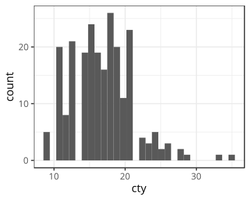

## Examples

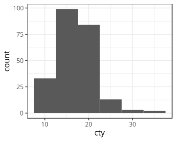

## How to lie with graphs

It is easy to exaggerate effects or distort the reality with graphs.

## Examples


## Examples

<center>
<figure>
  
<figcaption>It seems that the second bar is 3 times higher than the first bar.</figcaption>
</figure>
</center>

## Do not use 3D, ever!

3D graphics are very rarely useful:

1. First, they break the data-to-ink ratio rule.

2. Secondly, they can distort the reality.

## Examples

#### What is the value of C?

<center>
<figure>
  
<figcaption>Source: http://consultantjournal.com/blog/use-3d-charts-at-your-own-risk</figcaption>
</figure>
</center>

## Examples

<center>
<figure>
  
<figcaption>Source: http://consultantjournal.com/blog/use-3d-charts-at-your-own-risk</figcaption>
</figure>
</center>

The value of C is 3...

## Examples

#### What is the value of y at z = low and x = t1?

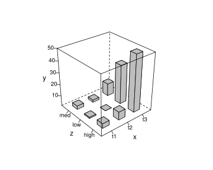

----

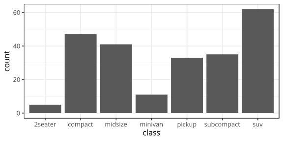

## Top 3 of bad graphs

<center>
Source: http://bit.ly/1OnKlEi
</center>

----

<center>

</center>

----

<center>

</center>

----

<center>

</center>

## ggplot2

## ggplot2

- ggplot2 is an extremely powerful package based on the grammar of graphics to produce complicated graphics in an elegant manner.

- ggplot2 works best when you have **tidy data**.

- Graphics are built by combining layers.

- You can refer to the printed **cheat sheet** for an overview of the package's functions.

## ggplot2

ggplot2 is not part of base R, so it needs to be installed.


```r
install.packages("ggplot2") # Install the package

library(ggplot2) # Load the package
```

## The data

For the following examples we are going to use the data from the `mpg` dataset. This dataset contains a subset of the fuel economy data that the EPA makes available on http://fueleconomy.gov. 

<small>
<!-- html table generated in R 3.5.2 by xtable 1.8-2 package -->
<!-- Sat Mar  2 14:20:15 2019 -->
<table border=1>
<tr> <th>  </th> <th> manufacturer </th> <th> model </th> <th> displ </th> <th> year </th> <th> cyl </th> <th> trans </th> <th> drv </th> <th> cty </th> <th> hwy </th> <th> fl </th> <th> class </th>  </tr>
  <tr> <td align="right"> 1 </td> <td> audi </td> <td> a4 </td> <td align="right"> 1.80 </td> <td align="right"> 1999 </td> <td align="right">   4 </td> <td> auto(l5) </td> <td> f </td> <td align="right">  18 </td> <td align="right">  29 </td> <td> p </td> <td> compact </td> </tr>
  <tr> <td align="right"> 2 </td> <td> audi </td> <td> a4 </td> <td align="right"> 1.80 </td> <td align="right"> 1999 </td> <td align="right">   4 </td> <td> manual(m5) </td> <td> f </td> <td align="right">  21 </td> <td align="right">  29 </td> <td> p </td> <td> compact </td> </tr>
  <tr> <td align="right"> 3 </td> <td> audi </td> <td> a4 </td> <td align="right"> 2.00 </td> <td align="right"> 2008 </td> <td align="right">   4 </td> <td> manual(m6) </td> <td> f </td> <td align="right">  20 </td> <td align="right">  31 </td> <td> p </td> <td> compact </td> </tr>
  <tr> <td align="right"> 4 </td> <td> audi </td> <td> a4 </td> <td align="right"> 2.00 </td> <td align="right"> 2008 </td> <td align="right">   4 </td> <td> auto(av) </td> <td> f </td> <td align="right">  21 </td> <td align="right">  30 </td> <td> p </td> <td> compact </td> </tr>
  <tr> <td align="right"> 5 </td> <td> audi </td> <td> a4 </td> <td align="right"> 2.80 </td> <td align="right"> 1999 </td> <td align="right">   6 </td> <td> auto(l5) </td> <td> f </td> <td align="right">  16 </td> <td align="right">  26 </td> <td> p </td> <td> compact </td> </tr>
  <tr> <td align="right"> 6 </td> <td> audi </td> <td> a4 </td> <td align="right"> 2.80 </td> <td align="right"> 1999 </td> <td align="right">   6 </td> <td> manual(m5) </td> <td> f </td> <td align="right">  18 </td> <td align="right">  26 </td> <td> p </td> <td> compact </td> </tr>
  <tr> <td align="right"> 7 </td> <td> audi </td> <td> a4 </td> <td align="right"> 3.10 </td> <td align="right"> 2008 </td> <td align="right">   6 </td> <td> auto(av) </td> <td> f </td> <td align="right">  18 </td> <td align="right">  27 </td> <td> p </td> <td> compact </td> </tr>
  <tr> <td align="right"> 8 </td> <td> audi </td> <td> a4 quattro </td> <td align="right"> 1.80 </td> <td align="right"> 1999 </td> <td align="right">   4 </td> <td> manual(m5) </td> <td> 4 </td> <td align="right">  18 </td> <td align="right">  26 </td> <td> p </td> <td> compact </td> </tr>
  <tr> <td align="right"> 9 </td> <td> audi </td> <td> a4 quattro </td> <td align="right"> 1.80 </td> <td align="right"> 1999 </td> <td align="right">   4 </td> <td> auto(l5) </td> <td> 4 </td> <td align="right">  16 </td> <td align="right">  25 </td> <td> p </td> <td> compact </td> </tr>
  <tr> <td align="right"> 10 </td> <td> audi </td> <td> a4 quattro </td> <td align="right"> 2.00 </td> <td align="right"> 2008 </td> <td align="right">   4 </td> <td> manual(m6) </td> <td> 4 </td> <td align="right">  20 </td> <td align="right">  28 </td> <td> p </td> <td> compact </td> </tr>
   </table>
</small>

## Basic structure

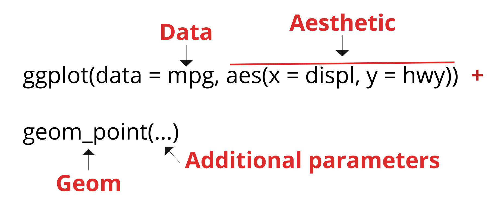

## geoms 

*geoms* is the short for geometric objects which are used to specify which type of graphic you want to produce (boxplot, barplot, scatter, ...).


```
##  [1] "geom_abline"     "geom_area"       "geom_bar"       
##  [4] "geom_bin2d"      "geom_blank"      "geom_boxplot"   
##  [7] "geom_col"        "geom_contour"    "geom_count"     
## [10] "geom_crossbar"   "geom_curve"      "geom_density"   
## [13] "geom_density_2d" "geom_density2d"  "geom_dotplot"   
## [16] "geom_errorbar"   "geom_errorbarh"  "geom_freqpoly"  
## [19] "geom_hex"        "geom_histogram"  "geom_hline"     
## [22] "geom_jitter"     "geom_label"      "geom_line"      
## [25] "geom_linerange"  "geom_map"        "geom_path"      
## [28] "geom_point"      "geom_pointrange" "geom_polygon"   
## [31] "geom_qq"         "geom_qq_line"    "geom_quantile"  
## [34] "geom_raster"     "geom_rect"       "geom_ribbon"    
## [37] "geom_rug"        "geom_segment"    "geom_sf"        
## [40] "geom_sf_label"   "geom_sf_text"    "geom_smooth"    
## [43] "geom_spoke"      "geom_step"       "geom_text"      
## [46] "geom_tile"       "geom_violin"     "geom_vline"
```

## One variable graphics

There are two main types of one variable graphics:

| **Graphic type** | **Geom**           | **Description**                          |
|------------------|--------------------|------------------------------------------|
| Histrogram       | `geom_histogram()` | Produces histograms for continuous data. |
| Barplot          | `geom_bar()`       | Produces histograms for discrete data.   |

## Histogram


```r
# First create the mapping.
p <- ggplot(data = mpg, mapping = aes(x = cty))

# Then add one histogram layer (geom) with no parameters.
p + geom_histogram()
```

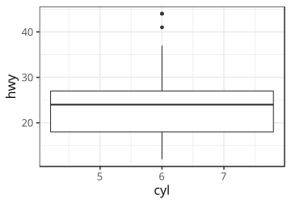

## Histogram


```r
# Specify a binwidth of 5 miles per gallon.
p + geom_histogram(binwidth = 5)
```

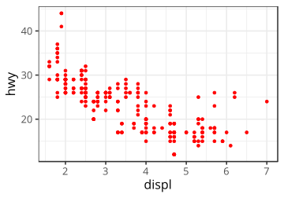

## Exercise {.exercises}

#### Exercise #1

Create an histogram of the `displ` variable and change the default color of the bars to red.

Hint: 


```r
?geom_histogram
```

## Barplot


```r
ggplot(data = mpg, mapping = aes(x = class)) + 
  geom_bar()
```

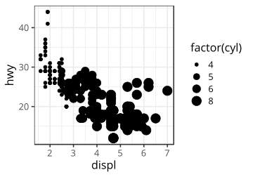

## Two variables graphics

Two variables graphics are more commmon. 

| **Graphic type** | **Geom**         | **Description**                            |
|------------------|------------------|--------------------------------------------|
| Scatter plot     | `geom_point()`   | Produces scatter plot between $x$ and $y$. |
| Line plot        | `geom_line()`    | Produces line plot between $x$ and $y$.    |
| Boxplot          | `geom_boxplot()` | Boxplot between $x$ and $y$.               |

## Scatter plot


```r
# First, create the mapping
p <- ggplot(mpg, aes(x = displ, y = hwy))

# Then, tell ggplot2 we want points for the relation between x and y.
p + geom_point()
```

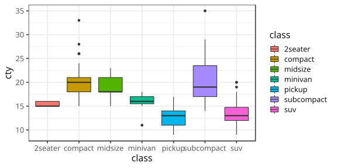

## Line plot


```r
# First, create the mapping
p <- ggplot(mpg, aes(x = displ, y = hwy))

# Then, tell ggplot2 we want lines for the relation between x and y.
p + geom_line()
```

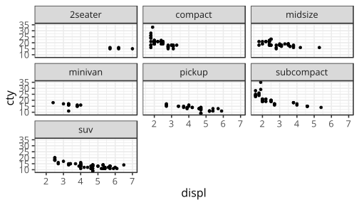

## Exercise {.exercises}

#### Exercise #1

Create a scatter plot between `hwy` (**x**) and `cty` (**y**). Change the color of the points to blue and the size to 4.

## Boxplot

> In descriptive statistics, a box plot or boxplot is a convenient way of graphically depicting groups of numerical data through their quartiles (Wikipedia).

To make a boxplot, we need to have a **discrete/categorical** variable on $x$ and a **continuous** variable on $y$.

## Boxplot


```r
ggplot(data = mpg, mapping = aes(x = class, y = cty)) + 
  geom_boxplot() # boxplot geom with no parameters
```

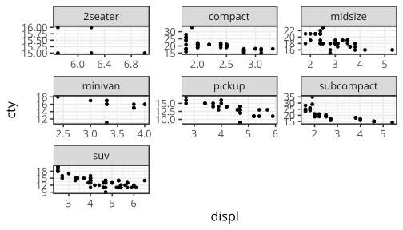

## Exercise {.exercises}

#### Exercise #1

Create a boxplot using the following code:


```r
ggplot(data = mpg, mapping = aes(x = cyl, y = hwy)) + 
  geom_boxplot() # boxplot geom with no parameters
```


## Working with colors

It can be useful to add colors in graphics. To change the colors of the points, we have to use the color parameter. 


```r
ggplot(mpg, aes(x = displ, y = hwy)) + 
  geom_point(color = "red")
```

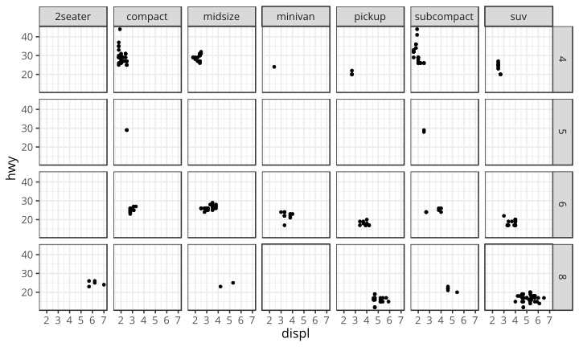

## Working with colors

If we want to set a color based on a variable, we have to use the aesthetic:
`aes(colour = variable)`.


```r
ggplot(mpg, aes(x = displ, y = hwy)) + 
  geom_point(aes(color = class))
```


## Working with size

In the same manner, the size of the dots can be based on a particular variable.


```r
ggplot(mpg, aes(x = displ, y = hwy)) + 
  geom_point(aes(size = factor(cyl)))
```

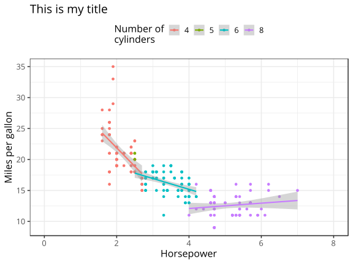

## Exercise {.exercises}

#### Exercise #1

Try to reproduce this graphic.


What is wrong with this graphic?

## Faceting

## Faceting

Faceting is a very powerful of the ggplot2 library which allows to display additional categorical variables in facets.

There are two types of faceting: `facet_grid()` and `facet_wrap()`.

## 1D facets


```r
ggplot(mpg, aes(x = displ, y = cty)) + # Mapping
  geom_point() + # We want a scatter plot
  facet_wrap(~class) # We want 1 panel for each class
```


## 1D facets


```r
ggplot(mpg, aes(x = displ, y = cty)) + # Mapping
  geom_point() + # We want a scatter plot
  facet_wrap(~class, scale = "free") # We want 1 panel for each class
```

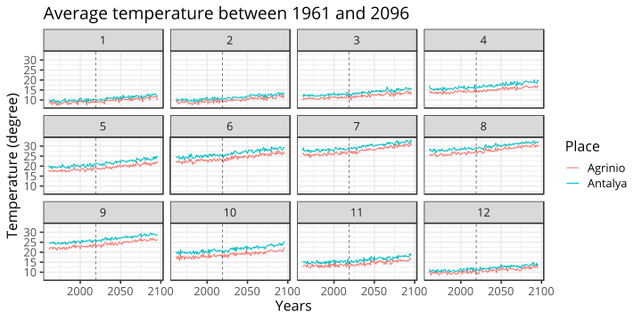

## 2D facets

2D facet graphics are made using the `facet_grid()` function.


```r
ggplot(mpg, aes(x = displ, y = hwy)) +
  geom_point() +
  facet_grid(cyl ~ class) # number of cyl as a function of class
```

----


```r
ggplot(mpg, aes(x = displ, y = hwy)) +
  geom_point() +
  facet_grid(cyl ~ class) # number of cyl as a function of class
```


## Graphics appearance

## Graphics appearance

There are a ton of options to modify the look and feel of your graphics and we can not go through them all in short period of time.

**Book:** *ggplot2: Elegant Graphics for Data Analysis (Use R!)*

Here I present the principal functions I usually use to make publication-ready graphics.

## Graphics appearance


```r
ggplot(mpg, aes(x = displ, y = cty)) + 
  geom_point(colour = factor(cyl)) + # Scatterplot color based on cyl
  
  stat_smooth(method = "lm") + # Add a linear smoother to the data
  
  labs(colour = "Number of\ncylinders") + # Title of the color legend
  
  xlab("Horsepower") + # Change x-axis title
  
  ylab("Miles per gallon") + # Change y-axis title
  
  ggtitle("This is my title") + # Add a title on top of the plot
  
  theme(legend.position = "top") + # Change legend position
  
  xlim(0, 8) # Change limits of x-axis
```

----


## Saving your graphic

Saving your pretty ggplot2 graphics is pretty easy with the `ggsave()` function.


```r
p <- ggplot(mpg, aes(x = displ, y = cty)) +
  geom_point()

# Vector formats
ggsave("path/to/myfile.pdf", p, width = 5.97, height = 4.79)
ggsave("path/to/myfile.eps", p, width = 5.97, height = 4.79)
ggsave("path/to/myfile.ps", p, width = 5.97, height = 4.79)

# Raster formats
ggsave("path/to/myfile.jpg", p, width = 5.97, height = 4.79)
ggsave("path/to/myfile.tiff", p, width = 5.97, height = 4.79)
ggsave("path/to/myfile.png", p, width = 5.97, height = 4.79)
```

## Exercise {.exercises}

#### Exercise #1

Use the following data and reproduce the plot on the next slide.


```r
agrinio <- read_csv("data/T_Agrinio_EM.csv")
antalya <- read_csv("data/T_Antalya_EM.csv")
```

Hint #1: Use `bind_rows()` to bind both datasets.

Hint #2: Before starting, take time to analyze the graphic and think how you need to format the data and what are the different components of the plot.

<small>
Data source: http://climrun.cyi.ac.cy/?q=csv
</small>

----


