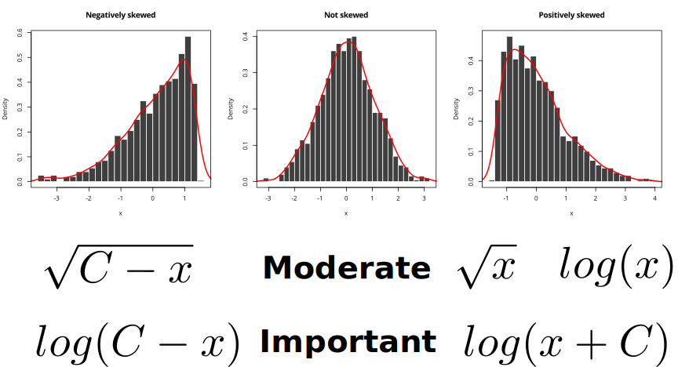

```{r setup, include=FALSE}
library(svglite)
library(tidyr)

knitr::opts_chunk$set(
  message = FALSE,
  warning = FALSE,
  dev = "svg",
  fig.ext = ".svg",
  fig.width = 5,
  fig.height = 4,
  fig.align = "center"
)
library(tidyverse)

library(extrafont)
loadfonts(quiet = TRUE)

theme_set(theme_bw(base_size = 16, base_family = "Open Sans"))
```

## Introdction to basics linear analysis in R

## Student's t-test

The t-test is a test used to determine whether there is a significant difference between the means of two groups. It assumes that the dependent variable fits a normal distribution.

H0: $\mu_1 = \mu_2$

H1: The means are differents

## t-test

A working example.

```{r}
data("InsectSprays")
InsectSprays
```

## t-test

```{r}
# Subset the data to get only two groups
InsectSprays2 <- dplyr::filter(InsectSprays, spray %in% c("C", "F"))

# Visualize the data
ggplot(InsectSprays2, aes(x = spray, y = count)) +
  geom_boxplot()
```

## t-test (assumptions)

1. Data normality
2. Homogeneous variances

## Normality

```{r}
ggplot(InsectSprays2, aes(x = count)) +
  geom_histogram() +
  facet_wrap(~spray, scales = "free")
```

Visually it does not look that our data is normally distributed.

## Normality

We can use the `shapiro.test()` function to determine if our data is normally distributed (null model).

```{r}
shapiro.test(InsectSprays2$count[InsectSprays2$spray == "C"])

```
We can reject the null hypothesis that our data is normally distributed.

## Normality

```{r}
shapiro.test(InsectSprays2$count[InsectSprays2$spray == "F"])
```

Despite the non-normal look of this data, the test suggests it is normally distributed.

## Normality

Since our data is not normal, what can we do?

> - Use a mathematical tranformation to *normalize* the data and do the statistical test on these transformed data.

Here, we work with data that is distributed asymmetrically with a dominance of low values, and some strong values. This type of distribution typically corresponds to a log-normal distribution, that is, the log-transformed values follow a Normal distribution.

```{r}
# We can use the log tranformation to normalize our data
InsectSprays2 <- mutate(InsectSprays2, count_norm = log10(count + 1))
```

## Normality

```{r}
ggplot(InsectSprays2, aes(x = count_norm)) +
  geom_histogram() +
  facet_wrap(~spray, scales = "free")
```


## Normality

Log-transformed data are normal.

```{r}
shapiro.test(InsectSprays2$count_norm[InsectSprays2$spray == "C"])
shapiro.test(InsectSprays2$count_norm[InsectSprays2$spray == "F"])
```

## Homogeneous variances

The second assumption we need to verify is that the variance of the two groups are homogeneous.

```{r, echo=FALSE, fig.width=7}
set.seed(1)
n <- 5000

invoke_map(list(rnorm, rnorm), list(list(n = n, sd = 3), list(n = n, sd = 1))) %>% 
  enframe("simulation") %>% 
  unnest() %>% 
  ggplot(aes(x = value, fill = factor(simulation))) +
  geom_histogram(alpha = 0.5, color = NA, bins = 100) +
  scale_fill_discrete(breaks = c("1", "2"), labels = c("SD = 3", "SD = 1")) +
  theme(legend.title = element_blank())

```

## Homogeneous variances

It can be tested using the `var.test()` function.

```{r}
var.test(count_norm ~ spray, data = InsectSprays2)
```
Because p > 0.05, we can conclude that the variances between the two groups **are not significantly different** at a 95% confidence interval.

## t-test

Now that we have verified the two assumptions, we can use the `t.test()` function to compare the mean between the two groups. Note that here we are using `var.equal = TRUE`. If the variances are not equals, we should use `var.equal = FALSE`. This will perform a Welch's t-test, or unequal variances t-test.

## t-test

```{r}
t.test(count_norm ~ spray, data = InsectSprays2, var.equal = TRUE)
```
The p-value < 0.05 allows us to conclude that these two types of treatment lead to different average insect numbers, 19 times out of 20 (95% confidence).

## t-test

```{r, echo=FALSE}
(mod <- t.test(count_norm ~ spray, data = InsectSprays2, var.equal = TRUE))
```

We then report the results of the t-test as follows:

There was a significant difference in the number of insects between spray C (mean = `r round(mod$estimate[1], digits = 2)`) and spray F (mean = `r round(mod$estimate[2], digits = 2)`)[t(`r mod$parameter`) = `r round(mod$statistic, digits = 2)`, p = `r round(mod$p.value, digits = 4)`].

## t-test

You can (and should) exponentiate the results you get from the log-transformation. Doing so will provide the geometric mean and not the arithmetic mean.

There was a significant difference in the number of insects between spray C (mean = `r round(10^mod$estimate[1], digits = 2)`) and spray F (mean = `r round(10^mod$estimate[2], digits = 2)`)[t(`r mod$parameter`) = `r round(mod$statistic, digits = 2)`, p = `r round(mod$p.value, digits = 4)`].

```{r, echo=FALSE, fig.width=4, fig.height=3}
InsectSprays2 %>% 
  ggplot(aes(x = spray, y = count)) +
  geom_boxplot()
```


## t-test

- We usually do a bilateral test that is appropriate for the vast majority of situations. A bilateral test does not presuppose that the average should be significantly higher or lower than the threshold value, but rather that it could be one or the other, without preference.

- A unilateral test is used to checks if a value is superior or equal to the test value (`alternative = "greater"`) or inferior or equal to the test value (`alternative = "less"`). 

## t-test

```{r}
t.test(
  count_norm ~ spray,
  data = InsectSprays2,
  var.equal = TRUE,
  alternative = "greater"
)
```
## t-test

```{r}
t.test(
  count_norm ~ spray,
  data = InsectSprays2,
  var.equal = TRUE,
  alternative = "less"
)
```


## Non-parametric test

If your data is not normal and can not be transformed, you should use a non-parametric test (i.e. based on the ranks) such as the Wilcoxon / Mann-Whitney test (`wilcoxon.test()`).

## Analysis of Variances (ANOVA)

## Analysis of Variances (ANOVA)

<!-- http://cba.ualr.edu/smartstat/topics/anova/example.pdf -->
<!-- http://www.analyticsforfun.com/2014/06/performing-anova-test-in-r-results-and.html -->

> - The objective of an ANOVA is to test weither there is a statistically significant difference in the mean of a continuous variable among different groups.

> - Compares the variation **among** sample means to the variation **within** groups.

H0: $\mu_1 = \mu_2 = \mu_3 = ... = \mu_{n-1} = \mu_n$

H1: At least one mean is different

## A concrete example

This dataset contains a subset of the fuel economy data that the EPA makes available on http://fueleconomy.gov.

```{r, results='hide'}
data("mpg")
mpg
```

<small>
```{r, echo = FALSE, results="asis"}
print(xtable::xtable(head(mpg, 10)), type = "html", NA.string = "NA")
```
</small>

## A concrete example

```{r}
# city miles per gallon as a function of number of cylinders
ggplot(mpg, aes(x = factor(cyl), y = cty)) +
  geom_boxplot()
```

## ANOVA

A one-way anova is performed using the `aov()` (analysis of variance) function.

```{r}
# city miles per gallon AS A FUNCTION of the grouping variable cyl
my_aov <- aov(cty ~ factor(cyl), data = mpg)
```

We can have a look to the summary of the model using the `summary()` function.

```{r}
summary(my_aov)
```

----

The coefficients of an ANOVA can be extracted using the `coef()` function.

```{r}
coef(my_aov)
```

If we compare with observed mean for each group:

```{r}
group_by(mpg, factor(cyl)) %>% 
  summarise(mean_mpg = mean(cty))
```

## ANOVA

```{r}
summary(my_aov)
```

Based on the output we have F = `r round(summary(my_aov)[[1]]$F[1], digit = 2)` with a p-value of `r round(summary(my_aov)[[1]]$Pr[1], digit = 2)`. We can **reject the null hypothesis** (H0: all means are equal) and **accept the alternative hypothesis** H1.

## ANOVA

#### Reporting AVNOVA results in a paper

Here is how you should report the result of your ANOVA in your paper.

> There was a significant (not a significant) effect of the number of cylinders on city miles per gallon at the $p < 0.05$ level $[F(3, 230) = 146.41, p < 0.0001]$.

## Non-parametric test

If your data is not normal and can not be transformed, you should use a non-parametric test (i.e. based on the ranks) such as the Kruskal-Wallis test (`kruskal.test()`).

## Tukey post-hoc test

- From the `summary()` function we rejected the null hypothesis.

- We know that not all means are equal but we do not know which one(s).

- To determine which groups are different from each other we need to use a **post hoc test** such as the **Tukey Honest Significant Differences**.

## TukeyHSD

In R, the Tukey test is performed using the `TukeyHSD()` function which use the result returned by the `aov()` function.

```{r}
tuk <- TukeyHSD(my_aov)
tuk
```

## TukeyHSD

It is possible to plot the object to have a graphical representation of the differences.

```{r}
plot(tuk)
```

## Two+ factors ANOVA

It is easy to fit a multiple factors ANOVA using the `+` sign in the formula.

```{r}
my_aov <- aov(cty ~ factor(cyl) + drv, data = mpg)
summary(my_aov)
```

## Two+ factors ANOVA

If you want to use the TukeyHSD function you must specify which factor is of interest.

```{r}
TukeyHSD(my_aov, "drv") # Look at the difference for the fl variable
```

## Two+ factors ANOVA

```{r}
plot(TukeyHSD(my_aov, "drv"))
```

## Exercise {.exercises}

#### Exercise #1

Take few minutes to open the data for your project and try to perform a simple ANOVA.

## Linear and multiple linear regressions

<!-- https://stat.ethz.ch/education/semesters/ss2012/regression/Part5.pdf -->

## Definition

A **linear regression** is simply an approach for modeling the **linear** relationship between a dependent variable (**Y**) and one or more explanatory/independent variable(s) (**X**).

> - One predictor -> **simple linear regression**
> - Two or more predictors -> **multiple linear regression**

## Assumptions

1. **Normality**: Both response and explanatory variables should be normally distributed.

2. **Linearity**: The mean of the response variable is a linear combination of the predictors.

3. **Homoscedasticity**: Sometimes termed as *homogeneity of variance*, this means that the variance in the error is the same regardless of the values of the predictor variables.

4. **Independence of errors**: This assumes that the errors of the response variables are uncorrelated with each other.

5. **No multicollinearity**: This means that predictors are not (or very little) correlated among each others.

## Purpose of a LM

- Fitting a linear model (lm) is the process of **minimizing** the errors/residuals between observations and the regression line.

- The line that minimizes these errors is called the **least square line**.

## Graphical view of a LM

```{r, echo = FALSE}
set.seed(1234)

x <- 1:7
y <- x + rnorm(x, sd = 1)

lm1 <- lm(y ~ x)

tmp <- coef(lm1) %*% t(c(0.50, 0.75, 1.25, 1.50))

tmp <- apply(tmp, 2, function(tmp){return(tmp[2] * x + tmp[1])}) %>% 
  as.data.frame()

names(tmp) <- c("y1", "y2", "y3", "y4")

df <- data.frame(x = x, y = y, y_hat = predict(lm1)) %>% 
  bind_cols(tmp)

p <- ggplot(df, aes(x = x, y = y)) +
  geom_point(size = 3) +
  xlim(0, 8)

p

```

Where to draw the **least square line**?

## Graphical view of a LM

```{r, echo = FALSE}
df2 <- tidyr::gather(df, y, value, -x) %>% dplyr::filter(y != "y")
p + geom_line(data = df2, aes(x = x, y = value, group = y, color = y)) +
  theme(legend.position = "none")

```

Where to draw the **least square line**?

## Formulation

$$
Y = \alpha + \beta X + \epsilon
$$

**$\alpha$** is the intercept of the line (i.e. when $X$ = 0).

**$\beta$** is the slope of the line describing how much $Y$ changes when $X$ varies by one unit.

**$\epsilon$** is the error or variation not accounted by the model. 

## Formulation

#### An important assumption of lm

$$
\epsilon \sim N(0,\sigma^2)
$$

The errors follow a Normal distribution of mean **$\mu = 0$**  and variance **$\sigma$**.

Objective: Find **$\alpha$** and **$\beta$** that will *minimize* **$\epsilon$**.

## Graphical view of a LM

```{r, echo = FALSE, fig.width = 7, fig.height = 5}
p <- p +
  geom_line(aes(y = y_hat), col = "black") +

  geom_segment(aes(
    x = x,
    y = y,
    xend = x,
    yend = y_hat
  ),
  color = ifelse((df$y - df$y_hat) > 0, "red3", "darkgreen"),
  linetype = 1
  )
p
```

## Graphical view of a LM

```{r, echo = FALSE, fig.width = 7, fig.height = 5}

p <- p + geom_text(aes(
  x = ifelse((y - y_hat) > 0, x - 0.5, x + 0.5),
  y = y_hat + ((y - y_hat) / 2),
  label = "epsilon[i] == y[i] - bar(y)"
),
parse = TRUE,
size = 4
)
p
```

## Graphical view of a LM

$$
Y_i = \alpha + \beta X_i + \epsilon_i
$$

```{r, echo = FALSE, fig.width = 7, fig.height = 5}
p + geom_text(aes(
  y = ifelse((y - y_hat) > 0, y + 0.5, y - 0.5),
  label = paste("Y[", x, "]")
), parse = TRUE, color = "red")
```

## Fitting parameters

$$
Y_i = \alpha + \beta X_i + \epsilon_i
$$

- Find **$\alpha$** and **$\beta$** that will minimize **$\sum\limits_{i=1}^n \epsilon_i$**

- Cannot simply use **$\sum\limits_{i=1}^n \epsilon_i$**. Why?

## Two possibilities

- There are two other possibilities, either use $\sum\limits_{i=1}^n |\epsilon_i|$ or $\sum\limits_{i=1}^n \epsilon_i^2$

- We consider the second option because working with squares is mathematically easier than working with absolute values.

- Find **$\alpha$** and **$\beta$** that will minimize **$\sum\limits_{i=1}^n \epsilon_i^2$**

- This is why we call it the **the standard squared error (SSE)**.

## Standard squared error (SSE)

**$SSE(\alpha, \beta)$** : $\sum\limits_{i=1}^n (Y_i - \bar{Y})^2 = \sum\limits_{i=1}^n (Y_i - \alpha - \beta X_i)^2$

Objective: Find **$\alpha$** and **$\beta$** that minimize SSE.

----

Partial derivatives of $SSE(\alpha, \beta)$ with respect to $\alpha$ and $\beta$ equal to 0

$SSE(\alpha, \beta) = \sum\limits_{i=1}^n (Y_i - \alpha - \beta X_i)^2$

<br>

$$
\begin{align}
\frac{\partial SSE(\alpha, \beta)}{\partial \alpha} &= \sum (-1)(2)(Y_i - \alpha - \beta X_i) = 0 \\
&= \sum (Y_i - \alpha - \beta X_i) = 0
\end{align}
$$

$$
\begin{align}
\frac{\partial SSE(\alpha, \beta)}{\partial \beta} &= \sum (-X_i)(2)(Y_i - \alpha - \beta X_i) = 0 \\
&= \sum X_i(Y_i - \alpha - \beta X_i) = 0
\end{align}
$$

----

After a bit of algebra we ends up with two equations:

$$
\alpha = \bar{Y} - \beta \bar{X}
$$

<br>

$$
\beta = \frac{\sum(X_i - \bar{X})(Y_i - \bar{Y})}{\sum(X_i - X)^2}
$$

## Exercise {.exercises}

#### Question #1

Using the follow data, find **$\alpha$** and **$\beta$**.

```{r, echo = FALSE}
knitr::kable(df[, c("x", "y")])

```

----

```{r}
b <- sum( (df$x - mean(df$x)) * (df$y - mean(df$y)) ) / 
  sum((df$x - mean(df$x))^2)
b

a <- mean(df$y) - b * mean(df$x)
a
```

Hence the equation is: **$y = `r round(coef(lm1)[1], digit = 4)` + `r round(coef(lm1)[2], digit = 4)`x$**

## Linear regression in R

- (Multiple) linear regression are performed using the `lm()` function.

- The model is specified as `model <- lm(y ~ x)`.

## Example

```{r, echo = FALSE}
df <- dplyr::select(df, x, y)
df
```

## Example

```{r}
mod <- lm(y ~ x, data = df) # Define the model
```

Different functions can be used on lm models:

- `plot(mod)`: Shows diagnostic plots of the model.
- `residuals(mod)`: Return the residuals of the model (**$\epsilon_i$**).
- `predict(mod)`: Return the predicted values of the model (**$\hat{Y}_i$**).
- `summary(mod)`: Print a summary of the model.
- `coef(mod)`: Extract the coefficients of the model.

## Summary

```{r}
summary(mod)
```

## Coefficients

```{r}
coef(mod) # a and b
```

## Visualization

It is easy to plot the regression line using the `abline()` function.

```{r, fig.width = 5, fig.height = 4}
plot(x, y, pch = 21, bg = "gray") # Plot the data
abline(mod, col = "red") # Plot the regression line
```

## Visualization

With ggplot it is even easier using `geom_smooth()`.

```{r}
ggplot(df, aes(x = x, y = y)) +
  geom_point(size = 3) + 
  geom_smooth(method = "lm") # Add a geom_smooth using lm
```

## Visualization

Use `se = FALSE` if you do not want the confidence interval.


```{r}
ggplot(df, aes(x = x, y = y)) +
  geom_point(size = 3) + 
  geom_smooth(method = "lm", se = FALSE)
```

## Predicted values

```{r}
predict(mod)
```

```{r, echo = FALSE, fig.width = 8, fig.height = 4}
p + geom_point(aes(y = y_hat, color = "Predicted\nvalues"), size = 4) +
  labs(color = "")
```

## Residuals

```{r}
residuals(mod) # This is the equivalent of e in previous equations
```

Remember that $\epsilon \sim N(\mu,\sigma^2)$ and that $\mu = 0$

```{r, class = "fragment"}
mean(residuals(mod))
```

## Exercise {.exercises}

#### Exercise #1

Use the `mpg` data and make a model to predict `cty` using the variable `hwy` (*do not forget to look at the data before making your model*).

<small>
```{r, echo = FALSE, results="asis"}
print(xtable::xtable(head(mpg, 10)), type = "html", NA.string = "NA")
```
</small>


## Analyzing the model

## Plot of the data

```{r}
ggplot(mpg, aes(x = hwy, y = cty)) +
  geom_point()
```

## Create the model

```{r}
lm1 <- lm(cty ~ hwy, data = mpg) # Fit the model

summary(lm1)
```


## Look at the residuals

```{r}
plot(mpg$hwy, residuals(lm1)) # Check if any patterns in residuals
abline(h = 0, col = "red")
```

## Residuals normality

Remember that $\epsilon \sim N(\mu,\sigma^2)$ and that $\mu = 0$

```{r, fig.width = 5, fig.height = 4}
hist(residuals(lm1))
```

## Normality Test

H0: Data from a normally distributed population.

H1: Data are not from a normally distributed population.

```{r}
shapiro.test(residuals(lm1))
```

<p><small>This p-value tells you what the chances are that the sample comes from a normal distribution. The lower this value, the smaller the chance. You cannot say "the sample has a normal distribution" or "the sample comes from a population which has a normal distribution", but only "you cannot reject the hypothesis that the sample comes from a population which has a normal distribution".</small></p>

## Constant error variance

H0: Constant error variance

H1: Error variance changes with the level of the response

```{r}
library(car) # Load required library
ncvTest(lm1) # Score Test for Non-Constant Error Variance
```

Since $p = `r round(ncvTest(lm1)$p, digits = 4)`$ **we reject the null hypothesis** and we consider that the model has not a constant error variance.

## Understanding error variance

```{r, echo = FALSE}

#https://gist.githubusercontent.com/anonymous/1212076/raw/949d01c268b0fdb14ff854d7d6221a3c5fa8edc0/gistfile1.r
#
set.seed(1234)

x <- seq(0,100,length.out = 100)   # independent variable
sig <- 0.1 + 0.05*x                # non-constant variance
b_0 <- 6                           # true intercept
b_1 <- 0.1                         # true slope

e <- rnorm(100,mean = 0, sd = sig) # normal random error with non-constant var
y <- b_0 + b_1 * x + e             # dependent variable
dat <- data.frame(x,y)

ggplot(dat, aes(x,y)) + 
  geom_point() +
  geom_smooth(method = "lm")

```

## Understanding error variance

```{r, echo = FALSE}

par(mar = c(4, 4, 1, 1))

x <- dat$x
y <- dat$y
lm3 <- lm(y ~ x)

plot(x, residuals(lm3), xlim = c(0, 105), ylim = c(-15, 15), pch = ".", cex = 5)
abline(a = 0, b = 0, col = "red", lwd = 1, lty = 2)

# make one normal distribution
mu    <- 0
sigma <- 1
nSd   <- 30
xLims <- c(mu-nSd*sigma, mu+nSd*sigma)
X     <- seq(xLims[1], xLims[2], length.out=98)

# the last 2 points are reserved for (mu, dnorm(mu)) and (mu, 0)
X[length(X)+1] <- mu             # for point (mu, dnorm(mu))
X[length(X)+1] <- mu             # for point (mu, 0)
Y <- dnorm(X, mu, sigma)         # y coordinates

#X <- seq(10, 20, length.out = 100)
#Y <- dnorm(X, mean =15)

# scale distribution to different width and height
nxW <- 100
nyW <- 10
X   <- (X / diff(range(X))) * nxW
Y   <- (Y / diff(range(Y))) * nyW
Y[length(Y)] <- 0                # point (mu, 0)

# rotate normal distribution 90° clockwise
XY  <- cbind(X, Y)
ang <- pi/2
R   <- matrix(c(cos(ang), sin(ang), -sin(ang), cos(ang)), nrow=2)
XYr <- XY %*% R

# chose a couple of x-coordinates to place rotated normal distributions
# ptsX <- x[round(seq(1, length(x), length.out=6))]
# ptsX <- ptsX[-c(1, length(ptsX))]
# ptsY <- b*ptsX + a
# pts  <- cbind(ptsX, ptsY)

pts <- data.frame(ptsX = seq(10, 100, by = 20), 
                  ptsY = rep(0, 20))

pts <- as.matrix(pts)
ptsX <- pts[, 1]
ptsY <- pts[, 2]

# move normal distibutions to chosen (x, y)-coords as center and draw them
nr   <- nrow(XY)
XYrt <- vector("list", length(ptsX))
for (i in seq(along=ptsX)) {
  
  XYrt[[i]] <- sweep(XYr, 2, pts[i, ], "+")
  
  polygon(XYrt[[i]][-c(nr, nr-1) , 1], XYrt[[i]][-c(nr, nr-1) , 2], border=NA, col=rgb(0.7, 0.7, 0.7, 0.2))
  
  #lines(XYrt[[i]][-c(nr, nr-1) , 1], XYrt[[i]][-c(nr, nr-1) , 2], col="red", lwd=3)
  
  segments(XYrt[[i]][nr, 1], XYrt[[i]][nr, 2], XYrt[[i]][nr-1, 1], XYrt[[i]][nr-1, 2], col="black", lwd = 2, lty = 2)
}
```

## What to do?

- Generalized Least Squares (GLS)
    + The errors are allowed to have a varying variance

- Done in R using the `gls()` function from the `nlme` library.

- Specifically provide the structure of the error **as a function of the observed values**.

- Different possibilities:
    + Power `varPower()`
    + Exponential `varExp()`

- Useful book: @Zuur2009

## Data transformation

## Data transformation

Most linear statistics (anova, lm, etc.) suppose normally distributed data:

$$
Y \sim N(\mu,\sigma^2)
$$

What to do if the data is not following such distribution?

## Data transformation

<center>
 
</center>

## Data transformation

```{r echo = FALSE, fig.width=10}
library(fGarch)
set.seed(1234)
df <- data.frame(x  = rsnorm(n = 1000, xi = 4)) %>% 
  mutate(xlog = log((x - min(x)) + 1))

p1 <- ggplot(df) +
  geom_histogram(aes(x = x), binwidth = 0.05) +
  ggtitle("Raw data")
  
p2 <- ggplot(df) +
  geom_histogram(aes(x = xlog), binwidth = 0.05) +
  ggtitle("Transformed data")

gridExtra::grid.arrange(p1, p2, ncol = 2)
```

Data transformation is one option, but most of the time we can use better options to deal with data that do not follow a Normal distribution. We will see how when talking about **glm**.

## Multiple linear regression

## Formulation

$$
Y = \alpha + \beta_i X + \beta_2 X + \beta_3 X + ... \beta_n X + \epsilon
$$

A multiple regression is only an extension of a simple linear regression which include two or more predictors.

## A look to the data

```{r, fig.width = 5, fig.height = 5}
library(languageR)
pairscor.fnc(mtcars[, 1:7])
```

## Tempting to do...

```{r}

model1 <- lm(mpg ~ cyl + disp + hp + drat + wt + qsec, data = mtcars)
summary(model1)
```

## R2 always increasing

```{r, echo = FALSE, fig.width = 7}

r2 <- mat.or.vec(6, 1)
r2adj <- mat.or.vec(6, 1)

for(i in 2:7){
  lm <- lm(mtcars$mpg ~ as.matrix(mtcars[, 2:i]))
  
  r2[i - 1] <- summary(lm)$r.squared
  
  r2adj[i - 1] <- summary(lm)$adj.r.squared

}

dat <- data.frame(x = 1:6, r2 = r2, r2adj = r2adj)

pr2 <- ggplot(dat, aes(x = x)) +
  geom_point(aes(y = r2, color = "R2")) +
  geom_line(aes(y = r2, color = "R2")) +
  xlab("Number of predictor") +
  ylab("Goodness of fit") +
  scale_x_discrete(breaks = 1:6) + 
  labs(color = "")
  
pr2
```

The $R^2$ will always increase when adding new predictors the the model.

## Adjusted R2

Since $R^2$ is always increasing when new predictors (**$X_i$**) are added, we need a better way to evaluated the goodness of fit of multiple-linear regression models.

> The adjusted R-squared is a modified version of R-squared that has been adjusted for the number of predictors in the model.

## Adjusted R2

The adjusted $R^2$ takes into account the number of explanatory variables in the model.

$$
R^2_{adj} = R^2 - (1 - R^2) \frac{p}{n - p - 1}
$$

Where $p$ is the number of explanatory variables and $n$ the number of observations in the data.

## Adjusted R2

```{r, echo = FALSE, fig.width = 7}
pr2 <- pr2 + 
  geom_point(aes(y = r2adj, color = "Adjusted R2")) +
  geom_line(aes(y = r2adj, color = "Adjusted R2"))

pr2

```

**Always report $R^2_{adj}$ when using multiple-linear regressions.**

## What is a good model?

Trade-off between performance and complexity

```{r good_model, echo = FALSE, fig.width=10}

par(mfcol = c(1,3), mai = c(0.1,0.5,0.1,0.1), omi = c(0.5, 0.1, 0.1, 0.1), ps = 12, cex = 1)

x = -40:40
y = 1 /(1+exp(-0.15*x))

plot(x,y, xlim = c(-40,40), ylim = c(0, max(y)*1.1), axes = F, yaxs = 'i', xlab = '', ylab = 'Performance', mgp = c(1.5, 1, 0), lty = 1, type = 'l')
axis(1, tck = -0.02, labels = FALSE)
axis(2, tck = -0.02, labels = FALSE)
box(bty = 'l')
segments(-45, 0.9*max(y), x[which(abs(y-0.9*max(y))==min(abs(y-0.9*max(y))))], 0.9*max(y), lty = 2, col = 'red', lwd = 0.5)
segments(-45, 0.99*max(y), x[which(abs(y-0.99*max(y))==min(abs(y-0.99*max(y))))], 0.99*max(y), lty = 2, col = 'red', lwd = 0.5)

y = exp(0.07*x)
plot(x,y, xlim = c(-40,40), ylim = c(0, max(y)*1.1), axes = F, yaxs = 'i', xlab = '', ylab = 'Complexity', mgp = c(1.5, 1, 0), lty = 1, type = 'l')
axis(1, tck = -0.02, labels = FALSE)
axis(2, tck = -0.02, labels = FALSE)
box(bty = 'l')

y = dnorm(-40:40,mean=0,sd=10)
plot(x,y, xlim = c(-40,40), ylim = c(0, max(y)*1.1), axes = F, yaxs = 'i', xlab = '', ylab = 'Efficacity', mgp = c(1.8, 1, 0), lty = 1, type = 'l', xpd = NA)
axis(1, tck = -0.02, labels = FALSE)
axis(2, tck = -0.02, labels = FALSE)
segments(-45, max(y), 0, max(y), lty = 2, col = 'red', lwd = 0.5)
segments(x[which(y == max(y))], 0, x[which(y == max(y))], max(y), lty = 2, col = 'red', lwd = 0.5)

box(bty = 'l')

mtext("Number of variable/parameter", side = 1, outer = TRUE, line = 1.25)
mtext("-", side = 1, outer = TRUE)
mtext("+", side = 1, outer = TRUE)

```

## Philosophy

When I work to make a new model I personally like to keep in mind that:

> Any modeling project should be tempered by the **morality of laziness** [@Barnes2010].

Avoid the pitfall of: **my $R^2$ is better than yours**.

## Potential problems in multiple linear regression

## Problem #1: Multicollinearity

## Definition

- Multicollinearity occurs when predictors are highly correlated among them.

- Some predictors add redundant information to the model.

- Variance inflation factor (**VIF**) is a measure used to quantify the degree of multicollinearity in a multiple regression analysis.

- Tells how much larger the standard error is, compared with what it would be if that variable were uncorrelated with the other predictor variables in the model.

## Possible problem...

```{r, echo = FALSE, fig.width = 6, fig.height = 6}
pairscor.fnc(mtcars[, 1:7])
```

## Variance inflation factor (VIF)

It is easy to understand how to calculate VIF. Basically, we take 1 predictor of the regression and predict it using other predictors (1 VIF per $X_i$).

**Step #1**: Regressions (1 per explanatory variable)

$$
X_1 = \alpha + \beta_1 X_2 + \beta_2 X_3 + \beta_3 X_4 + ... \beta_n X_n + \epsilon
$$

**Step #2**: Calculate VIF

$$
VIF = \frac{1}{1 - R^2}
$$

----

**Step #3**: Analyze

If the variance inflation factor of a predictor variable were 5.27 ($\sqrt{5.27}$ = 2.3) this means that the standard error for the coefficient of that predictor variable is 2.3 times as large as it would be if that predictor variable were uncorrelated with the other predictor variables.

As a rule of the thumb, if $\sqrt{VIF} > 2$ multicollinearity is considered high.

## An example

Lets calculate VIF for the `cyl` explanatory variable.

Remember that:

```{r, eval = FALSE}
model1 <- lm(mpg ~ cyl + disp + hp + drat + wt + qsec, data = mtcars)
summary(model1)
```

## Step #1

#### Multiple regression, 1 per explanatory variable

```{r}
# Multiple regression for cyl
reg1 <- lm(cyl ~ disp + hp + drat + wt + qsec, data = mtcars)
```

## Step #2

#### Calculate VIF

```{r}
R2_cyl <- summary(reg1)$r.squared
R2_cyl

VIF <- 1 / (1 - R2_cyl) # VIF for the cyl variable
VIF
```

## Step #3

#### Analyze

Given that $\sqrt{VIF}$ = `r round(sqrt(VIF), digits = 2)` we conclude that MC is high.

```{r, fig.height = 5, fig.width = 5, echo = FALSE}
languageR::pairscor.fnc(mtcars[, 2:7])
```

## VIF in R

There is an easy way to calculate VIF in R using the `vif()` function from the `car` library.

```{r}
library(car)
vif(model1)

sqrt(vif(model1)) > 2 # problem?
```

Based on these results we have high MC for many predictors. What can we do about it?

## How to select predictors?

#### Controversial topic in statistics

There are many **stepwise techniques** to select predictors (**$X_i$**) in a multiple linear regression.

> In statistics, stepwise regression includes regression models in which the choice of predictive variables is carried out by an automatic procedure (Wikipedia).

## Why controversial?

Basically, you say: "Here are my data and find out a good model for me."

1. $R^2$ values badly biased to be high.
2. It allows us to not think about the problem.
3. It has severe problems in the presence of collinearity.

## Forward selection

Nevertheless, many peoples have been working to develop new methods that minimize these drawbacks.

We will see an approach based on the technique suggested by @Blanchet2008 called **forward selection**.

The package is not installed by default.

```{r, eval = FALSE}
install.packages("packfor", repos="http://R-Forge.R-project.org")

library(packfor)
```

## Overview of the method

Without going in too much details, the method 

Two tests:

1. Global test (Adjusted-R2)
2. p-value

## Using packfor

The first step consists in creating two matrices: **$x$** that will contains our explanatory variables and **$y$** that contains the response variable.

```{r}
library(packfor)

x <- mtcars[, 2:7]  # Extract the possible predictors
y <- mtcars$mpg     # Extract the response variable
```

## Using packfor

The second step 

```{r, message=FALSE, results="hide"}
model2_temp <- forward.sel(y, x, alpha = 1, 
                           R2more = 0.0000000001, 
                           adjR2thresh = 1)
```

```{r}
model2_temp
```

## Using packfor

```{r}
# Maximum r2 expected
globalR2 <- model2_temp$AdjR2Cum[length(model2_temp$AdjR2Cum)] 

model2_final <- forward.sel(y, x, alpha = 0.05, R2thresh = 1, 
                            R2more = 0.001, adjR2thresh = globalR2, 
                            nperm = 999)

model2_final
```

## Using packfor

```{r}
model2_final <- lm(mpg ~ wt + cyl, data = mtcars)

summary(model2_final)
```

## Comparing models

#### Initial model with ALL predictors

```{r}
summary(model1)
```

## Comparing models

#### Final model with selected predictors

```{r}
summary(model2_final)
```

## Variance partitioning

## Relative Importance

For this, lets suppose that the following model is good (which is not).

```{r}
model1 <- lm(mpg ~ cyl + disp + hp + drat + wt + qsec, data = mtcars)
```

The model includes 6 predictors and yield a $R^2$ of `r vegan::RsquareAdj(model1)[1]`

The question we might ask is, how this value is divided among predictors?

## Relative importance

We can evaluate the the contribution of each predictor to the $R^2$. We call this operation **variance partitioning**.

This can be easily done in R using the `calc.relimp()` function from the `relaimpo` package.

## Relative importance

```{r}
library(relaimpo) #Do not forget to install it first

ri <- calc.relimp(model1)
ri
```

## Relative importance

```{r, fig.width=6, fig.height=5}
plot(ri)
```

## Your turn

Practice these concepts on your own data.

## External resources

<small>

http://cba.ualr.edu/smartstat/topics/anova/example.pdf

http://www.analyticsforfun.com/2014/06/performing-anova-test-in-r-results-and.html

http://www.ats.ucla.edu/stat/r/faq/posthoc.htm

http://www.r-tutor.com/elementary-statistics/probability-distributions/f-distribution

http://qcbs.ca/wiki/r_atelier3

</small>

## References  {.refsection}
