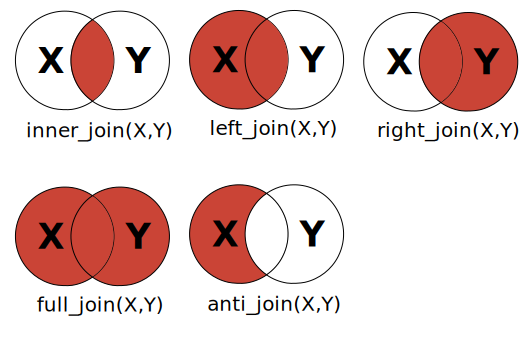

```{r setup, include = FALSE}
library(tidyverse)

options(width = 150)
knitr::opts_chunk$set(echo = TRUE, warning = FALSE, message = FALSE)
```

## Importing your data

Until now we have been working with simple data generated within R. 

However, most of the time we want to work with external data.

- Various sources and types of data: text file, images (geotif/raster).
- Most of the time either **.csv** or **.xls** formats.

## Data frames

**Data frames** are important objects in R which are created when reading a file.

Can be seen as an Excel tabular sheet:

> - **Lines are observations**
> - **Columns are variables**

A data frame can be seen as a matrix with the difference that **columns (variables) can be of different types** (numerics, dates, characters, etc.).

## Examples

```{r}
# See the first 6 rows of the mpg data frame (included in R)
head(mtcars) 
```

## Structure of a df

After you opened a data file, it is always a good idea to look the structure of the returned data frame. This ensure that all variables have the right types.

```{r}
str(mtcars) # str stands for structure
```

## Useful functions

```{r}
names(mtcars) # List column names
nrow(mtcars) # Return the number of row (observations)
ncol(mtcars) # Return the number of column (variables)
```

## Accessing elements of data frame

There are two main ways to access data of a data frame.

#### First method

The first way to access elements of a data frame consists in using **indexes** as we did for accessing matrix. 

For example, 

```{r}
mtcars[1, 3]
```

----

Accessing columns of a data frame.

```{r}
mtcars[, 4] # Column 4 (i.e "hp")
```

----

Accessing rows of a data frame.

```{r}
mtcars[1, ] # First row 
```

----

#### Second method

The second method to access elements of a data frame consists in using the `$` operator using the `df$variable` scheme.

```{r}
mtcars$cyl # Return the values of the vector named "cyl"
```

----

Using the second method makes things more obvious and easy to read since you don't have to wonder the position (indexes) of the variables in the data frame.

```{r}
mtcars$cyl[1:10] # first 10 values of the vector names "cyl"
```

## Quick-RStudio tip

> After typing the name of a data frame, the list of all variables within this data frame will appears. Use the keyboard to select the variable of interest. 

## CSV and Excel files

I recommend to use `readr` and `readxl` libraries for reading CSV and Excel files. These two libraries are not installed by default.

<center>
  
</center>

```{r, eval = FALSE}
install.packages("readr") # Package to read csv files
install.packages("readxl") # Package to read Excel files
```

----

Reading Excel files

```{r, eval = FALSE}
library(readxl) # Load the readxl package
mydata <- read_excel("/path/to/myfile.xls")
mydata <- read_excel("/path/to/myfile.xlsx", sheet = 3)
```

Reading csv files

```{r, eval = FALSE}
library(readr) # Load the readr package
mydata <- read_csv("/path/to/myfile.csv") # Read some data
```

Use `read_csv2()` if you are using CSV files produced with EU settings (`;` instead of `,` separator).

## Other file formats

There are many file format supported by R. This is a list of functions to use to open most used file format.

| **Data format**                    | **Function** | **Package** |
|------------------------------------|--------------|-------------|
| Comma separated values (.csv)      | read_csv()   | readr       |
| Excel (.xls, .xlsx)                | read_excel() | readxl      |
| Other text files (.txt, .dat, ...) | read_delim() | readr       |
| Stata                              | read_stata() | haven       |
| SPSS                               | read_spss()  | haven       |
| SAS                                | read_sas()   | haven       |
| Matlab file (.mat)                 | readMat()    | R.matlab    |


## Exercise {.exercises}

#### Exercise #1

Open your data in R and start exploring them. 

> - Data types as expected?
> - How missing values (`NA`) have been handled by R?
> - Any problems?

## Data manipulation 

> It is often said that 80% of data analysis is spent on the cleaning and preparing data. And it's not just a first step, but it must be repeated many over the course of analysis as new problems come to light or new data is collected.

- Two main characteristics of good data manipulation:
    + **speed** (results are returned in reasonable time)
    + **elegance** (easy to use and understand what is going on)

## The tidyverse

> The tidyverse is an opinionated collection of R packages designed for data science. All packages share an underlying design philosophy, grammar, and data structures.

## The tidyverse

The tidyverse provides a set of packages which provides flexible tools for data manipulation.

<center>

</center>

<center>
    
</center>

## The tidyverse

The package is not included in the base installation of R.

```{r, eval = FALSE}
install.packages("tidyverse") # Install the tidyverse packages
```

```{r, eval=FALSE}
# Load all the packages inncluded in tidyverse
library(tidyverse)
```


You can refer to the printed **cheat sheet** for an overview of the package's functions.

## dplyr

All dplyr functions use the same scheme: the first argument to provide is a data frame.

| **Function**           | **Definition**                                                                                                           |
|--------------------|----------------------------------------------------------------------------------------------------------------------|
| filter(df, ...)    | Select a subset of the rows of a data frame.                                                                         |
| arrange(df, ...)   | Reorder rows of a data frame.                                                                                        |
| select(df, ...)    | Select columns of a data frame.                                                                                      |
| mutate(df, ...)    | Add new columns to a data frame.                                                                                     |
| summarise(df, ...) | Summarize a data frame into a single row. This function is very helpful in combination with the group_by() function. |
| group_by(df, ...)  | Group a data frame based on the specified columns.                                                                   |

## Lets practice!

To learn how to use these functions, we will use datasets from package `nycflights13` which we first need to install.

```{r, eval = FALSE}
install.packages("nycflights13") # Install a dataset package
```

## nycflights13

This package contains information about all flights that departed from New York (i.e., EWR, JFK and LGA) in 2013. 

For the following examples we are going to use **fights**, **planes**, **airports**, **airlines** tables.

```{r}
library(dplyr)
library(nycflights13) # Load the data, look at your workspace

data(flights)
data(planes)
data(airports)
data(airlines)
```

## Exploring the data

## flights

```{r}
str(flights)
```

```{r, eval = FALSE}
?flights # Description of all variables included in the data frame
```

## planes

```{r}
str(planes)
```

```{r, eval = FALSE}
?planes # Description of all variables included in the data frame
```

## airports

```{r}
str(airports)
```

```{r, eval = FALSE}
?airports # Description of all variables included in the data frame
```

## airlines

```{r}
str(airlines)
```

```{r, eval = FALSE}
?airlines # Description of all variables included in the data frame
```

## Relationships between tables


## Filtering data

## filter

Most of the time you will want to work on subset observations of your data. 

- `filter()` allows you to select a subset of the rows of a data frame. 

- The first argument is the name of the data frame, and the second and subsequent are filtering expressions evaluated in the context of that data frame.

## Example

#### Select all flights with tail number equal to "N14228".

```{r}
filter(flights, tailnum == "N14228")
```

## Example

#### Select all flights with a departure delay >= 180 minutes.

```{r}
filter(flights, dep_delay >= 180)
```

## Example

#### Select all flights from carriers "MQ" or "EV".

```{r}
filter(flights, carrier ==  "MQ" | carrier == "EV")
```

## Example

#### Select all flights from carriers MQ OR EV.

```{r}
filter(flights, carrier %in% c("MQ", "EV"))
```

## arrange

> - `arrange()` works similarly to `filter()` except that instead of filtering or selecting rows, it reorders them. 

> - The function takes a data frame, and a set of column names (or more complicated expressions) to order by.

## Example

#### Order flights on the departure delay.

```{r}
arrange(flights, dep_delay)
```

## Example

#### Order flights on the departure delay and by arrival delay

```{r}
arrange(flights, dep_delay, arr_delay)
```

## Example

#### Order flights on the departure delay and by *decreasing* arrival delay

```{r}
arrange(flights, dep_delay, desc(arr_delay)) # Using desc()
```

## select

> - `select()` is used to extract columns from a data frame.
> - Useful when you want to perform data analysis on specific columns and not the complete dataset.

## Example

#### Select "faa" and "name" columns from the airports data frame.

```{r}
select(airports, faa, name)
```

## Example

You can also use `select()` to remove columns by using `-` in front of the columns you want to remove.

```{r}
select(airports, -faa, -name)
```

## mutate and transmute

> - The `mutate()` and `transmute()` functions are used to add columns to a data frame.
> - The difference between both functions is that mutate adds new variables and preserves existing while transmute drops existing variables.

## Example

#### Add a new column named "distance_km" which converts mile distances into km distances.

```{r}
mutate(flights, distance_km = distance / 0.62137)
```

## Example

`transmute()` drops all other columns.

```{r}
transmute(flights, distance_km = distance / 0.62137)
```

## Example

It is also possible to add many new variable in a single operation.

```{r}
transmute(flights, distance_km = distance / 0.62137,
          distance_knot = distance / 1.15078)
```

## summarise

> - The `summarise()` function allows to summarise columns from a dataframe.
> - **Compress** a data frame into single values (i.e. one row).

Hence, you have to provide a function that will be used to calculate a certain value.

## Example

#### Calculate the average departure and arrival delays in the flights table.

```{r}
summarise(flights,
          average_departure_delay = mean(dep_delay),
          average_arrival_delay = mean(arr_delay))
```

What is going on?

## Example

#### Calculate the average departure and arrival delays in the flights table.

```{r}
summarise(flights,
          average_departure_delay = mean(dep_delay, na.rm = TRUE),
          average_arrival_delay = mean(arr_delay, na.rm = TRUE))
```

## Working with grouped data

> - Alone, the `summarise()` function is not really helpful because it collapses a data frame to a single row.
> - Usually we want to work on grouped data.
> - `group_by()` "prepares" a data frame to send it to the `summarise()` function.

## Example

#### Calculate the average departure delay for each carrier.

```{r, eval = FALSE}
grouped <- group_by(flights, carrier) # Group flights by carrier

summarise(grouped, 
          average_departure_delay = mean(dep_delay, na.rm = TRUE))
```

----

```{r, echo = FALSE}
grouped <- group_by(flights, carrier) # Group flights by carrier

summarise(grouped, 
          average_departure_delay = mean(dep_delay, na.rm = TRUE))
```

## Example

It might be interested to know how many observations were used in each group to compute the average. To do so, we can use the `n()` function.

```{r, eval = FALSE}
grouped <- group_by(flights, carrier) # Group flights by carrier

summarise(grouped, 
          average_departure_delay = mean(dep_delay, na.rm = TRUE),
          number_of_observation = n())
```

----

```{r, echo = FALSE}
grouped <- group_by(flights, carrier) # Group flights by carrier

summarise(grouped, 
          average_departure_delay = mean(dep_delay, na.rm = TRUE),
          number_of_observation = n())
```

## Example

It is possible to summarise more than one column at once.

```{r, eval = FALSE}
grouped <- group_by(flights, carrier) # Group flights by carrier

summarise(grouped,
          number_of_flight = n(),
          average_departure_delay = mean(dep_delay, na.rm = TRUE),
          min_delay = min(dep_delay, na.rm = TRUE),
          max_delay = max(dep_delay, na.rm = TRUE))
```

----

```{r, echo = FALSE}
grouped <- group_by(flights, carrier) # Group flights by carrier

summarise(grouped,
          number_of_flight = n(),
          average_departure_delay = mean(dep_delay, na.rm = TRUE),
          min_delay = min(dep_delay, na.rm = TRUE),
          max_delay = max(dep_delay, na.rm = TRUE))
```

## Exercise {.exercises}

For this exercise, we will look at statistics of R packages downloaded on 2015-11-21. You can load the data as follow:

```{r}
downloads <- read_csv("data/2018-07-15.csv.gz") 
```

#### Question #1

Which package has been downloaded the most that day?

## Exercise {.exercises}

#### Question #2

From which countries people downloaded the most packages?

## Exercise {.exercises}

#### Question #3

How many packages have been downloaded that day from people in Denmark?

## Joining tables

## Joining tables

- Data are rarely stored in a single data frame.

- Good database practices recommend to have similar data in separate tables.

- Joins are used to "merge" data frame together.

## Joins in R

There are many ways of joining tables (data frames) in R. We will however focus on the merging tools offered by the package `dplyr`.

## Types of join

<center>

<figure>



<figcaption>Source: http://bit.ly/1QZ8Oil</figcaption>
</figure>

</center>

## Examples

To understand how joins work we will create two small data frames from data in `nycflights13`.

```{r}
flights2 <- select(flights, year, month, day, hour, origin)
flights2
```

## Examples

```{r}
airports2 <- select(airports, faa, name)
airports2
```

## left join

With a left join, all observations from table A are keep and only observations from table B that match will be merged.

```{r, error = TRUE}
# By default, dplyr will merge using all common columns.
left_join(flights2, airports2)
```

## left join

With a left join, all observations from table A are keep and only observations from table B that match will be merged.

```{r}
# By default, dplyr will merge using all commun columns.
left_join(flights2, airports2, by = c("origin" = "faa"))
```

## left join

**Attention, the order is important!**

```{r}
left_join(airports2, flights2, by = c("faa" = "origin"))
```

## right join

With a right join, all observations from table B are keep and only observations from table A that match will be merged.

```{r}
# This is the same as the previous "inverted" left join
right_join(flights2, airports2, by = c("origin" = "faa"))
```

## inner join

With a inner join, only observations that match both tables are kept.

```{r}
# Here the order is not important.
inner_join(flights2, airports2, by = c("origin" = "faa"))
```

## full join

With a full join, **all observations** from both tables are kept.

```{r}
full_join(flights2, airports2, by = c("origin" = "faa"))
```

## anti join

With an anti join, only observations from table A that do not match table B are kept. 

```{r}
# Which airports do not match flights.
anti_join(airports2, flights2, by = c("faa" = "origin"))
```

## Exercise {.exercises}

#### Exercise #1

First, load the statistics of R packages downloaded on 2015-11-21 and countries ISO codes as follow:

```{r}
# http://cran-logs.rstudio.com/2018/2018-07-15.csv.gz
downloads <- read_csv("data/2018-07-15.csv.gz")

countries <- read_csv("data/countries_ISO.csv")
```

From which countries **there were no** packages downloaded this particular date?

## Tidy data

## Tidy data 

In a tidy data set, each row correspond to an **observation** whereas each column is a **variable**.

Tidying a dataset consists in cleaning and structuring datasets to facilitate analysis.

## What is a messy dataset?

<small>
https://cran.r-project.org/web/packages/tidyr/vignettes/tidy-data.html
</small>

There are five main common problems that define a messy dataset:

1. Column headers are values, not variable names.
2. Multiple variables are stored in one column.
3. Variables are stored in both rows and columns.
4. Multiple types of observational units are stored in the same table.
5. A single observational unit is stored in multiple tables.

## Is there a solution?

Of course! Most of these problems can be easily addressed with little effort using the `tidyr` package (included in tidyverse). 

```{r, eval = FALSE}
 # To install it alone if you have not installed tidyverse
install.packages("tidyr")
library(tidyr)
```

You can refer to the printed **cheat sheet** for an overview of the package's functions.

## Column headers are values, not variable name

## The messy data

The following dataset explores the relationship between income and religion in the US. 

```{r}
messy <- read_csv("https://goo.gl/4rjDWu")
```

## The messy data

Take a minute to look at the following table to find what is the main problems.

<small>
```{r, echo = FALSE, results="asis"}
print(xtable::xtable(head(messy)), type = "html", NA.string = "NA")
```
</small>

## The problem

#### Column headers are values, not variable names

What we need to do here is to **gather** information that is spread in the column names.

This is done using the `gather(df, key, value)` function where `df` is a data frame, `key` is the new column name that will contain the values of the data spread in the old dataframe and `value` is the name of the new column that will contain the actual values.

We can also specify variables that we do not need to tidy using the `-var` operator. In this case, `-religion`.

## gather

```{r}
# Tidy the data frame (2 new columns and keep "religion" as is).
fixed <- gather(messy, income, frequency, -religion)
```

<small>
```{r, echo = FALSE, results="asis"}
print(xtable::xtable(head(fixed, 10)), type = "html", NA.string = "NA")
```
</small>

<small>
This new dataset is tidy each column represents a variable and each row represents an observation. We will later see how tidy data can be very useful for analysis and plotting (especially with ggplot2).
</small>

## Multiple variables stored in one column

## The messy data

The following messy dataset comes from the World Health Organisation, and records the counts of confirmed tuberculosis cases between 1980 and 2008. 

The demographic groups are broken down by sex (m, f) and age (0-14, 15-25, 25-34, 35-44, 45-54, 55-64, unknown).

```{r}
messy <- read_csv("https://goo.gl/xyxnJU")
messy <- select(messy, -new_sp) # Remove unneeded column
```

<small>
http://www.who.int/tb/country/data/download/en/
</small>

## The messy data

Take a minute to look at the following table to find what are the main problems.

<small>
```{r, echo = FALSE, results="asis"}
print(xtable::xtable(head(messy[1:8], 12)), type = "html", NA.string = "NA")
```
</small>

## The problems

There are two main problems with this dataset:

1. We have column names representing observations.
2. There are two type of information in column names (sex and age).

## Problem #1

#### Column headers are values, not variable names

As for the previous dataset, we use the `gather()` function.

```{r}
fixed <- gather(messy, demographic, frequency, -iso2, -year)
```

<small>
```{r, echo = FALSE, results="asis"}
print(xtable::xtable(head(fixed)), type = "html", NA.string = "NA")
```
</small>

<small>
At this point, the dataset looks already better.
</small>

## Problem #2

#### Multiple variables stored in one column

The column demographic contains two types of information (sex and age). 

<center>
<figure>

</figure>
</center>

It seems ti be always the same pattern: sex start at the **7th position** and the age at the **8th position**.

## Problem #2

To "split" this column into three different columns, we will use the `separate()` function.

```{r}
fixed <- separate(data = fixed, # Which data frame we separate
         col = demographic, # Which column we want to separate
         into = c("junk", "sex", "age_group"), # The new col. names
         sep = c(7, 8)) # How do we split the demographic col?

```

## The result

<small>
```{r, echo = FALSE, results="asis"}
print(xtable::xtable(head(fixed, 15)), type = "html", NA.string = "NA")
```
</small>


## Variables are stored in both rows and columns

## The messy data

The following messy dataset is the daily weather data from the Global Historical Climatology Network for one weather station (MX17004) in Mexico for five months in 2010.

Take a minute to look at the following table to find what are the main problems.

```{r}
messy <- read_csv("https://goo.gl/eUUJ6n")
```

<small>
```{r, echo = FALSE, results="asis"}
print(xtable::xtable(head(messy)[1:14]), type = "html", NA.string = "NA")
```
</small>

## Problem #1

#### Column headers are values, not variable names

It is easy to understand that we have values spread in the columns. For instance, `d1` means **day 1**. We should instead have a column named `day` with values from 1 to 31.

```{r}
fixed <- gather(messy, day, temperature, -id, -year, -month, -element)

fixed <- na.omit(fixed) # Remove NA while we there
```

## First problem resolved

It feels better already.

<small>
```{r, echo = FALSE, results="asis"}
print(xtable::xtable(head(fixed, 12)), type = "html", NA.string = "NA")
```
</small>

## Problem #2

#### The variable `day` is not numeric.

```{r}
str(fixed)
```

## Problem #2

We can easily extract numerical values from character using the `parse_number()` function.

```{r}
fixed <- mutate(fixed, day = parse_number(day))
```

<small>
```{r, echo = FALSE, results="asis"}
print(xtable::xtable(head(fixed, 12)), type = "html", NA.string = "NA")
```
</small>

## Problem #3

#### Variables are stored in column

Looking at the table we see that there is something strange with `element`. Can you guess it?

<small>
```{r, echo = FALSE, results="asis"}
print(xtable::xtable(head(fixed, 12)), type = "html", NA.string = "NA")
```
</small>

## Problem #3

`tmin` and `tmax` are variables, not values and we should make them columns instead.

This is easily done using the `spread()` function.

```{r}
fixed <- spread(fixed, element, temperature)
```

<small>
```{r, echo = FALSE, results="asis"}
print(xtable::xtable(head(fixed, 10)), type = "html", NA.string = "NA")
```
</small>

## Your turn

Using your data:

> - Is you data tidy?
> - If not, what can you do?
> - Do you need to merge different data sources? What type of joins would you use?