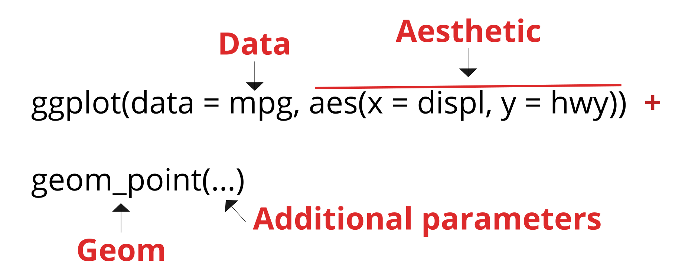

```{r setup, include = FALSE}

library(svglite)

knitr::opts_chunk$set(
  message = FALSE,
  warning = FALSE,
  dev = "svg",
  fig.ext = ".svg",
  fig.width = 5,
  fig.height = 4,
  fig.align = "center"
)
library(ggplot2)
library(dplyr)
library(readr)
library(tidyr)

library(extrafont)
loadfonts(quiet = TRUE)

theme_set(theme_bw(base_size = 16, base_family = "Open Sans"))
```

## Data visualization

- Important aspect in data sciences -> Communicate information clearly and efficiently to the community.

- Powerful tool to discovers patterns in the data.

- It makes complex data more accessible -> **reveal data**.

- Bad graphics can be a reason for paper rejection!

- A picture is worth a thousand words.
    + Always, always, always plot the data!
    + When possible, replace tables with figures that are more compelling.

## What is a good graph?

## Data-ink ratio

The data-ink ratio is the proportion of ink that is used to present actual data compared to the total amount of ink used in the entire display.

<br>

$$
\verb|data-ink ratio| = \frac{\verb|Data-ink|}{\verb|Total ink used to print the graphic|}
$$

The data-to-ink ratio should be keep as high as possible.

<br>

## Examples

```{r, echo = FALSE}
df <- data.frame(x = 1:4, y = 1:4)

p <- ggplot(df, aes(x, y)) +
  geom_bar(stat="identity") +
  theme(panel.background = element_rect(fill = "gray"))
p
```

## Examples

```{r, echo = FALSE, fig.width = 10}
p2 <- p + theme_bw()
gridExtra::grid.arrange(p, p2, ncol = 2)
```

## How to lie with graphs

It is easy to exaggerate effects or distort the reality with graphs.

## Examples

```{r, echo = FALSE, fig.width = 10}

set.seed(1234)

x <- seq(1, 100, length.out = 100)
y <- 200 + 2 * x + rnorm(x, sd = 30)

df <- data.frame(x = x, y = y)

p1 <- ggplot(df, aes(x = x, y = y)) +
  geom_point() +
  geom_smooth(method = "lm") +
  ylim(0, 600)

p2 <- ggplot(df, aes(x = x, y = y)) +
  geom_point() +
  geom_smooth(method = "lm")

gridExtra::grid.arrange(p1, p2, ncol = 2)
```

## Examples

<center>
<figure>
  
<figcaption>It seems that the second bar is 3 times higher than the first bar.</figcaption>
</figure>
</center>

## Do not use 3D, ever!

3D graphics are very rarely useful:

1. First, they break the data-to-ink ratio rule.

2. Secondly, they can distort the reality.

## Examples

#### What is the value of C?

<center>
<figure>
  
<figcaption>Source: http://consultantjournal.com/blog/use-3d-charts-at-your-own-risk</figcaption>
</figure>
</center>

## Examples

<center>
<figure>
  
<figcaption>Source: http://consultantjournal.com/blog/use-3d-charts-at-your-own-risk</figcaption>
</figure>
</center>

The value of C is 3...

## Examples

#### What is the value of y at z = low and x = t1?

```{r 3d_bar, echo = FALSE}
df <- data.frame(x = c("t1", "t1", "t1", "t2", "t2", "t2", "t3", "t3", "t3"),
                 y = c(5, 2, 4, 8, 1, 3, 50, 12, 35),
                 z = c("high", "low", "med", "high", "low", "med", "high", "med", "low"))

lattice::cloud(y ~ x + z,
      df,
      panel.3d.cloud = latticeExtra::panel.3dbars,
      col.facet='grey', 
      xbase = 0.4,
      ybase = 0.4,
      scales = list(arrows = FALSE, col = 1), 
      par.settings = list(axis.line = list(col = "transparent")))
```

----

```{r, echo = FALSE, fig.width=10}
p1 <- lattice::cloud(y ~ x + z,
               df,
               panel.3d.cloud = latticeExtra::panel.3dbars,
               col.facet='grey', 
               xbase = 0.4,
               ybase = 0.4,
               scales = list(arrows = FALSE, col = 1), 
               par.settings = list(axis.line = list(col = "transparent")))

p2 <- ggplot(df, aes(x = x, y = y, fill = z)) +
  geom_bar(stat="identity", position = "dodge")

gridExtra::grid.arrange(p1, p2, ncol = 2)
```

## Top 3 of bad graphs

<center>
Source: http://bit.ly/1OnKlEi
</center>

----

<center>

</center>

----

<center>

</center>

----

<center>

</center>

## ggplot2

## ggplot2

- ggplot2 is an extremely powerful package based on the grammar of graphics to produce complicated graphics in an elegant manner.

- ggplot2 works best when you have **tidy data**.

- Graphics are built by combining layers.

- You can refer to the printed **cheat sheet** for an overview of the package's functions.

## ggplot2

ggplot2 is not part of base R, so it needs to be installed.

```{r, eval = FALSE}
install.packages("ggplot2") # Install the package

library(ggplot2) # Load the package
```

## The data

For the following examples we are going to use the data from the `mpg` dataset. This dataset contains a subset of the fuel economy data that the EPA makes available on http://fueleconomy.gov. 

<small>
```{r, echo = FALSE, results="asis"}
print(xtable::xtable(head(mpg, 10)), type = "html", NA.string = "NA")
```
</small>

## Basic structure



## geoms 

*geoms* is the short for geometric objects which are used to specify which type of graphic you want to produce (boxplot, barplot, scatter, ...).

```{r, echo = FALSE}
ls(pattern = '^geom_', env = as.environment('package:ggplot2'))
```

## One variable graphics

There are two main types of one variable graphics:

| **Graphic type** | **Geom**           | **Description**                          |
|------------------|--------------------|------------------------------------------|
| Histrogram       | `geom_histogram()` | Produces histograms for continuous data. |
| Barplot          | `geom_bar()`       | Produces histograms for discrete data.   |

## Histogram

```{r, fig.height = 4, fig.width = 5}
# First create the mapping.
p <- ggplot(data = mpg, mapping = aes(x = cty))

# Then add one histogram layer (geom) with no parameters.
p + geom_histogram()
```

## Histogram

```{r}
# Specify a binwidth of 5 miles per gallon.
p + geom_histogram(binwidth = 5)
```

## Exercise {.exercises}

#### Exercise #1

Create an histogram of the `displ` variable and change the default color of the bars to red.

Hint: 

```{r, eval = FALSE}
?geom_histogram
```

## Barplot

```{r, fig.width = 8, fig.height = 4}
ggplot(data = mpg, mapping = aes(x = class)) + 
  geom_bar()
```

## Two variables graphics

Two variables graphics are more commmon. 

| **Graphic type** | **Geom**         | **Description**                            |
|------------------|------------------|--------------------------------------------|
| Scatter plot     | `geom_point()`   | Produces scatter plot between $x$ and $y$. |
| Line plot        | `geom_line()`    | Produces line plot between $x$ and $y$.    |
| Boxplot          | `geom_boxplot()` | Boxplot between $x$ and $y$.               |

## Scatter plot

```{r}
# First, create the mapping
p <- ggplot(mpg, aes(x = displ, y = hwy))

# Then, tell ggplot2 we want points for the relation between x and y.
p + geom_point()
```

## Line plot

```{r}
# First, create the mapping
p <- ggplot(mpg, aes(x = displ, y = hwy))

# Then, tell ggplot2 we want lines for the relation between x and y.
p + geom_line()
```

## Exercise {.exercises}

#### Exercise #1

Create a scatter plot between `hwy` (**x**) and `cty` (**y**). Change the color of the points to blue and the size to 4.

## Boxplot

> In descriptive statistics, a box plot or boxplot is a convenient way of graphically depicting groups of numerical data through their quartiles (Wikipedia).

To make a boxplot, we need to have a **discrete/categorical** variable on $x$ and a **continuous** variable on $y$.

## Boxplot

```{r, fig.width = 8}
ggplot(data = mpg, mapping = aes(x = class, y = cty)) + 
  geom_boxplot() # boxplot geom with no parameters
```

## Exercise {.exercises}

#### Exercise #1

Create a boxplot using the following code:

```{r, fig.height = 3.5}
ggplot(data = mpg, mapping = aes(x = cyl, y = hwy)) + 
  geom_boxplot() # boxplot geom with no parameters
```

## Working with colors

It can be useful to add colors in graphics. To change the colors of the points, we have to use the color parameter. 

```{r, fig.height=3.5}
ggplot(mpg, aes(x = displ, y = hwy)) + 
  geom_point(color = "red")
```

## Working with colors

If we want to set a color based on a variable, we have to use the aesthetic:
`aes(colour = variable)`.

```{r, fig.height=3.5}
ggplot(mpg, aes(x = displ, y = hwy)) + 
  geom_point(aes(color = class))
```

## Working with size

In the same manner, the size of the dots can be based on a particular variable.

```{r, fig.height=3.5}
ggplot(mpg, aes(x = displ, y = hwy)) + 
  geom_point(aes(size = factor(cyl)))
```

## Exercise {.exercises}

#### Exercise #1

Try to reproduce this graphic.

```{r, fig.width = 8, echo = FALSE}
ggplot(data = mpg, mapping = aes(x = class, y = cty)) + 
  geom_boxplot(aes(fill = class))
```

What is wrong with this graphic?

## Faceting

## Faceting

Faceting is a very powerful of the ggplot2 library which allows to display additional categorical variables in facets.

There are two types of faceting: `facet_grid()` and `facet_wrap()`.

## 1D facets

```{r, fig.width = 7}
ggplot(mpg, aes(x = displ, y = cty)) + # Mapping
  geom_point() + # We want a scatter plot
  facet_wrap(~class) # We want 1 panel for each class
```

## 1D facets

```{r, fig.width = 7}
ggplot(mpg, aes(x = displ, y = cty)) + # Mapping
  geom_point() + # We want a scatter plot
  facet_wrap(~class, scale = "free") # We want 1 panel for each class
```

## 2D facets

2D facet graphics are made using the `facet_grid()` function.

```{r, eval = FALSE}
ggplot(mpg, aes(x = displ, y = hwy)) +
  geom_point() +
  facet_grid(cyl ~ class) # number of cyl as a function of class
```

----

```{r, fig.width=10, fig.height=6}
ggplot(mpg, aes(x = displ, y = hwy)) +
  geom_point() +
  facet_grid(cyl ~ class) # number of cyl as a function of class
```

## Graphics appearance

## Graphics appearance

There are a ton of options to modify the look and feel of your graphics and we can not go through them all in short period of time.

**Book:** *ggplot2: Elegant Graphics for Data Analysis (Use R!)*

Here I present the principal functions I usually use to make publication-ready graphics.

## Graphics appearance


```{r, eval = FALSE}
ggplot(mpg, aes(x = displ, y = cty)) + 
  geom_point(colour = factor(cyl)) + # Scatterplot color based on cyl
  
  stat_smooth(method = "lm") + # Add a linear smoother to the data
  
  labs(colour = "Number of\ncylinders") + # Title of the color legend
  
  xlab("Horsepower") + # Change x-axis title
  
  ylab("Miles per gallon") + # Change y-axis title
  
  ggtitle("This is my title") + # Add a title on top of the plot
  
  theme(legend.position = "top") + # Change legend position
  
  xlim(0, 8) # Change limits of x-axis
```

----

```{r, echo = FALSE, fig.width=8, fig.height=6}
# Create the aes
ggplot(mpg, aes(x = displ, y = cty, colour = factor(cyl))) + 
  geom_point() + # scatterplot
  stat_smooth(method = "lm") + # add a linear smoother to the data
  labs(colour = "Number of\ncylinders") + # Change color legend
  xlab("Horsepower") + # Change x-axis title
  ylab("Miles per gallon") + # Change y-axis title
  ggtitle("This is my title") + # Add a title on top of the plot
  theme(legend.position = "top") + # Change legend position
  xlim(0, 8) # Change limits of x-axis
```

## Saving your graphic

Saving your pretty ggplot2 graphics is pretty easy with the `ggsave()` function.

```{r, eval = FALSE}
p <- ggplot(mpg, aes(x = displ, y = cty)) +
  geom_point()

# Vector formats
ggsave("path/to/myfile.pdf", p, width = 5.97, height = 4.79)
ggsave("path/to/myfile.eps", p, width = 5.97, height = 4.79)
ggsave("path/to/myfile.ps", p, width = 5.97, height = 4.79)

# Raster formats
ggsave("path/to/myfile.jpg", p, width = 5.97, height = 4.79)
ggsave("path/to/myfile.tiff", p, width = 5.97, height = 4.79)
ggsave("path/to/myfile.png", p, width = 5.97, height = 4.79)
```

## Exercise {.exercises}

#### Exercise #1

Use the following data and reproduce the plot on the next slide.

```{r}
agrinio <- read_csv("data/T_Agrinio_EM.csv")
antalya <- read_csv("data/T_Antalya_EM.csv")
```

Hint #1: Use `bind_rows()` to bind both datasets.

Hint #2: Before starting, take time to analyze the graphic and think how you need to format the data and what are the different components of the plot.

<small>
Data source: http://climrun.cyi.ac.cy/?q=csv
</small>

----

```{r, echo = FALSE, fig.width=10, fig.height=5}
temp <- bind_rows(agrinio, antalya)

temp <- gather(temp, month, temperature, -tplace, -year) %>% 
  mutate(month = parse_number(month))

ggplot(temp, aes(x = year, y = temperature)) +
  geom_line(aes(color = tplace)) +
  facet_wrap(~month) +
  ggtitle("Average temperature between 1961 and 2096") +
  ylab("Temperature (degree)") +
  xlab("Years") +
  labs(color = "Place") +
  geom_vline(xintercept = 2019, lty = 2, size = 0.25)
```