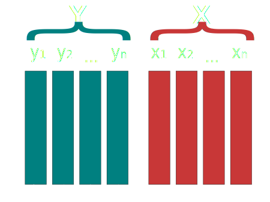
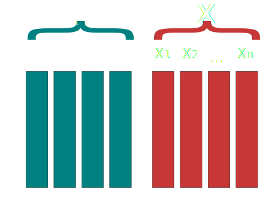
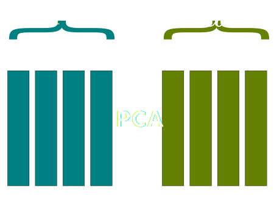
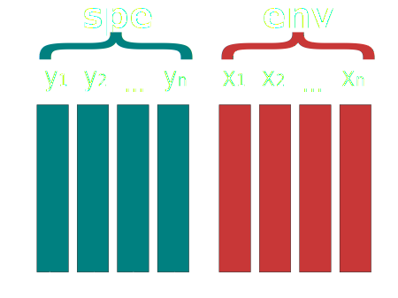
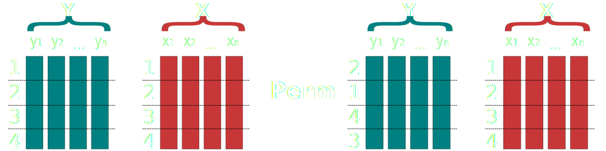
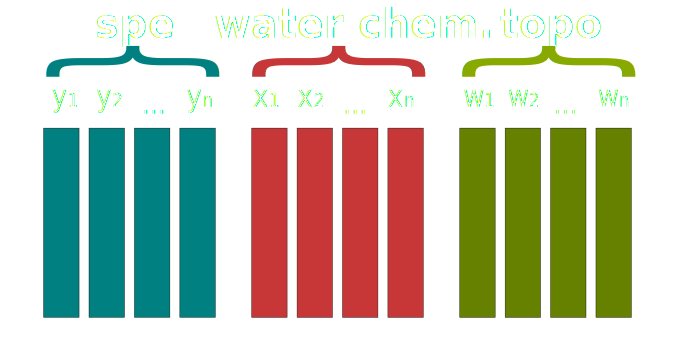
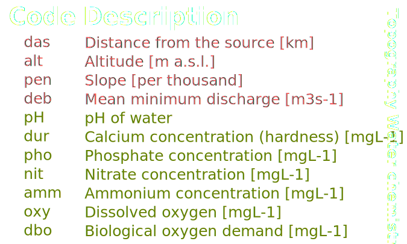
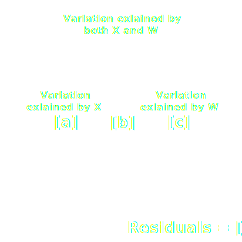

```{r setup, include=FALSE}
knitr::opts_chunk$set(
  message = FALSE,
  warning = FALSE,
  dev = "svg",
  fig.width = 7,
  fig.height = 5,
  fig.align = "center",
  tidy = TRUE,
  tidy.opts = list(width.cutoff = 60)
)

library(ggplot2)
library(dplyr)
library(vegan)
library(extrafont)
loadfonts(quiet = TRUE)

theme_set(theme_bw(base_size = 16, base_family = "Open Sans"))
# options(width = 10)
```

```{r cache=F,echo=F}
s0 <- knitr::knit_hooks$get('source')
o0 <- knitr::knit_hooks$get('output')

knitr::knit_hooks$set(
  list(
    source=function(x,options){
      if (is.null(options$class)) s0(x, options)
      else
        paste0(
          paste0("<div class='", options$class, "'><pre><code>")
          ,x
          ,'</code></pre>\n'
        )
    }
    ,output = function(x,options){
      if (is.null(options$class)) o0(x, options)
      else 
        paste0(
          "<pre><code>"
          ,x
          ,'</code></pre></div>\n'
        )
    }
  )
)
```

## Redundancy analysis

- Simple (unconstrained) ordination analyses (such as PCA) on a single data matrix **$X$** helps to reveal its major structure [@Borcard2011].

- There are not notions of **explanatory** or **response** variables.

- On contrary, **canonical ordination** such as RDA explicitly explores the relationships between two matrices: a **response** matrix and an **explanatory** matrix.

## Redundancy analysis

- RDA is the multivariate (meaning *multiresponse*) technique analogue of regression.

- The method uses a mix of linear regression and principal components analysis (PCA).

- Conceptually, RDA is a multivariate (meaning multiresponse) multiple linear
regression followed by a PCA of the table of fitted values.

## Definitions

Lets define :

> - $X$ a matrix of **explanatory variables**
> - $Y$ a matrix of **response variables**

<center>

</center>

## Definitions

RDA procedure works on both **centered** matrices. This simply means that that the average of the variable is subtracted from each observation.

$$
\bar{X}_j = \sum_{i = 1}^{n} X_{ij} = 0
$$

$$
\bar{Y}_j = \sum_{i = 1}^{n} Y_{ij} = 0
$$


## RDA cookbook
<!-- Page 155 Borcard2011 -->
These steps are from @Borcard2011 which I **highly** recommend.

1. Regress each (centered) $y$ variable on explanatory matrix $X$ and compute the fitted ($\hat{y}$) and residuals ($y_{res}$) vectors.

2. Create a new matrix ($\hat{Y}$) containing all the fitted vectors ($\hat{y}$).

3. Compute a PCA on $\hat{Y}$. This will produces a vector of canonical eigenvalues and a matrix $U$ of canonical eigenvectors (principal components).

## Graphical view

$\hat{Y}$ is produced using multiple linear regression between $X$ and each $y_i$.

<center>

</center>

## Graphical view

A PCA is performed on $\hat{Y}$ which gives a set of principal component vectors $U$.

<center>

</center>

## PCA vs RDA

PCA and RDA are very similar:

- PCA is performed on a matrix with explanatory variables.

- RDA is performed on a matrix of **predicted** explanatory variables.

## Two types of RDA

Depends on how site scores are calculated (**two possibilities**).

> - $Y \times U$ to obtain ordination in the space of the original variables $Y$.
> - $\hat{Y} \times U$ to obtain ordination in the space of the variables $X$.

Site scores calculated using $Y \times U$ are simply called **site scores** where as scores calculates using $\hat{Y} \times U$ are called **site constraints** since they are calculated using linear combinations of constraining variables $X$.

## Vegan R package

The `vegan` package makes it very easy to perform RDA in R using the `RDA()` function.


```{r, eval = FALSE}
# Install the package
install.packages("vegan")

# Load the package
library(vegan) 
```

## Vegan R package

#### Basic usage


```{r, eval = FALSE}
# X is a matrix or data frame of explanatory variables
my_rda <- rda(Y ~ x1 + x2 + x3, data = X)
```

## A concrete example

http://goo.gl/hwxKAD

<p><small>
The data come from a Ph.D. thesis (Verneaux, 1973) who proposed to use fish species to characterize ecological zones along European rivers and streams. He showed that fish communities were good biological indicators of these water bodies. Data have been collected at 30 localities along Doubs river.
</small></p>

<p><small>
The first matrix (**Y**) contains coded abundances of 27 fish species.
</small></p>

<p><small>
The second matrix (**X**) contains 11 environmental variables related to the hydrology, geomorphology and chemistry of the river.
</small></p>

<p><small>
*Reference:* Verneaux, J. (1973) Cours d'eau de Franche-Comté (Massif du Jura). Recherches écologiques sur le réseau hydrographique du Doubs. Essai de biotypologie. Thèse d'état, Besançon. 1–257.
</small></p>

## A concrete example

<center>

</center>

## A concrete example

Matrix **$Y$** contains fish species abundance.

```{r}
spe <- read.csv("http://goo.gl/hwxKAD", row.names = 1)
```

<small>
```{r, echo = FALSE, results="asis"}
print(xtable::xtable(head(spe, 10)[, 1:10]), type = "html", NA.string = "NA")
```
</small>

## A concrete example

Lets transform abundance data (**$Y$**) using the **Hellinger-transform** method [@Borcard2011; @Legendre2001].

> Particularly suited to species abundance data, this transformation gives low weights to variables with low counts and many zeros. The transformation itself comprises dividing each value in a data matrix by its row sum, and taking the square root of the quotient.

<small>
Source: http://mb3is.megx.net/gustame/reference/transformations
</small>

## A concrete example

In R, the **Hellinger-transform** is performed using the `decostand()` function from `vegan` package.

```{r}
spe_hellinger <- decostand(spe, method = "hellinger")
```

<small>
```{r, echo = FALSE, results="asis"}
print(xtable::xtable(head(spe_hellinger, 10)[, 1:10]), 
      type = "html", NA.string = "NA")
```
</small>

## A concrete example

Environemental data (**$X$**)

```{r}
env <- read.csv("http://goo.gl/HDAWtO", row.names = 1)
```

<small>
```{r, echo = FALSE, results="asis"}
print(xtable::xtable(head(env, 10)), 
      type = "html", NA.string = "NA")
```
</small>

## A concrete example

Environmental data (**X**)

| Code | Description of the variable              |
|------|------------------------------------------|
| das  | Distance from the source [km]            |
| alt  | Altitude [m a.s.l.]                      |
| pen  | Slope [per thousand]                     |
| deb  | Mean minimum discharge [m3s-1]           |
| pH   | pH of water                              |
| dur  | Calcium concentration (hardness) [mgL-1] |
| pho  | Phosphate concentration [mgL-1]          |
| nit  | Nitrate concentration [mgL-1]            |
| amn  | Ammonium concentration [mgL-1]           |
| oxy  | Dissolved oxygen [mgL-1]                 |
| dbo  | Biological oxygen demand [mgL-1]         |

----

```{r, fig.width = 8, fig.height = 5.5}
languageR::pairscor.fnc(env) # First look at pairwise correlations
```

**Can you spot potential problems?**

## Lets do it

```{r, eval = FALSE}
# Create the model
my_rda <- rda(spe_hellinger ~ das + alt + pen + deb + pH + dur + pho + nit + amm + oxy + dbo, data = env)
```

## Quick R tip

To make the syntax easier, you can use the formulation 

`y ~ ., data = x` 

which means: *y as a function of all variables in x*.

```{r}
# Predicting transformed species using all variables contained in env
my_rda <- rda(spe_hellinger ~ ., data = env)
```

## Summary

```{r, eval = FALSE}
summary(my_rda) # Lets have a look to the summary of the RDA
```

First part -> contribution to **explained variance**

Second part -> contribution to **total variance**

## Visualisation

For RDA, the visualization plot is called **triplot** since there are three different entities in the plot: *sites*, *response variables* and *explanatory variables* [@Borcard2011].

## Interpreting triplot

```{r}
plot(my_rda) # Show the triplot
```

## Explained variance

## RDA: explained variance

**Attention**: $R^2$ as the relative contribution of each eigenvectors are unadjusted and are therefore biased. For a proper computation of unbiased, adjusted $R^2$ one should use the `RsquareAdj()` function.

```{r}
RsquareAdj(my_rda) # Total variance explained by the RDA
```

$$
R^2_{adj} = 1 - \frac{n - 1}{n - m - 1}(1 - R^2)
$$

## Test of significance

## Tests of RDA results

Most of the time, ecological data are not normally-distributed: **parametric tests are not appropriate**.

For canonical analysis such as RDA, model significance relies on **permutation tests**.

<small>

> The principle of a permutation test is to generate a reference distribution of the chosen statistic under the null hypothesis $H0$ by randomly permuting appropriate elements of the data a large number of times and recomputing the statistic each time. Then, one compares the true value of the statistic to this reference distribution. The $p$ value is computed as the proportion of the permuted values equal to or larger than the true (unpermuted) value of the statistic for a one-tailed test in the upper tail, like the $F$ test used in RDA [@Borcard2011].

</small>

## Permutation test

#### Repeat the process *n* numbers of times (default: *n* = 999)

<center>
 
</center>

$H0$: Observed results can be produced by random chance.

The null hypothesis is rejected if this $p$ value is equal to or smaller than the predefined significance level $\alpha$ (ex.: $\alpha = 0.05$).

## Permutation test

For an RDA, you have to test for three different things:

1. Global RDA significance

2. Axis significance

3. Terms (explanatory variables) significance

## Global significance

We use the function `anova.cca()` to perform the permutation test. **Do not get confused with the name**, is has nothing to do with the classical ANOVA test.

```{r, eval = FALSE}
anova.cca(rda, permutations = 999)
```

> Argument `permutations` gives the minimal number of permutations requested to assess if the F value of a test is obviously significant or not [@Borcard2011].

## Permutation test

```{r}
anova.cca(my_rda)
```

Since $p$ = `r anova.cca(my_rda)[4][1,1]` we reject $H0$ meaning that the RDA model is significant.

## Axis significance

Axis significance can be done by adding `by = "axis"`.

```{r}
anova.cca(my_rda, by = "axis") # Test which axis are significant
```

## Terms significance

Terms significance can be done by adding `by = "terms"`.

```{r}
anova.cca(my_rda, by = "terms") # Test which terms are significant
```

## Linear dependencies

As with multiple linear regressions, there are chances to have collinearity among predictors (**$X$**).

This needs to be carefully verified.

## Linear dependencies

Lets look at the environmental matrix (**$X$**) used for the RDA.

```{r echo = FALSE, fig.width = 7, fig.height = 5.5}
languageR::pairscor.fnc(env)
```

## Linear dependencies

Multicollinearity can be verified using the `vif.cca()` function.

```{r}
sqrt(vif.cca(my_rda))
```

As a rule of the thumb, if $\sqrt{VIF} > 2$ multicollinearity is considered high.

Here, it seems that some of explanatory variables are **redundant**. 

Should we reduce the number of explanatory variables?

## Forward selection

Like we saw for the multiple regression analysis, we can use the `forward.sel()` function to select the *best* explanatory variables. 

You have to install the `packfor` package.

```{r, eval = FALSE}
install.packages("packfor", repos = "http://R-Forge.R-project.org")
```

## Recipe

1. To prevent problem with inflation of type I error: compute the **global** model (i.e. using all explanatory variables) and calculate *p* value. If the model is significant, perform the forward selection.

2. To prevent adding too many explanatory variables: compute the **global** $R^2_{adj}$ of the model. Use this value as the second stopping criteria.

## Forward selection

```{r}
library(packfor)

# Global model with all environmental variables
my_rda <- rda(spe_hellinger ~ ., data = env) 

# global R2
global_r2 <- RsquareAdj(my_rda)$adj.r.squared

global_r2
```

## Forward selection

Perform the forward selection with $R^2_{adj} = `r round(global_r2, digits = 2)`$.

```{r, tidy=FALSE}
# Forward selection
fs <- forward.sel(spe_hellinger, # Y matrix
  env, # X matrix
  adjR2thresh = global_r2, # Set the adj.R2 threshold
  alpha = 0.001, # Set alpha level
  nperm = 999  # Number of permutations
)   
```

## Forward selection

The forward selection has determined that fish species gradient was best modeled using 3 environmental variables.

```{r}
fs
```

Based on the forward selection, it seems that `das`, `oxy` and `dbo` are *good* predictors.

## Forward selection

Lets create another RDA using the selected variables.

```{r}
my_rda2 <- rda(spe_hellinger ~ das + oxy + dbo, data = env)
```

## Forward selection

```{r}
RsquareAdj(my_rda)$adj.r.squared # Using 11 explanatory variables
RsquareAdj(my_rda2)$adj.r.squared # Using 3 explanatory variables
```

The RDA using only 3 explanatory variables explains **almost as much** as the RDA using 11 explanatory variables.

## Forward selection

```{r}
sqrt(vif.cca(my_rda))   # Multicollinearity before variables selection
sqrt(vif.cca(my_rda2))  # Multicollinearity after variables selection
```

**Remember**: $\sqrt{VIF} > 2$ means high multicollinearity among predictor.

## Axis significance

Axis significance can be done by adding `by = "axis"`.

```{r}
anova.cca(my_rda2, by = "axis") # Test which axis are significant
```

## Terms significance

Terms significance can be done by adding `by = "terms"`.

```{r}
anova.cca(my_rda2, by = "terms") # Test which terms are significant
```

## Unexplained variance

It is a good idea to look at the residual variation in the data. We can use the **Kaiser-Guttman criterion** [@Kaiser1960].

```{r}
my_rda$CA$eig[my_rda$CA$eig > mean(my_rda$CA$eig)]
```

>- Based on this result, we see there is still some variation in these PCA that has not been explained by our set of environmental data. 
>- Need more data?

## Exercise {.exercises}

#### Exercise #1

Explore our data for your using an RDA. 

If you do not have data, use the following data and create an RDA to predict vascular plant abundance with chemical variables.

```{r}
#bryo <- read.delim("http://goo.gl/UugH8X", row.names = 1)

vasc <- read.delim("http://goo.gl/UBcc5J", row.names = 1)

chem <- read.delim("http://goo.gl/55gDIi", row.names = 1)
```

```{r, eval = FALSE, echo = FALSE, tidy=FALSE}
vasc_hellinger <- decostand(vasc, method = "hellinger")

my_rda <- rda(vasc_hellinger ~ ., data = chem)

global_r2 <- RsquareAdj(my_rda)$adj.r.squared


fs <- forward.sel(vasc_hellinger, chem, alpha = 0.01, adjR2thresh = global_r2)

my_rda2 <- rda(vasc_hellinger ~ Ca + conduct + Si + NH3 + NO3 + Mg, data = chem)

anova(my_rda2)

anova(my_rda2, by = "axis")
anova(my_rda2, by = "terms")

plot(my_rda2, type = "text", scaling = 3)

```

## Partial RDA

## Partial RDA

It is possible to run an RDA of a matrix **Y**, explained by a matrix variables **X**, in the presence of co-variable(s) **W**.

This analysis allows to display the patterns of the response data (**Y**) uniquely explained by a linear model of the explanatory variables (**X**) when the effect of other covariates (**W**) is held constant [@Borcard2011].

## An example

The analysis that follows determines whether water chemistry (**X**) significantly explains the fish species patterns (**Y**) when the effect of the topographical gradient (**W**) is held constant.

In other words, we want to model the effect of water chemistry variables on fish abundance once the effect of topographic variables is removed.

## Partial RDA

<center>
 
</center>

## Partial RDA

#### Subsetting variables

<center>
 
</center>

## Partial RDA in R

The construction of a partial RDA is pretty much the same as for a *standard* RDA except that we are using the `Condition(...)` function to specify which covariate (**$W$**) we want to remove the effect.

## Model formulation

```{r}
partial_rda <- rda(spe_hellinger ~ pH + dur + pho + nit + amm + oxy + dbo + Condition(das + alt + pen + deb), data = env)
```

## Summary

```{r}
summary(partial_rda)
```

## Interpreting the output

According to @Borcard2011:

- **Conditioned**: gives the amount of variance that has been explained by the covariables and removed (55.49%).

- **Constrained**: gives the amount of variance uniquely explained by the explanatory variables (17.21%).

- **Unconstrained**: gives the residual variance (27.31%).

## Interpreting the output

Caution: the values are unadjusted and are therefore biased.

```{r}
RsquareAdj(partial_rda) # Always report adjusted R2
```

## Test of significance

As for RDA without covariates we can use the `anova.cca()` function to test the significance of partial RDA.

```{r}
anova.cca(partial_rda)
```

Since $p \leq 0.05$ we reject $H0$ and can conclude that the result was not produced *randomly*.

## Exercise {.exercises}

#### Question #1

Run `anova.cca(partial_rda)` couple of times. What are you observing?

## Visualization

```{r}
# As expected, topographic data not present
plot(partial_rda, scaling = 1)
```

## What is going on?

```{r}
# Adj-R2 using all env. variables
RsquareAdj(rda(spe_hellinger ~ ., data = env))$adj.r.squared

# Adj-R2 after removing effect of topography
RsquareAdj(rda(spe_hellinger ~ pH + dur + pho + nit + amm + oxy + dbo + Condition(das + alt + pen + deb), data = env))$adj.r.squared

# Adj-R2 after removing effect of water chemistry
RsquareAdj(rda(spe_hellinger ~ das + alt + pen + deb + Condition(pH + dur + pho + nit + amm + oxy + dbo), data = env))$adj.r.squared
```

```{r, echo = FALSE, results=" hide"}
# Adj-R2 using all env. variables
r2a <- RsquareAdj(rda(spe_hellinger ~ ., data = env))$adj.r.squared

# Adj-R2 after removing effect of topography
r2b <- RsquareAdj(rda(spe_hellinger ~ pH + dur + pho + nit + amm + oxy + dbo + Condition(das + alt + pen + deb), data = env))$adj.r.squared

# Adj-R2 after removing effect of water chemistry
r2c <- RsquareAdj(rda(spe_hellinger ~ das + alt + pen + deb + Condition(pH + dur + pho + nit + amm + oxy + dbo), data = env))$adj.r.squared
```
<small>
Why `r round(r2b, digits = 2)`% + `r round(r2c, digits = 2)`% **is not equal to** `r round(r2a, digits = 2)`%?
</small>

## Variance partitioning

## Variance partitioning

We just saw that the $R^2_{adj}$ of each partial RDA does not sum up to the $R^2_{adj}$ of the global model.

`r round(r2a, digits = 2) * 100`% - `r round(r2b, digits = 2) * 100`% - `r round(r2c, digits = 2) * 100` = `r round(r2a - r2b - r2c, digits = 2) * 100`%

Where is the missing `r round(r2a - r2b - r2c, digits = 2) * 100`%?

There must have **confounded** variance explained by **both** partial RDA.

## Variance partitioning

<center>
 
</center>


## Variance partitioning in R

In R, variance partitioning among partial RDA is done using the `varpart` function from the `vegan` package.

```{r eval = FALSE, tidy = FALSE}
# Y = response variables matrix (species community)

# X = explanatory variables matrix (water chemistry variables)

# W = covariate variables matrix (topography variables)
vp <- varpart(Y, X, W)
```

## Varpart

```{r}
env_topograhpy <- env[, 1:4] # Extract topography variables
env_water_chemistry <- env[, 5:11] # Extract water chem variables
vp <- varpart(spe_hellinger, env_water_chemistry, env_topograhpy)
vp
```

## Varpart

```{r, fig.width = 4, fig.height = 2.5, echo = -1}
par(mar = c(0, 0, 0, 0))
plot(vp)
RsquareAdj(partial_rda)
```

## Test of significance

We have tested the global significance of the RDA. We also need to do it for each fraction: (**1**) [a + b], (**2**) [b + c], (**3**) [a + b + c], (**4**) [a] and (**5**) [c]

<center>
 
</center>

## Test of significance

Same as a *normal* RDA using permutation test.

#### Testing fractions [a + b]

```{r}
# Test fractions [a + b]
anova.cca(rda(spe_hellinger, env_water_chemistry))
```

----

#### Testing fractions [b + c]

```{r}
# Test fractions [b + c]
anova.cca(rda(spe_hellinger, env_topograhpy))

```

----

#### Testing fractions [a + b + c]

```{r}
# Test fractions [a + b + c]
anova.cca(rda(spe_hellinger, env))

```

----

#### Testing fraction [a]

```{r}
# Test fraction [a]
anova.cca(rda(spe_hellinger, env_water_chemistry, env_topograhpy))

```

----

#### Testing fraction [c]

```{r}
# Test fraction [c]
anova.cca(rda(spe_hellinger, env_topograhpy, env_water_chemistry))

```

## Varpart

With `varpart` it is possible to have up to 4 explanatory matrices.

```{r, echo = FALSE}
op <- par(mfrow = c(2,2), mar = c(0, 0, 0, 0))
showvarparts(2)
showvarparts(3)
showvarparts(4)
par(op)
```

## Quick note

Variable selection is kind of powerful statistical tool to select *best* explanatory variables. However, it should not replace good scientific knowledge and good scientific hypothesis! **Don't go fishing on your explanatory variables.**

## Exercise {.exercises}

#### Exercise #1

Perform a RDA on fish species data using water chemistry variables as **X** and topography variables as **W**.

1. Perform variable selection on **X** using $\alpha = 0.01$.

2. Perform variable selection on **W** using $\alpha = 0.01$.

3. Keep selected variables in both **X** and **W** and perform variance partitioning.

4. Test **each** fraction significance.

5. What are the differences with the previous varpart we performed?

```{r, eval = TRUE, echo = FALSE, results = "hide", fig.show="hide"}

## Get the global R2 using all variables
rda_water_chemistry <- rda(spe_hellinger, env_water_chemistry)
r2_water_chemistry <- RsquareAdj(rda_water_chemistry)$adj.r.squared

## Get the global R2 using all variables
rda_topography <- rda(spe_hellinger, env_topograhpy)
r2_topography <- RsquareAdj(rda_topography)$adj.r.squared


#---------------------------------------------------------------------
# Forward selection
#---------------------------------------------------------------------

## Forward selection on water chemistry variables
fs_water_chemistry <- forward.sel(spe_hellinger,
  env_water_chemistry,
  adjR2thresh = r2_water_chemistry,
  alpha = 0.01
)

## Forward selection on topographic variables
fs_topography <- forward.sel(spe_hellinger,
  env_topograhpy,
  adjR2thresh = r2_topography,
  alpha = 0.01
)

#---------------------------------------------------------------------
# Create new data frames with variables selection by the forward selection
#---------------------------------------------------------------------
env_water_selected <- dplyr::select(env_water_chemistry, oxy, nit, amm)
env_topo_selected <- dplyr::select(env_topograhpy, das, alt, deb)

#---------------------------------------------------------------------
# Create the partial RDA
#---------------------------------------------------------------------
rda_water_chemistry_final <- rda(spe_hellinger, env_water_selected)
rda_topography_final <- rda(spe_hellinger, env_topo_selected)

plot(rda_water_chemistry_final, scaling = 1)
plot(rda_topography_final, scaling = 1)

#---------------------------------------------------------------------
# Variance partitioning
#---------------------------------------------------------------------
vp <- varpart(spe_hellinger, env_water_selected, env_topo_selected)
vp

plot(vp)

#---------------------------------------------------------------------
# Test each individual fractions
#---------------------------------------------------------------------

# [a + b]
anova.cca(rda(spe_hellinger, env_water_selected))

# [b + c]
anova.cca(rda(spe_hellinger, env_topo_selected))

# [a + b + c]
anova.cca(rda(spe_hellinger, cbind(env_water_selected, env_topo_selected)))

# [a]
anova.cca(rda(spe_hellinger, env_water_selected, env_topo_selected))

# [c]
anova.cca(rda(spe_hellinger, env_topo_selected, env_water_selected))
```

## Comparing both models

```{r, echo = FALSE, fig.width = 10}

par(mfrow = c(1, 2), mar = c(1,1,1,1))

plot(varpart(spe_hellinger, env_water_chemistry, env_topograhpy))
mtext("RDA with 11 variables")

plot(varpart(spe_hellinger, env_water_selected, env_topo_selected))
mtext("RDA with 6 variables")

```

## Exercise {.exercises}

#### Exercise #2

Use `env` and create three data frames and perform a RDA using three sets of covariates and perform variance partitioning.

```{r}
X <- env[, 1:3]
W <- env[, 4:6]
Z <- env[, 7:11]
```

```{r, echo=FALSE}
head(as_tibble(env))
```


----

```{r, echo = FALSE}
vp <- varpart(spe_hellinger, X, W, Z)
plot(vp)
```
Same amount of explained variance, just *divided* differently.


## Useful resources

<small>

http://evol.bio.lmu.de/_statgen/Multivariate/11SS/rda.pdf

http://mb3is.megx.net/gustame/constrained-analyses/rda

http://www.davidzeleny.net/anadat-r/doku.php/en:rda_cca

</small>

## References  {.refsection}
